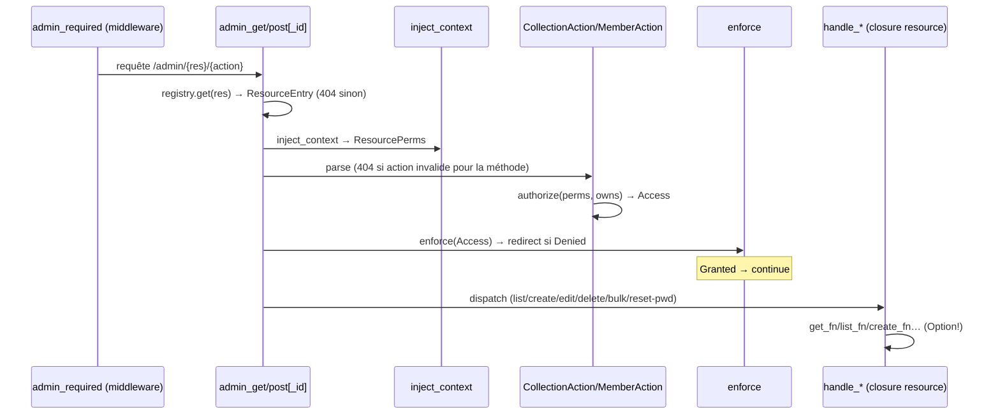
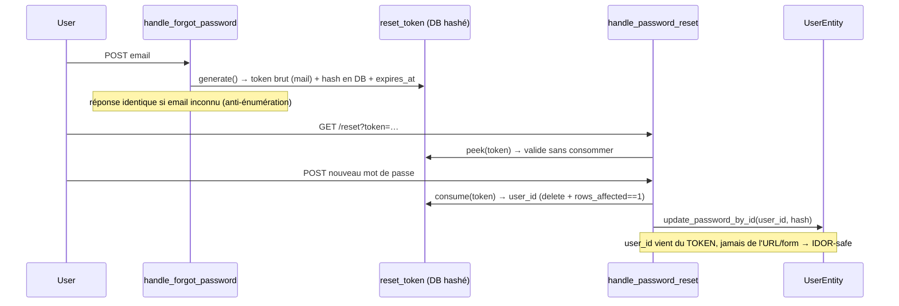
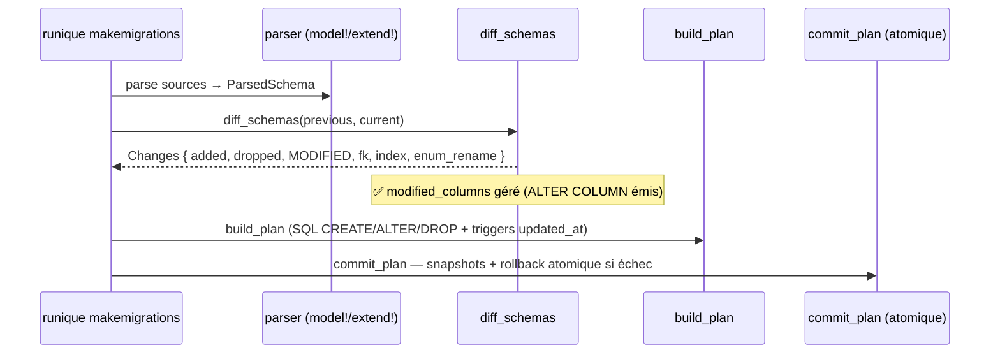

# Flux — Admin CRUD, reset password, makemigrations

## Admin CRUD (pattern Command)

[`admin/admin_main/`](../../runique/src/admin/admin_main/)

Source unique d'autorisation : `ResourcePerms` (template + serveur). Voir
[../uml/admin/admin-resource-permissions.md](../uml/admin/admin-resource-permissions.md).

## Reset password (IDOR-safe, single-use)

## makemigrations (diff complet + commit atomique)

## Anomalies / flux suspects

### 🟠 ACR1 — Closures resource `Option` : no-op silencieux (rappel A1)
Si `get_fn`/`create_fn`/… est `None` (bug daemon), l'action dégrade en silence (page vide)
au lieu d'erreur. À durcir (501/log).

### 🟢 ACR2 — Reset password : audit clean (pas d'anomalie)
Token haché, single-use strict, `user_id` dérivé du token, anti-énumération sur forgot,
logout avant reset. Chaîne saine.

### 🟢 ACR3 — makemigrations : diff complet (confirme M1 = faux positif)
`diff_schemas` gère added/dropped/**modified**/fk/index/enum-rename ; commit atomique avec
rollback. Le `ModelSchema::diff` limité (add/drop) n'est pas sur ce chemin.
