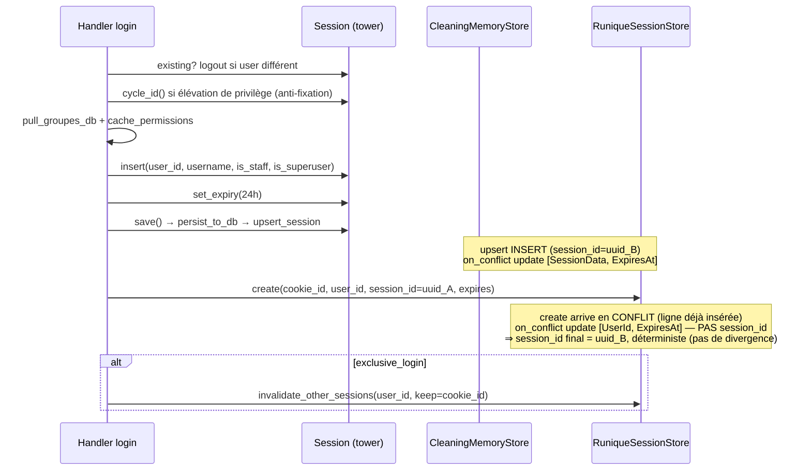
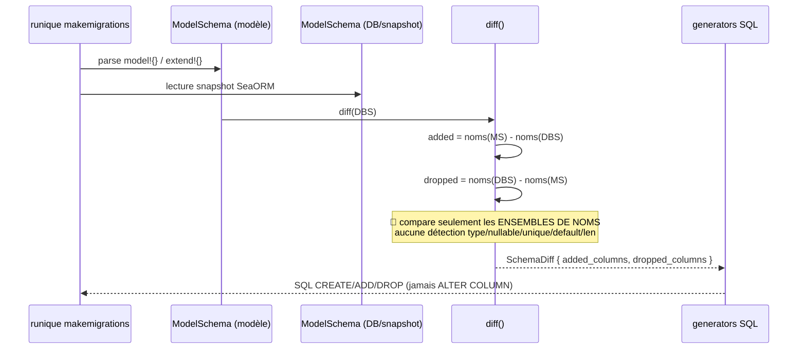

# Flux — Login/session & makemigrations

## Séquence : login authentifié

[`auth/session.rs:291`](../../runique/src/auth/session.rs#L291)

> **Lecture du diagramme** : les deux écritures ont des `on_conflict.update_columns`
> disjoints et **aucune** ne touche `session_id` sur conflit. `upsert` (1ʳᵉ, via `save()`)
> fixe `session_id` ; `create` (2ᵉ) ne fait qu'un UPDATE de `[UserId, ExpiresAt]`. Donc
> `session_id` est cohérent — le seul coût réel est **2 aller-retours DB** (AM2 = perf, pas
> divergence). C'est précisément le genre de faux positif qu'un flux complet (avec les
> `update_columns`) élimine d'emblée.

## Séquence : makemigrations (diff)

## Anomalies / flux suspects

### ❌ AM1 — FAUX POSITIF (makemigrations gère bien les `ALTER COLUMN`)
La CLI utilise `diff_schemas` ([makemigration.rs:489](../../runique/src/utils/cli/makemigration.rs#L489))
qui calcule `modified_columns`. Le `ModelSchema::diff` limité (add/drop) n'est **pas** le
chemin de la CLI. Détecté en traçant le flux jusqu'au vrai `diff` appelé.

### ❌ AM2 — FAUX POSITIF sur la divergence (résidu = perf seulement)
Voir le diagramme ci-dessus : les `on_conflict.update_columns` sont disjoints et **aucun** ne
touche `session_id`. `upsert` (1ʳᵉ) le fixe, `create` (2ᵉ) ne fait qu'un UPDATE
`[UserId, ExpiresAt]`. `session_id` est donc déterministe — pas de divergence. Résidu réel :
**double aller-retour DB** au login (🟡 perf, fusionnable).

### 🟡 AM3 — TTL 24h codé en dur en double — ✅ CORRIGÉ
Extrait en constante unique `AUTH_SESSION_TTL_HOURS` (cookie + DB).

### 🟡 AM4 — `pull_groupes_db` à chaque login + cache mémoire process-local
`cache_permissions` est un cache mémoire. En multi-process/multi-instance, le cache d'une
instance ignore les changements de droits faits via une autre → permissions périmées jusqu'au
prochain login/évict. À acter (cohérent avec le modèle mono-process actuel).
