# Flux — makemigrations 4.1 : une séquence par cas

Document de travail du chantier makemigrations 4.1, refait le 2026-11-19 après les décisions du
jour. Chaque cas a sa séquence.
Vue d'ensemble, règles de fond et questions : [makemigrations-4-1-chantier.md](makemigrations-4-1-chantier.md).
Ce qui existe déjà dans le code, cas par cas : [makemigrations-4-1-existant.md](makemigrations-4-1-existant.md).

**Les deux sources (décidé le 2026-11-20).** Le fichier de migration est la seule source du `up`
et du `down` d'une modification : il n'en existe aucune copie, pas de dossier `history/`. Le
snapshot est l'état d'une table après un `migration up` ou `down` réussi, retranscription de
l'entité, écrit à l'application.

Marques : `[EXISTANT]` le code le fait, `[DECIDE]` tranché par Sébastien et pas codé, `[ETUDE]`
étudié par Claude et pas décidé. Plus aucune question n'est ouverte.

Participants communs : `D` le dev, `MM` makemigrations, `UP` migration up, `DN` migration down,
`BA` le builder atomique, `F` les fichiers du projet, `DB` la base, `CR` la crate `migration/`.

---

## Ligne 0 : savoir où en est la base

### 0.1 Connexion

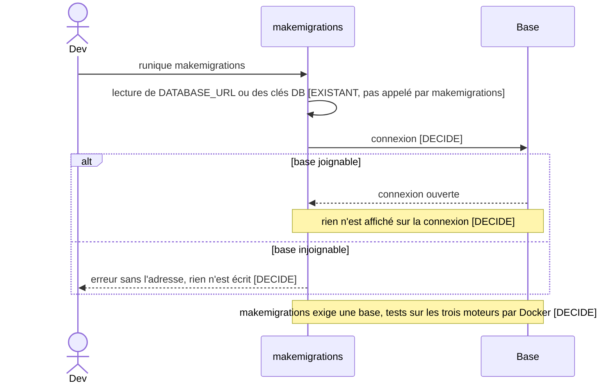
```mermaid
sequenceDiagram
    actor D as Dev
    participant MM as makemigrations
    participant DB as Base
    D->>MM: runique makemigrations
    MM->>MM: lecture de DATABASE_URL ou des clés DB [EXISTANT, pas appelé par makemigrations]
    MM->>DB: connexion [DECIDE]
    alt base joignable
        DB-->>MM: connexion ouverte
        Note over MM,DB: rien n'est affiché sur la connexion [DECIDE]
    else base injoignable
        MM-->>D: erreur sans l'adresse, rien n'est écrit [DECIDE]
    end
    Note over MM,DB: makemigrations exige une base, tests sur les trois moteurs par Docker [DECIDE]
```

### 0.2 Lecture de la position

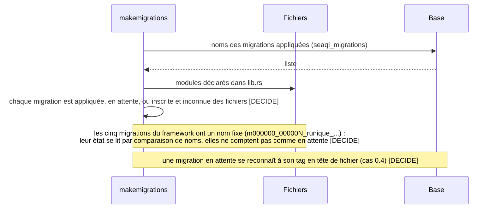
```mermaid
sequenceDiagram
    participant MM as makemigrations
    participant F as Fichiers
    participant DB as Base
    MM->>DB: noms des migrations appliquées (seaql_migrations)
    DB-->>MM: liste
    MM->>F: modules déclarés dans lib.rs
    MM->>MM: chaque migration est appliquée, en attente, ou inscrite et inconnue des fichiers [DECIDE]
    Note over MM,F: les cinq migrations du framework ont un nom fixe (m000000_00000N_runique_...) :<br/>leur état se lit par comparaison de noms, elles ne comptent pas comme en attente [DECIDE]
    Note over MM,DB: une migration en attente se reconnaît à son tag en tête de fichier (cas 0.4) [DECIDE]
```

### 0.3 Contrôles avant tout calcul

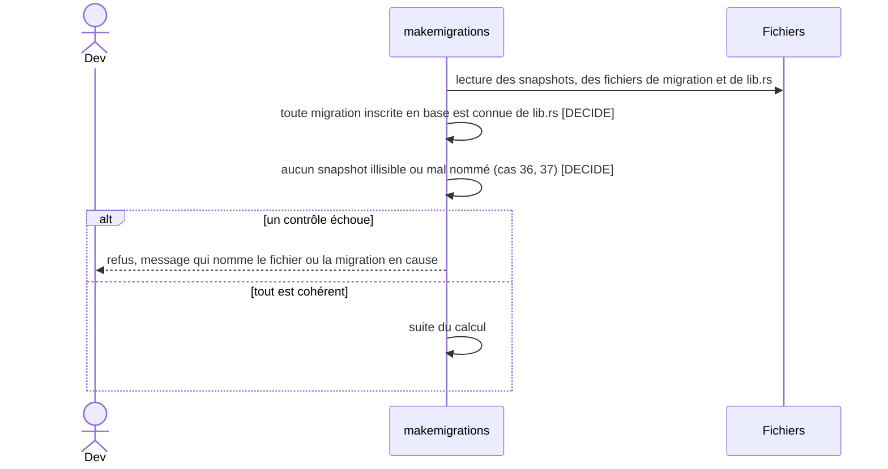
```mermaid
sequenceDiagram
    actor D as Dev
    participant MM as makemigrations
    participant F as Fichiers
    MM->>F: lecture des snapshots, des fichiers de migration et de lib.rs
    MM->>MM: toute migration inscrite en base est connue de lib.rs [DECIDE]
    MM->>MM: aucun snapshot illisible ou mal nommé (cas 36, 37) [DECIDE]
    alt un contrôle échoue
        MM-->>D: refus, message qui nomme le fichier ou la migration en cause
    else tout est cohérent
        MM->>MM: suite du calcul
    end
```

### 0.4 Migration générée et pas appliquée

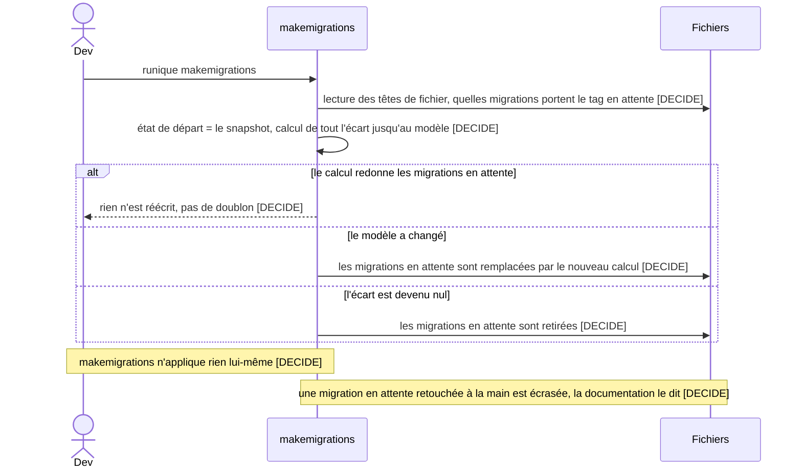
```mermaid
sequenceDiagram
    actor D as Dev
    participant MM as makemigrations
    participant F as Fichiers
    D->>MM: runique makemigrations
    MM->>F: lecture des têtes de fichier, quelles migrations portent le tag en attente [DECIDE]
    MM->>MM: état de départ = le snapshot, calcul de tout l'écart jusqu'au modèle [DECIDE]
    alt le calcul redonne les migrations en attente
        MM-->>D: rien n'est réécrit, pas de doublon [DECIDE]
    else le modèle a changé
        MM->>F: les migrations en attente sont remplacées par le nouveau calcul [DECIDE]
    else l'écart est devenu nul
        MM->>F: les migrations en attente sont retirées [DECIDE]
    end
    Note over MM,D: makemigrations n'applique rien lui-même [DECIDE]
    Note over MM,F: une migration en attente retouchée à la main est écrasée, la documentation le dit [DECIDE]
```

### 0.5 Table déjà là sans inscription

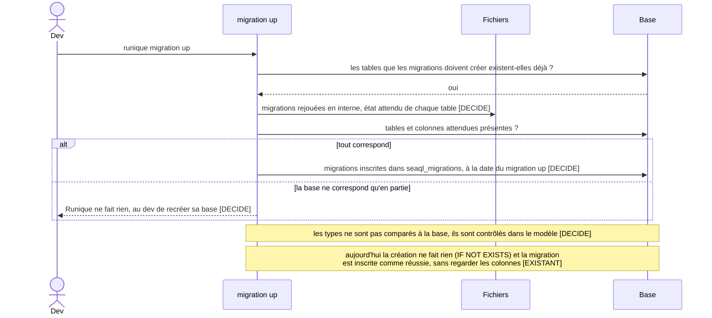
```mermaid
sequenceDiagram
    actor D as Dev
    participant UP as migration up
    participant F as Fichiers
    participant DB as Base
    D->>UP: runique migration up
    UP->>DB: les tables que les migrations doivent créer existent-elles déjà ?
    DB-->>UP: oui
    UP->>F: migrations rejouées en interne, état attendu de chaque table [DECIDE]
    UP->>DB: tables et colonnes attendues présentes ?
    alt tout correspond
        UP->>DB: migrations inscrites dans seaql_migrations, à la date du migration up [DECIDE]
    else la base ne correspond qu'en partie
        UP-->>D: Runique ne fait rien, au dev de recréer sa base [DECIDE]
    end
    Note over UP,DB: les types ne sont pas comparés à la base, ils sont contrôlés dans le modèle [DECIDE]
    Note over UP,DB: aujourd'hui la création ne fait rien (IF NOT EXISTS) et la migration<br/>est inscrite comme réussie, sans regarder les colonnes [EXISTANT]
```

### 0.6 Deux devs sur la même table

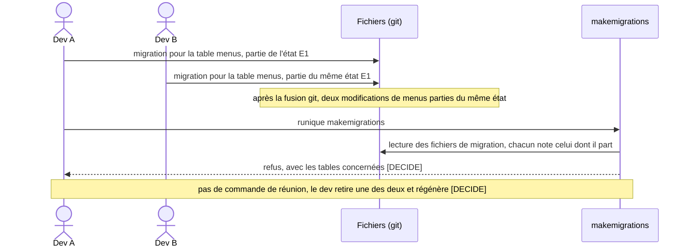
```mermaid
sequenceDiagram
    actor A as Dev A
    actor B as Dev B
    participant F as Fichiers (git)
    participant MM as makemigrations
    A->>F: migration pour la table menus, partie de l'état E1
    B->>F: migration pour la table menus, partie du même état E1
    Note over F: après la fusion git, deux modifications de menus parties du même état
    A->>MM: runique makemigrations
    MM->>F: lecture des fichiers de migration, chacun note celui dont il part
    MM-->>A: refus, avec les tables concernées [DECIDE]
    Note over MM,A: pas de commande de réunion, le dev retire une des deux et régénère [DECIDE]
```

### 0.7 Les deux commandes en même temps

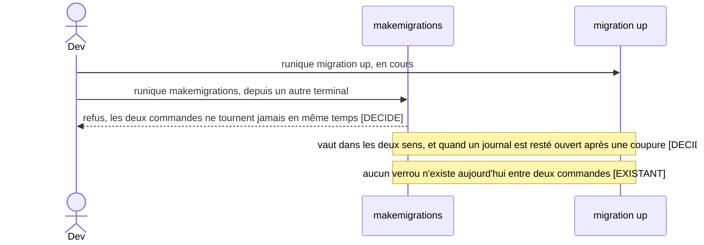
```mermaid
sequenceDiagram
    actor D as Dev
    participant MM as makemigrations
    participant UP as migration up
    D->>UP: runique migration up, en cours
    D->>MM: runique makemigrations, depuis un autre terminal
    MM-->>D: refus, les deux commandes ne tournent jamais en même temps [DECIDE]
    Note over MM,UP: vaut dans les deux sens, et quand un journal est resté ouvert après une coupure [DECIDE]
    Note over MM,UP: aucun verrou n'existe aujourd'hui entre deux commandes [EXISTANT]
```

---

## Ligne 1 : comparer

### 1.1 Table nouvelle

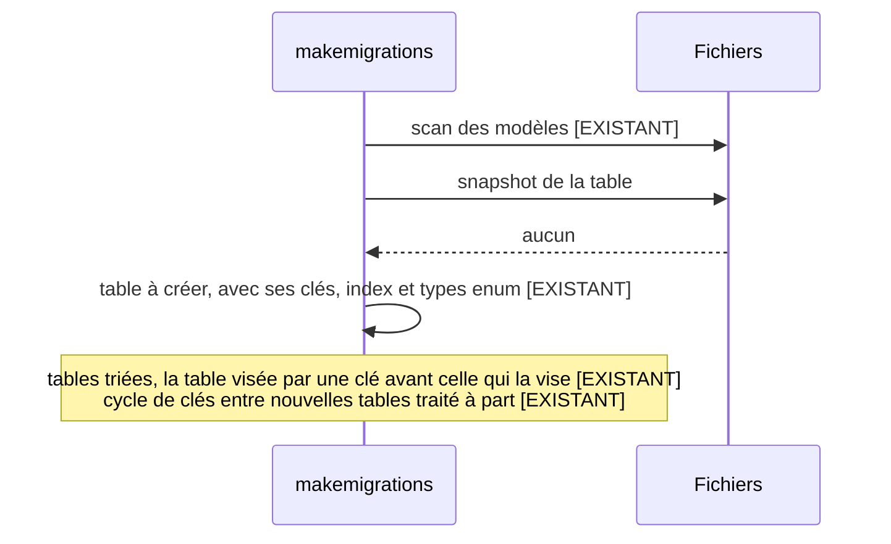
```mermaid
sequenceDiagram
    participant MM as makemigrations
    participant F as Fichiers
    MM->>F: scan des modèles [EXISTANT]
    MM->>F: snapshot de la table
    F-->>MM: aucun
    MM->>MM: table à créer, avec ses clés, index et types enum [EXISTANT]
    Note over MM: tables triées, la table visée par une clé avant celle qui la vise [EXISTANT]<br/>cycle de clés entre nouvelles tables traité à part [EXISTANT]
```

### 1.2 Colonne ajoutée, retirée, modifiée

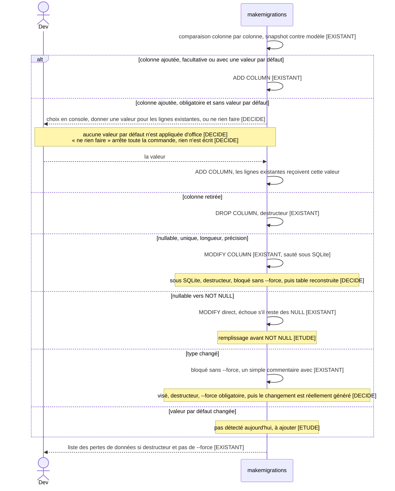
```mermaid
sequenceDiagram
    actor D as Dev
    participant MM as makemigrations
    MM->>MM: comparaison colonne par colonne, snapshot contre modèle [EXISTANT]
    alt colonne ajoutée, facultative ou avec une valeur par défaut
        MM->>MM: ADD COLUMN [EXISTANT]
    else colonne ajoutée, obligatoire et sans valeur par défaut
        MM-->>D: choix en console, donner une valeur pour les lignes existantes, ou ne rien faire [DECIDE]
        Note over MM,D: aucune valeur par défaut n'est appliquée d'office [DECIDE]<br/>« ne rien faire » arrête toute la commande, rien n'est écrit [DECIDE]
        D-->>MM: la valeur
        MM->>MM: ADD COLUMN, les lignes existantes reçoivent cette valeur
    else colonne retirée
        MM->>MM: DROP COLUMN, destructeur [EXISTANT]
    else nullable, unique, longueur, précision
        MM->>MM: MODIFY COLUMN [EXISTANT, sauté sous SQLite]
        Note over MM: sous SQLite, destructeur, bloqué sans --force, puis table reconstruite [DECIDE]
    else nullable vers NOT NULL
        MM->>MM: MODIFY direct, échoue s'il reste des NULL [EXISTANT]
        Note over MM: remplissage avant NOT NULL [ETUDE]
    else type changé
        MM->>MM: bloqué sans --force, un simple commentaire avec [EXISTANT]
        Note over MM: visé, destructeur, --force obligatoire, puis le changement est réellement généré [DECIDE]
    else valeur par défaut changée
        Note over MM: pas détecté aujourd'hui, à ajouter [ETUDE]
    end
    MM-->>D: liste des pertes de données si destructeur et pas de --force [EXISTANT]
```

### 1.3 Colonne renommée

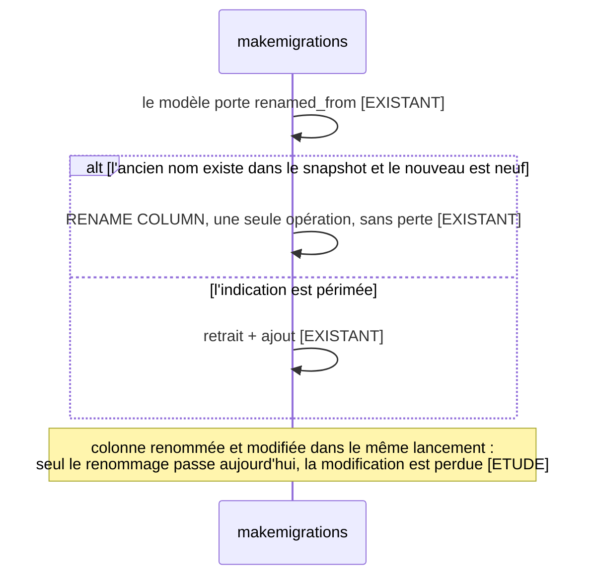
```mermaid
sequenceDiagram
    participant MM as makemigrations
    MM->>MM: le modèle porte renamed_from [EXISTANT]
    alt l'ancien nom existe dans le snapshot et le nouveau est neuf
        MM->>MM: RENAME COLUMN, une seule opération, sans perte [EXISTANT]
    else l'indication est périmée
        MM->>MM: retrait + ajout [EXISTANT]
    end
    Note over MM: colonne renommée et modifiée dans le même lancement :<br/>seul le renommage passe aujourd'hui, la modification est perdue [ETUDE]
```

### 1.4 Enum

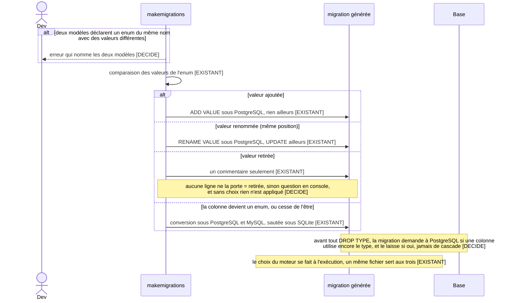
```mermaid
sequenceDiagram
    actor D as Dev
    participant MM as makemigrations
    participant CR as migration générée
    participant DB as Base
    alt deux modèles déclarent un enum du même nom avec des valeurs différentes
        MM-->>D: erreur qui nomme les deux modèles [DECIDE]
    end
    MM->>MM: comparaison des valeurs de l'enum [EXISTANT]
    alt valeur ajoutée
        MM->>CR: ADD VALUE sous PostgreSQL, rien ailleurs [EXISTANT]
    else valeur renommée (même position)
        MM->>CR: RENAME VALUE sous PostgreSQL, UPDATE ailleurs [EXISTANT]
    else valeur retirée
        MM->>CR: un commentaire seulement [EXISTANT]
        Note over MM,CR: aucune ligne ne la porte = retirée, sinon question en console,<br/>et sans choix rien n'est appliqué [DECIDE]
    else la colonne devient un enum, ou cesse de l'être
        MM->>CR: conversion sous PostgreSQL et MySQL, sautée sous SQLite [EXISTANT]
    end
    Note over CR,DB: avant tout DROP TYPE, la migration demande à PostgreSQL si une colonne<br/>utilise encore le type, et le laisse si oui, jamais de cascade [DECIDE]
    Note over CR: le choix du moteur se fait à l'exécution, un même fichier sert aux trois [EXISTANT]
```

### 1.5 Clés étrangères et index

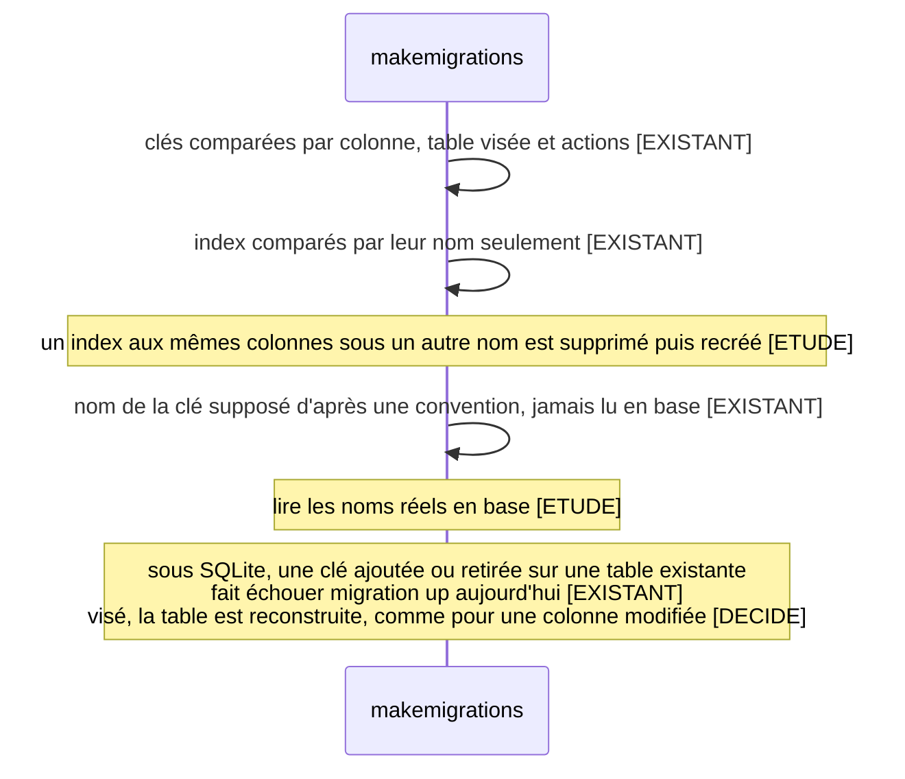
```mermaid
sequenceDiagram
    participant MM as makemigrations
    MM->>MM: clés comparées par colonne, table visée et actions [EXISTANT]
    MM->>MM: index comparés par leur nom seulement [EXISTANT]
    Note over MM: un index aux mêmes colonnes sous un autre nom est supprimé puis recréé [ETUDE]
    MM->>MM: nom de la clé supposé d'après une convention, jamais lu en base [EXISTANT]
    Note over MM: lire les noms réels en base [ETUDE]
    Note over MM: sous SQLite, une clé ajoutée ou retirée sur une table existante<br/>fait échouer migration up aujourd'hui [EXISTANT]<br/>visé, la table est reconstruite, comme pour une colonne modifiée [DECIDE]
```

### 1.6 Table supprimée

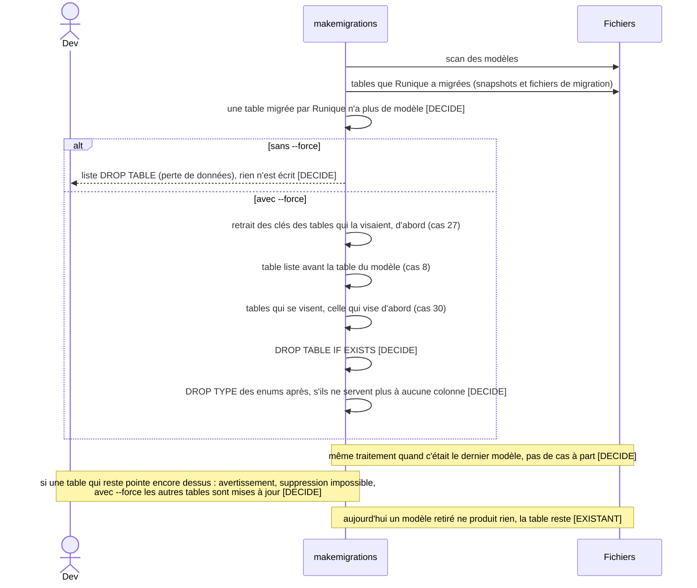
```mermaid
sequenceDiagram
    actor D as Dev
    participant MM as makemigrations
    participant F as Fichiers
    MM->>F: scan des modèles
    MM->>F: tables que Runique a migrées (snapshots et fichiers de migration)
    MM->>MM: une table migrée par Runique n'a plus de modèle [DECIDE]
    alt sans --force
        MM-->>D: liste DROP TABLE (perte de données), rien n'est écrit [DECIDE]
    else avec --force
        MM->>MM: retrait des clés des tables qui la visaient, d'abord (cas 27)
        MM->>MM: table liste avant la table du modèle (cas 8)
        MM->>MM: tables qui se visent, celle qui vise d'abord (cas 30)
        MM->>MM: DROP TABLE IF EXISTS [DECIDE]
        MM->>MM: DROP TYPE des enums après, s'ils ne servent plus à aucune colonne [DECIDE]
    end
    Note over MM,F: même traitement quand c'était le dernier modèle, pas de cas à part [DECIDE]
    Note over MM,D: si une table qui reste pointe encore dessus : avertissement, suppression impossible,<br/>avec --force les autres tables sont mises à jour [DECIDE]
    Note over MM,F: aujourd'hui un modèle retiré ne produit rien, la table reste [EXISTANT]
```

### 1.7 Renommage de table ou de champ liste

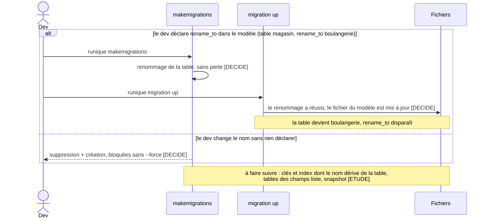
```mermaid
sequenceDiagram
    actor D as Dev
    participant MM as makemigrations
    participant UP as migration up
    participant F as Fichiers
    alt le dev déclare rename_to dans le modèle (table magasin, rename_to boulangerie)
        D->>MM: runique makemigrations
        MM->>MM: renommage de la table, sans perte [DECIDE]
        D->>UP: runique migration up
        UP->>F: le renommage a réussi, le fichier du modèle est mis à jour [DECIDE]
        Note over UP,F: la table devient boulangerie, rename_to disparaît
    else le dev change le nom sans rien déclarer
        MM-->>D: suppression + création, bloquées sans --force [DECIDE]
    end
    Note over MM,F: à faire suivre : clés et index dont le nom dérive de la table,<br/>tables des champs liste, snapshot [ETUDE]
```

### 1.8 Bloc extend

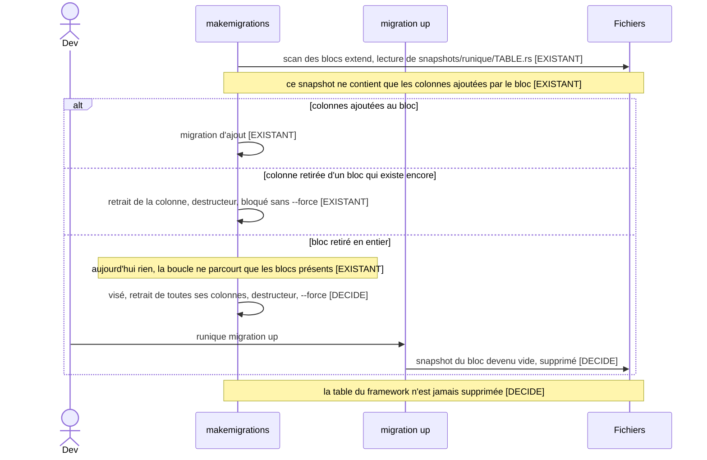
```mermaid
sequenceDiagram
    actor D as Dev
    participant MM as makemigrations
    participant UP as migration up
    participant F as Fichiers
    MM->>F: scan des blocs extend, lecture de snapshots/runique/TABLE.rs [EXISTANT]
    Note over MM,F: ce snapshot ne contient que les colonnes ajoutées par le bloc [EXISTANT]
    alt colonnes ajoutées au bloc
        MM->>MM: migration d'ajout [EXISTANT]
    else colonne retirée d'un bloc qui existe encore
        MM->>MM: retrait de la colonne, destructeur, bloqué sans --force [EXISTANT]
    else bloc retiré en entier
        Note over MM: aujourd'hui rien, la boucle ne parcourt que les blocs présents [EXISTANT]
        MM->>MM: visé, retrait de toutes ses colonnes, destructeur, --force [DECIDE]
        D->>UP: runique migration up
        UP->>F: snapshot du bloc devenu vide, supprimé [DECIDE]
    end
    Note over MM,F: la table du framework n'est jamais supprimée [DECIDE]
```

### 1.9 Gardes avant d'écrire

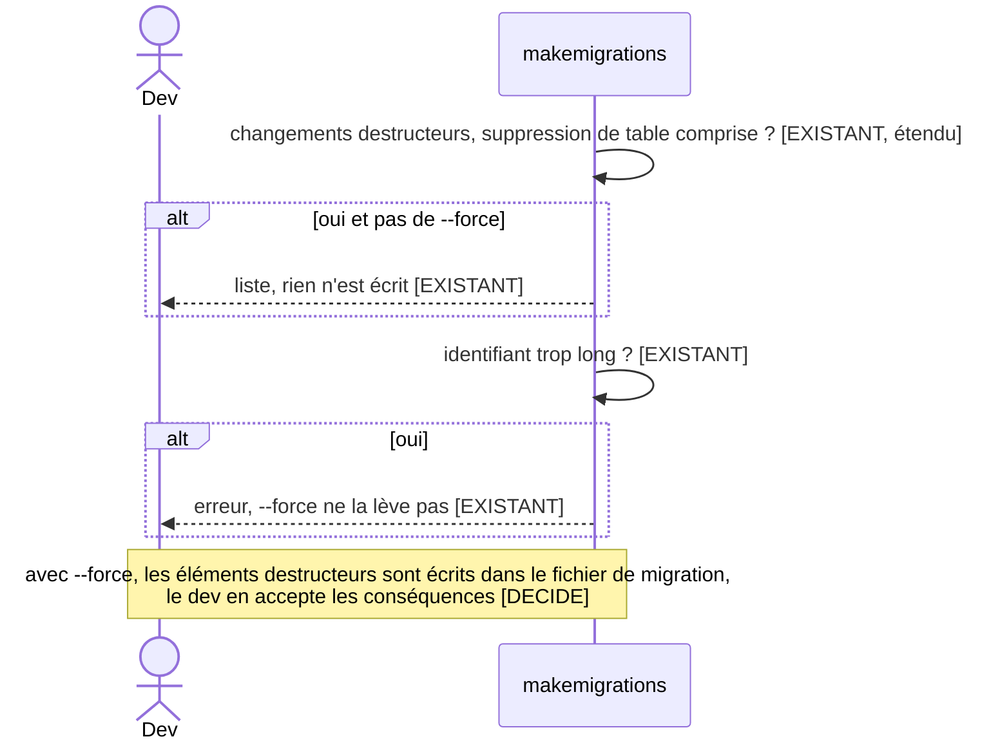
```mermaid
sequenceDiagram
    actor D as Dev
    participant MM as makemigrations
    MM->>MM: changements destructeurs, suppression de table comprise ? [EXISTANT, étendu]
    alt oui et pas de --force
        MM-->>D: liste, rien n'est écrit [EXISTANT]
    end
    MM->>MM: identifiant trop long ? [EXISTANT]
    alt oui
        MM-->>D: erreur, --force ne la lève pas [EXISTANT]
    end
    Note over MM,D: avec --force, les éléments destructeurs sont écrits dans le fichier de migration,<br/>le dev en accepte les conséquences [DECIDE]
```

### 1.10 Table en pause

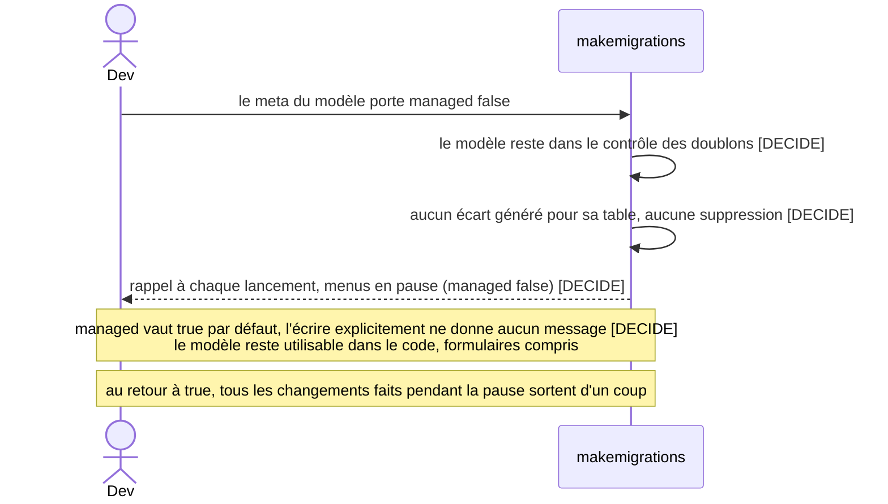
```mermaid
sequenceDiagram
    actor D as Dev
    participant MM as makemigrations
    D->>MM: le meta du modèle porte managed false
    MM->>MM: le modèle reste dans le contrôle des doublons [DECIDE]
    MM->>MM: aucun écart généré pour sa table, aucune suppression [DECIDE]
    MM-->>D: rappel à chaque lancement, menus en pause (managed false) [DECIDE]
    Note over MM,D: managed vaut true par défaut, l'écrire explicitement ne donne aucun message [DECIDE]<br/>le modèle reste utilisable dans le code, formulaires compris
    Note over MM,D: au retour à true, tous les changements faits pendant la pause sortent d'un coup
```

### 1.11 Modèle que le lecteur ne voit pas

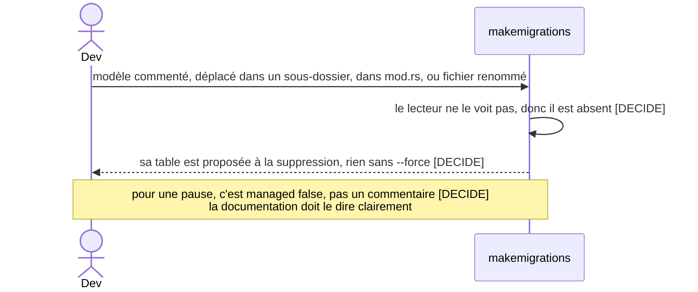
```mermaid
sequenceDiagram
    actor D as Dev
    participant MM as makemigrations
    D->>MM: modèle commenté, déplacé dans un sous-dossier, dans mod.rs, ou fichier renommé
    MM->>MM: le lecteur ne le voit pas, donc il est absent [DECIDE]
    MM-->>D: sa table est proposée à la suppression, rien sans --force [DECIDE]
    Note over MM,D: pour une pause, c'est managed false, pas un commentaire [DECIDE]<br/>la documentation doit le dire clairement
```

---

## Ligne 2 : générer

### 2.1 Lot normal

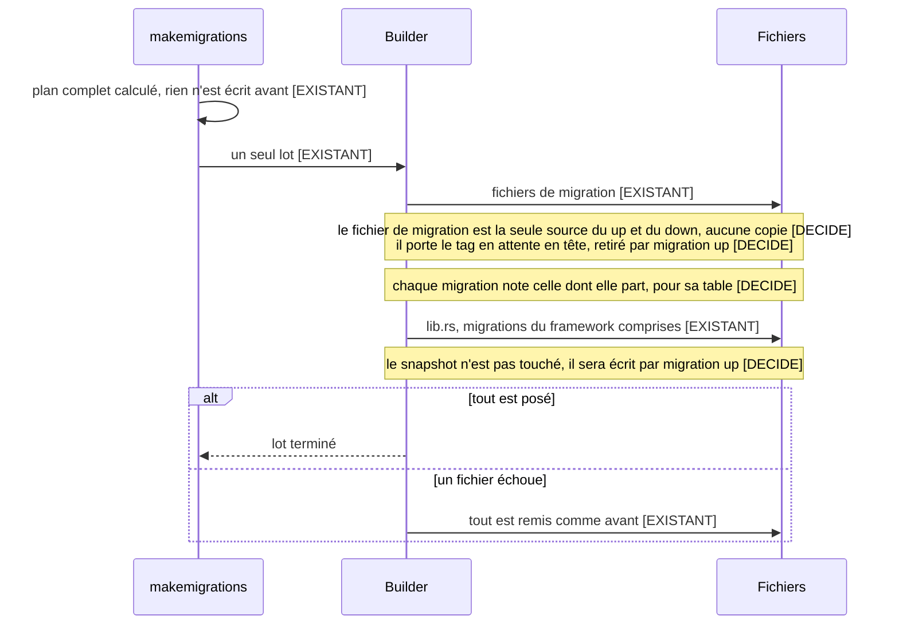
```mermaid
sequenceDiagram
    participant MM as makemigrations
    participant BA as Builder
    participant F as Fichiers
    MM->>MM: plan complet calculé, rien n'est écrit avant [EXISTANT]
    MM->>BA: un seul lot [EXISTANT]
    BA->>F: fichiers de migration [EXISTANT]
    Note over BA,F: le fichier de migration est la seule source du up et du down, aucune copie [DECIDE]<br/>il porte le tag en attente en tête, retiré par migration up [DECIDE]
    Note over BA,F: chaque migration note celle dont elle part, pour sa table [DECIDE]
    BA->>F: lib.rs, migrations du framework comprises [EXISTANT]
    Note over BA,F: le snapshot n'est pas touché, il sera écrit par migration up [DECIDE]
    alt tout est posé
        BA-->>MM: lot terminé
    else un fichier échoue
        BA->>F: tout est remis comme avant [EXISTANT]
    end
```

### 2.2 Projet existant

Rien à convertir : les snapshots et les fichiers de migration restent tels quels.

### 2.3 Coupure pendant l'écriture

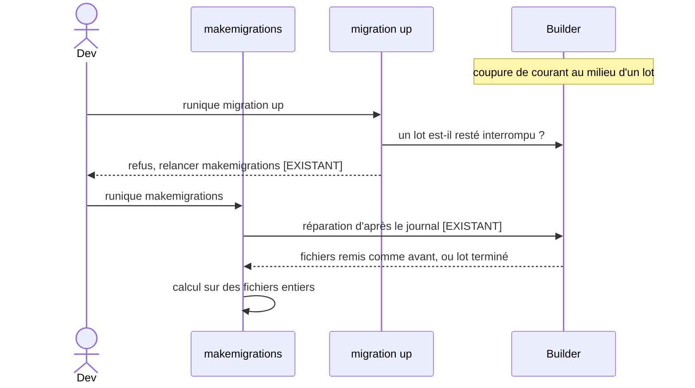
```mermaid
sequenceDiagram
    actor D as Dev
    participant MM as makemigrations
    participant UP as migration up
    participant BA as Builder
    Note over BA: coupure de courant au milieu d'un lot
    D->>UP: runique migration up
    UP->>BA: un lot est-il resté interrompu ?
    UP-->>D: refus, relancer makemigrations [EXISTANT]
    D->>MM: runique makemigrations
    MM->>BA: réparation d'après le journal [EXISTANT]
    BA-->>MM: fichiers remis comme avant, ou lot terminé
    MM->>MM: calcul sur des fichiers entiers
```

### 2.4 Forme et ordre des instructions

```mermaid
sequenceDiagram
    participant MM as makemigrations
    participant CR as migration générée
    Note over MM,CR: aujourd'hui, du texte poussé dans un ordre fixe en 11 étapes [EXISTANT]
    MM->>MM: liste d'instructions, chacune avec son inverse et son caractère destructeur ou non [DECIDE]
    MM->>MM: instructions destructrices en dernier [DECIDE]
    Note over MM: en gardant les contraintes d'ordre (une clé ou un index part avant sa colonne)
    MM->>CR: up = la liste dans l'ordre, down = les inverses dans l'ordre contraire
    Note over MM,CR: un retour arrière reprend à partir d'un rang donné de la liste [DECIDE]<br/>liste conçue ouverte pour y ajouter le plusieurs-à-plusieurs en 4.2
```

### 2.5 Suppression écrite et pas encore appliquée

```mermaid
sequenceDiagram
    actor D as Dev
    participant MM as makemigrations
    participant F as Fichiers
    MM->>F: migration drop avec le tag en attente, le snapshot de la table reste
    D->>MM: relance avant migration up
    MM->>MM: calcul à partir du snapshot
    alt le modèle est toujours absent
        MM-->>D: le calcul redonne la même suppression, rien n'est réécrit [DECIDE]
    else le modèle est revenu entre-temps (Ctrl+Z)
        MM->>F: l'écart est nul, la migration de suppression en attente est retirée [DECIDE]
    end
```

---

## Ligne 3a : restaurer en revenant en arrière

### 3a.1 PostgreSQL

```mermaid
sequenceDiagram
    participant CR as crate migration
    participant DB as Base
    CR->>DB: BEGIN, une seule transaction pour tout le lancement [DECIDE]
    loop pour chaque migration en attente
        CR->>DB: instructions de up()
        CR->>DB: inscription dans seaql_migrations
    end
    alt tout passe
        CR->>DB: COMMIT
    else une instruction échoue
        CR->>DB: annulation de tout le lancement [DECIDE]
    end
    Note over CR,DB: aujourd'hui, une transaction par migration : les précédentes restent appliquées [EXISTANT]
```

### 3a.2 SQLite

```mermaid
sequenceDiagram
    participant CR as crate migration
    participant DB as Base
    CR->>DB: instructions de up(), sans transaction par défaut [EXISTANT]
    Note over CR,DB: une seule transaction pour tout le lancement, si l'essai passe [DECIDE]
    alt colonne modifiée
        CR->>CR: instruction sautée, un commentaire dans le fichier [EXISTANT]
        Note over CR,DB: visé : élément destructeur, bloqué sans --force avec le risque expliqué,<br/>puis table reconstruite (créer, copier, supprimer, renommer) [DECIDE]
    else clé étrangère ajoutée ou retirée sur une table existante
        CR->>CR: arrêt brutal dans sea-query, aucun garde [EXISTANT]
        Note over CR,DB: visé, la table est reconstruite, par le chemin propre à SQLite [DECIDE]
    end
    CR->>DB: inscription dans seaql_migrations
```

### 3a.3 MySQL, compensation

```mermaid
sequenceDiagram
    participant CR as exécuteur de Runique
    participant J as Journal d'instructions
    participant H as Liste d'instructions de la migration
    participant DB as Base
    loop instructions non destructrices
        CR->>DB: instruction
        CR->>J: instruction faite
    end
    Note over CR,J: point de non-retour, première instruction destructrice [DECIDE]
    loop instructions destructrices
        CR->>DB: instruction
        CR->>J: instruction faite
    end
    alt panne avant le point de non-retour
        CR->>J: lecture de ce qui a été fait
        CR->>H: inverse de chaque instruction déjà faite
        CR->>DB: instructions inverses, de la dernière faite à la première
    else panne après
        CR->>J: lecture de ce qui reste
        CR->>DB: suite des instructions
    else panne entre une instruction et sa ligne de journal
        CR->>DB: la colonne, l'index existe-t-il ? (has_column, has_index)
        DB-->>CR: la réponse dit si l'instruction est passée
    end
    CR->>DB: inscription dans seaql_migrations
    Note over CR,DB: erreur pendant l'exécution = compensation tout de suite<br/>coupure brutale = au migration up suivant, avant toute autre chose
    Note over CR,DB: si la compensation échoue, message clair sur ce qui n'a pas pu être défait [DECIDE]
    Note over CR,DB: rien de tout cela n'existe aujourd'hui [EXISTANT : aucun]
```

### 3a.4 Contrôles sur les données avant d'appliquer

Décidé le 2026-11-19 : aucun contrôle à l'avance. Si des données empêchent une migration, la base
renvoie l'erreur, et la migration est annulée par la transaction ou par la compensation.

### 3a.5 Après le lancement, et la coupure de courant

```mermaid
sequenceDiagram
    participant UP as migration up
    participant J as Journal
    participant F as Fichiers
    participant DB as Base
    UP->>J: migrations de ce lancement notées avant de commencer [DECIDE]
    UP->>DB: le lancement est appliqué, tout ou rien
    alt il a réussi
        UP->>F: snapshots des tables touchées retranscrits depuis les entités [DECIDE]
        opt une migration renommait une table (rename_to)
            UP->>F: fichier du modèle mis à jour [DECIDE]
        end
        opt une migration supprimait une table
            UP->>F: snapshot de cette table retiré [DECIDE]
        end
        UP->>J: journal effacé
    else il a échoué
        Note over UP,F: aucun snapshot n'est touché [DECIDE]
    end
    Note over UP,J: coupure entre la validation de la base et l'écriture des snapshots :<br/>au lancement suivant, le journal le dit, seaql_migrations confirme, et les snapshots sont écrits [DECIDE]
    Note over UP,F: si le modèle a changé entre makemigrations et migration up,<br/>le snapshot retranscrit est faux, la documentation doit le dire [DECIDE]
```

### 3a.6 migration down

```mermaid
sequenceDiagram
    actor D as Dev
    participant DN as migration down
    participant BA as Builder
    participant F as Fichiers
    participant DB as Base
    D->>DN: runique migration down
    DN->>F: migration la plus récente du projet, tag en attente ou non [DECIDE]
    alt elle n'est pas appliquée
        DN->>BA: un seul lot
        BA->>F: fichier de migration supprimé, ligne retirée de lib.rs [DECIDE]
    else elle est appliquée
        alt PostgreSQL
            DN->>DB: down dans une transaction, ouverte par SeaORM [EXISTANT]
        else SQLite
            DN->>DB: down dans une transaction, ouverte par Runique [DECIDE]
        else MySQL
            DN->>DB: down instruction par instruction, compensation en cas de panne [DECIDE]
        end
        alt le down réussit
            DN->>F: snapshot ramené à l'état d'avant, par le même down appliqué au snapshot [DECIDE]
            DN->>BA: un seul lot
            BA->>F: fichier de migration supprimé, ligne retirée de lib.rs [DECIDE]
        else le down échoue
            DN-->>D: erreur, aucun fichier n'est touché
        end
    end
    Note over D,F: l'entité n'est jamais remise à son état d'origine, au dev de la reprendre [DECIDE]
    Note over DN,DB: aujourd'hui la commande passe la main à la crate et ne touche à aucun fichier [EXISTANT]
```

---

## Ligne 3b : restaurer en reconstruisant depuis une base existante

**Hors de la 4.1.** Commande `runique import-db`, prévue en 4.2 ou 4.3. Les séquences ci-dessous
décrivent ce qui est décidé pour elle. La documentation devra dire clairement que le typage est
à refaire à la main.

### 3b.1 Une commande à part

```mermaid
sequenceDiagram
    actor D as Dev
    participant CLI as runique import-db
    participant MM as makemigrations
    D->>CLI: runique import-db [DECIDE]
    Note over D,CLI: c'est le dev qui demande la reprise, aucune question en console
    D->>MM: runique makemigrations sur une base qui contient des tables inconnues
    MM-->>D: aucun changement, ces tables sont ignorées [DECIDE]
    Note over MM: makemigrations ne déclenche jamais la reprise [DECIDE]
```

### 3b.2 Lecture du schéma

```mermaid
sequenceDiagram
    participant MM as runique import-db
    participant DB as Base
    MM->>DB: découverte du schéma (sea-schema, une lecture par moteur)
    DB-->>MM: tables, colonnes avec leur type, clés, index
    MM->>MM: tables écartées : seaql_migrations et celles du framework
    Note over MM,DB: toutes les autres sont reprises [DECIDE]<br/>tables de liaison plusieurs-à-plusieurs laissées de côté jusqu'à la 4.2 [DECIDE]
    Note over MM: sea-schema est déjà dans Cargo.lock, pas en dépendance directe de Runique
```

### 3b.3 Un semblant de modèle, au typage refusé

```mermaid
sequenceDiagram
    actor D as Dev
    participant MM as runique import-db
    participant F as Fichiers
    MM->>F: pour chaque colonne, le nom et le type de la base recopié tel quel [DECIDE]
    Note over MM,F: exemple, la colonne email VARCHAR(255) est écrite email varchar
    MM-->>D: modèles écrits, à reprendre à la main, puis lancer makemigrations [DECIDE]
    D->>D: lance makemigrations sans les avoir repris
    Note over D: erreur de runique_dsl, type inconnu, avec le type le plus proche [EXISTANT]
    D->>D: choisit pour chaque champ son type Runique (text, email, password...)
    Note over D,MM: la revue à la main est forcée par le lecteur, pas seulement par la documentation [DECIDE]<br/>aucun mot de passe ne reste en texte par oubli
```

### 3b.4 Écriture

```mermaid
sequenceDiagram
    participant MM as runique import-db
    participant BA as Builder
    participant F as Fichiers
    MM->>BA: un seul lot, dans src/entities
    BA->>F: src/entities/TABLE.rs
    Note over BA,F: rien n'est écrit dans migration/src à ce stade [DECIDE]
    Note over MM,F: une fois les modèles repris, le lancement suivant écrit les migrations de création<br/>par le déroulé normal (modèle sans snapshot = table à créer)
```

### 3b.5 Inscription du point de départ

Décidé le 2026-11-19 : c'est le cas 0.5. Au `migration up` qui suit la reprise et la génération des migrations, les tables
existent et correspondent, donc les migrations de création sont inscrites sans être exécutées,
et les snapshots sont retranscrits depuis les entités.
