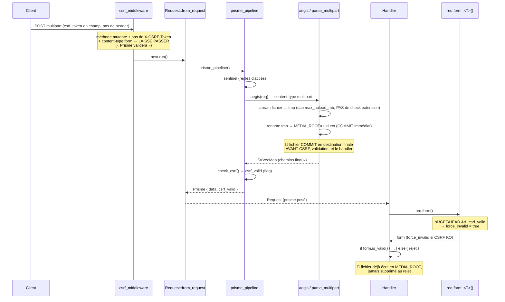

# Flux — Cycle requête, CSRF et upload

## Séquence : POST formulaire (multipart) → handler

## Points clés du flux

- **`csrf_middleware`** ([csrf.rs:40](../../runique/src/middleware/security/csrf.rs#L40)) :
  - GET/HEAD : strip `csrf_token` de l'URL (anti-fuite en query) + 302.
  - POST/PUT/DELETE/PATCH avec header `X-CSRF-Token` → valide en `ct_eq`, 403 si KO.
  - POST **form HTML sans header** → **ne valide pas**, délègue à Prisme/`form()`.
  - JSON sans header → 403 `CSRF token required`.
- **`prisme_pipeline`** ([extractor.rs:27](../../runique/src/forms/extractor.rs#L27)) : sentinel →
  aegis (parse) → `check_csrf` (flag seulement, **ne rejette pas**).
- **Enforcement réel** : `req.form()` ([template.rs:406](../../runique/src/context/template.rs#L406))
  pose `force_invalid = true` si CSRF KO → `is_save_allowed()` renvoie false.

## Anomalies / flux suspects

### 🔴 C1 — Upload COMMIT en MEDIA_ROOT avant CSRF/validation, sans auth ni check d'extension
[`parse_html.rs:166-184`](../../runique/src/utils/forms/parse_html.rs#L166)
`parse_multipart` ne fait pas que streamer en tmp : il **rename immédiatement tmp →
`MEDIA_ROOT/uuid.ext`** à la fin du parsing, et renvoie les chemins finaux. Or `parse_multipart`
tourne dans `prisme_pipeline`, exécuté par `Request::from_request` sur **toute** requête
multipart, **avant** :
- la validation CSRF (`csrf_valid` calculé après `aegis`),
- la validation du formulaire (`is_valid`),
- le check d'extension (qui vit dans `FileField::validate`, plus tard).

Conséquences :
1. **Écriture de fichier non authentifiée** sur tout endpoint public extrayant `Request` et
   acceptant du multipart : le fichier est commité en MEDIA_ROOT quoi qu'il arrive.
2. **Aucun filtre d'extension** à ce stade (seulement la taille) → un `.html`/`.svg`/`.js`
   peut atterrir dans MEDIA_ROOT ; si MEDIA_ROOT est servi en statique, risque de **stored
   XSS**/contenu hostile selon le content-type servi.
3. **Remplissage disque** non authentifié (borné `max_upload_mb` par fichier, mais répétable).
Seules les routes admin sont protégées car `admin_required` (middleware) s'exécute **avant**
l'extraction `Request`. Les routes publiques n'ont pas ce filet.

### 🟠 C2 — CSRF des forms HTML repose entièrement sur `req.form()` (footgun)
`csrf_middleware` laisse passer un POST form sans header, et `prisme_pipeline` ne rejette
pas : seul `req.form()` pose `force_invalid`. Un handler qui lit **`req.prisme.data`
directement** (sans passer par `form()` + `is_valid()`) **contourne entièrement la CSRF**.
Rien n'empêche ce chemin. (Les handlers admin se protègent via un `check_csrf` explicite ;
les handlers utilisateurs n'ont pas ce filet.) → fail-closed structurel manquant.

### 🔴 C3 — Aucun rollback du fichier commité quand la requête est rejetée
Corollaire de C1 : comme le commit est **eager** (rename en MEDIA_ROOT pendant le parse),
un rejet ultérieur (CSRF KO, honeypot, `is_valid()` faux, erreur handler) laisse le fichier
**définitivement** en MEDIA_ROOT. Il n'existe aucun chemin de compensation (« unlink si la
requête échoue »). Le parsing devrait écrire en **staging** et ne committer qu'après succès
CSRF + validation (vraie sémantique `finalize()`), ou bien le handler doit nettoyer sur
chaque chemin d'échec. Rejoint l'historique « ancien fichier non supprimé auto ».

### 🟡 C4 — `csrf_gate` : module possiblement mort / commentaire trompeur
`forms/prisme/csrf_gate.rs` existe et `form.rs:194` dit « CSRF already validated upstream by
csrf_gate (Prisme) », mais `prisme_pipeline` appelle `check_csrf` inline (extractor.rs), pas
`csrf_gate`. Soit `csrf_gate` est du code mort, soit un second chemin existe → à clarifier
(confusion = risque de réintroduire un trou en « nettoyant »).

### 🟡 C5 — Méthodes sûres : seuls GET/HEAD exemptés
`check_csrf` et `csrf_middleware` exemptent GET/HEAD mais traitent OPTIONS/TRACE comme
mutants. Sans impact courant (pas de form sur OPTIONS), mais à acter.
