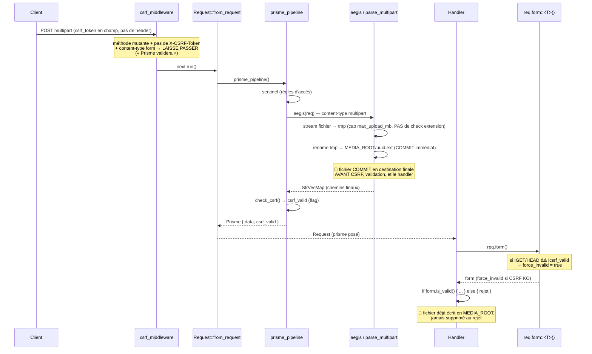

# Flux — Cycle requête, CSRF et upload

## Séquence : POST formulaire (multipart) → handler

## Points clés du flux

- **`csrf_middleware`** ([csrf.rs:40](../../runique/src/middleware/security/csrf.rs#L40)) :
  - GET/HEAD : strip `csrf_token` de l'URL (anti-fuite en query) + 302.
  - POST/PUT/DELETE/PATCH avec header `X-CSRF-Token` → valide en `ct_eq`, 403 si KO.
  - POST **form HTML sans header** → **ne valide pas**, délègue à Prisme/`form()`.
  - JSON sans header → 403 `CSRF token required`.
- **`prisme_pipeline`** ([extractor.rs:27](../../runique/src/forms/extractor.rs#L27)) : sentinel →
  aegis (parse) → `check_csrf` (flag seulement, **ne rejette pas**).
- **Enforcement réel** : `req.form()` ([template.rs:406](../../runique/src/context/template.rs#L406))
  pose `force_invalid = true` si CSRF KO → `is_save_allowed()` renvoie false.

## Anomalies / flux suspects

### 🔴 C1 — Upload COMMIT en MEDIA_ROOT avant CSRF/validation — ✅ CORRIGÉ
**Corrigé (2.1.21).** `parse_multipart` écrit désormais en **staging** `.staging-{uuid}` (non
servi) ; `FileField::finalize` est le seul committer (après CSRF + validation). Description du
problème d'origine ci-dessous (conservée pour mémoire) :
[`parse_html.rs:166-184`](../../runique/src/utils/forms/parse_html.rs#L166)
`parse_multipart` ne fait pas que streamer en tmp : il **rename immédiatement tmp →
`MEDIA_ROOT/uuid.ext`** à la fin du parsing, et renvoie les chemins finaux. Or `parse_multipart`
tourne dans `prisme_pipeline`, exécuté par `Request::from_request` sur **toute** requête
multipart, **avant** :
- la validation CSRF (`csrf_valid` calculé après `aegis`),
- la validation du formulaire (`is_valid`),
- le check d'extension (qui vit dans `FileField::validate`, plus tard).

Conséquences :
1. **Écriture de fichier non authentifiée** sur tout endpoint public extrayant `Request` et
   acceptant du multipart : le fichier est commité en MEDIA_ROOT quoi qu'il arrive.
2. **Aucun filtre d'extension** à ce stade (seulement la taille) → un `.html`/`.svg`/`.js`
   peut atterrir dans MEDIA_ROOT ; si MEDIA_ROOT est servi en statique, risque de **stored
   XSS**/contenu hostile selon le content-type servi.
3. **Remplissage disque** non authentifié (borné `max_upload_mb` par fichier, mais répétable).
Seules les routes admin sont protégées car `admin_required` (middleware) s'exécute **avant**
l'extraction `Request`. Les routes publiques n'ont pas ce filet.

### 🟠 C2 — CSRF des forms HTML reposait entièrement sur `req.form()` (footgun) — ✅ CORRIGÉ
**Corrigé (2.1.21).** `Prisme::data` est passé en `pub(crate)` : le code tiers ne peut plus
lire le corps brut hors CSRF. Seuls `req.form()` et `req.prisme.checked_data()` (fail-closed,
renvoie `None` si CSRF KO — pour les endpoints API/AJAX) exposent le corps. La politique de
méthode CSRF est centralisée dans `csrf_required()` (source unique, partagée par le pipeline
et `form()`). Audit interne clean (admin/login/`form()` gardent tous la CSRF avant `.data`).

### 🔴 C3 — Aucun rollback du fichier commité quand la requête est rejetée — ✅ CORRIGÉ
**Corrigé (2.1.21).** Conséquence de C1, résolue par le même fix : le staging non commité est
purgé par `sweep_stale_staging` (TTL), échecs tracés (jamais avalés). Plus de fichier orphelin
en MEDIA_ROOT après un rejet (CSRF/honeypot/validation).

### 🟡 C4 — `csrf_gate` : module mort / commentaire trompeur — ✅ CORRIGÉ
**Corrigé (2.1.21).** Le module `csrf_gate` était vide (poids mort) ; la logique est dans
`extractor::check_csrf`. Module supprimé (fichier + `pub mod` + tombstone test) et commentaire
`form.rs:194` corrigé pour pointer le vrai chemin.

### 🟡 C5 — Méthodes sûres : seuls GET/HEAD exemptés — ✅ DURCI
**Durci (2.1.21).** Politique CSRF par méthode collapsée en source unique `csrf_required()`
(GET/HEAD exemptés, tout le reste exige un token, fail-closed), partagée par le pipeline et
`Request::form()` → plus de dérive possible entre les deux sites. Comportement identique.
