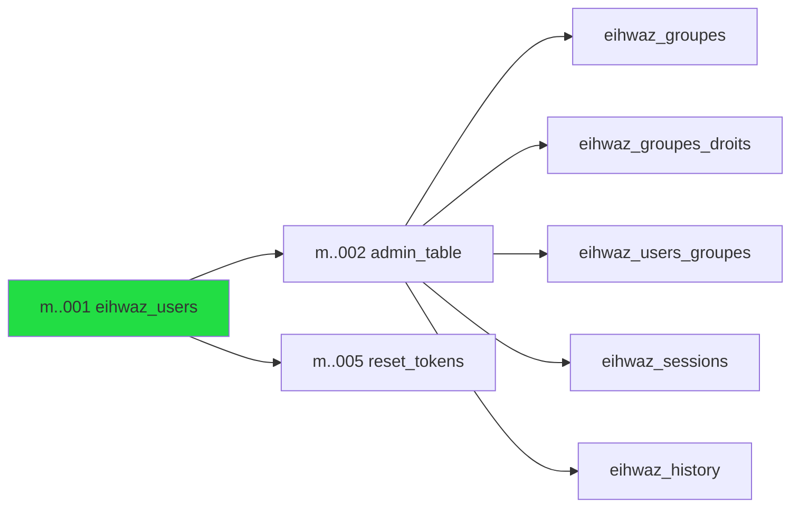

# Merise — Modèle de données framework (`eihwaz_*`)

Tables natives du framework, définies dans
[`runique/src/admin/table_admin/migrations_table.rs`](../../runique/src/admin/table_admin/migrations_table.rs).
Le nom de la table utilisateur est paramétrable via `RUNIQUE_USER_TABLE` (défaut `eihwaz_users`).

## MCD (conceptuel)

```mermaid
erDiagram
    USER ||--o{ USER_GROUPE : "appartient à"
    GROUPE ||--o{ USER_GROUPE : "regroupe"
    GROUPE ||--o{ GROUPE_DROIT : "possède"
    USER ||--o{ SESSION : "ouvre"
    USER ||--o{ RESET_TOKEN : "demande"
    USER }o..o{ HISTORY : "trace (réf. faible)"

    USER {
        pk id
        string username UK
        string email UK
        string password
        bool is_active
        bool is_staff
        bool is_superuser
        datetime created_at
        datetime updated_at
    }
    GROUPE {
        int id PK
        string nom UK
    }
    GROUPE_DROIT {
        int groupe_id FK
        string resource_key
        bool can_create
        bool can_read
        bool can_update
        bool can_delete
        bool can_update_own
        bool can_delete_own
    }
    USER_GROUPE {
        pk user_id FK
        int groupe_id FK
    }
    SESSION {
        int id PK
        string cookie_id UK
        pk user_id FK
        string session_id
        text session_data
        datetime expires_at
    }
    HISTORY {
        bigint id PK
        string resource_key
        string object_pk
        string action
        pk user_id
        string username
        datetime created_at
        text summary
        string batch_id
    }
    RESET_TOKEN {
        bigint id PK
        string token_hash UK
        pk user_id FK
        datetime expires_at
    }
```

## MLD (logique relationnel)

| Table | PK | Colonnes | FK | Contraintes |
|-------|----|----|----|------------|
| `eihwaz_users` | `id` (int/bigint¹) | username, email, password, is_active, is_staff, is_superuser, created_at?, updated_at? | — | username UNIQUE, email UNIQUE |
| `eihwaz_groupes` | `id` (int) | nom | — | nom UNIQUE |
| `eihwaz_groupes_droits` | (`groupe_id`,`resource_key`) | can_create/read/update/delete/update_own/delete_own | groupe_id → groupes.id **CASCADE** | PK composite |
| `eihwaz_users_groupes` | (`user_id`,`groupe_id`) | — | user_id → user_table.id **CASCADE**, groupe_id → groupes.id **CASCADE** | PK composite |
| `eihwaz_sessions` | `id` (int) | cookie_id, user_id, session_id, session_data?, expires_at | user_id → user_table.id **CASCADE** | cookie_id UNIQUE |
| `eihwaz_history` | `id` (bigint) | resource_key, object_pk, action, user_id, username, created_at, summary?, batch_id? | **aucune** | — |
| `eihwaz_reset_tokens` | `id` (bigint) | token_hash, user_id, expires_at | user_id → user_table.id **CASCADE** | token_hash UNIQUE |

¹ `id`/`user_id` = `bigint` si feature `big-pk`, sinon `integer`.

> **`resource_key` = référence molle (sans FK).** Dans `eihwaz_groupes_droits`, `resource_key`
> pointe vers une clé du **registry en code** (pas une table `ressources`), donc la DB ne peut pas
> en garantir l'intégrité → droits orphelins possibles si une ressource est renommée/supprimée.
> Fermé côté applicatif par `prune_orphan_droits` au **boot** (supprime les droits dont
> `resource_key ∉ registry`). Côté présentation, un droit est éditable comme **ressource enfant
> scopée** du groupe (`/groupes/{id}/droits/…`) sans changement de schéma.

## Ordre de création (migrations clé-en-main)



`AdminTableMigration::up` crée dans l'ordre : groupes → groupes_droits → users_groupes →
sessions → history. `eihwaz_users` et `eihwaz_reset_tokens` ont leurs propres migrations.

## Anomalies / flux suspects (couche données)

### 🔴 D1 — Incohérence de type sur `eihwaz_users_groupes.user_id` (feature `big-pk`) — ✅ CORRIGÉ
**Corrigé (2.1.21).** Le bloc conditionnel `#[cfg(feature = "big-pk")]` (BIGINT/INTEGER) a été
appliqué à `eihwaz_users_groupes.user_id`, aligné sur `sessions`/`history`/`reset_tokens`. La FK
est désormais de type cohérent avec `eihwaz_users.id` sous `big-pk`.
[`migrations_table.rs:184`](../../runique/src/admin/table_admin/migrations_table.rs#L184)
Problème d'origine : `user_id` codé en dur `.integer()` → FK incompatible avec `eihwaz_users.id`
BIGINT sous `big-pk` (échec de création FK sur Postgres strict).

### 🟠 D2 — `eihwaz_history.user_id` sans FK : décision implicite
[`migrations_table.rs:283-319`](../../runique/src/admin/table_admin/migrations_table.rs#L283)
Aucune FK sur `history.user_id` (contrairement à sessions/reset_tokens en CASCADE).
C'est probablement **voulu** (l'historique doit survivre à la suppression d'un user, sinon
le CASCADE effacerait l'audit). Mais c'est implicite et non documenté → à acter comme choix
de design, sinon quelqu'un « corrigera » en ajoutant un CASCADE qui détruirait l'audit.

### 🟠 D3 — Index manquants sur les colonnes de requête fréquentes
- `eihwaz_history` : filtres/vues par `resource_key`, `object_pk`, `batch_id`
  ([handle history dans router]) → **table scan**, aucun index.
- `eihwaz_sessions.user_id` : `invalidate_other_sessions()` filtre par `user_id` → scan.
- `eihwaz_reset_tokens` : purge par `expires_at` → scan.
Latent perf, s'aggrave avec le volume. À confirmer dans les flux (03).

### 🟡 D4 — `session_id` vs `cookie_id` : deux identifiants, sémantique à clarifier
`eihwaz_sessions` porte `cookie_id` (UNIQUE) **et** `session_id` (non unique). Le flux session
(voir 03) doit confirmer lequel est l'identifiant d'opposabilité et pourquoi deux. Risque de
collision/confusion déjà rencontré historiquement (collision `cookie_id` résolue en 2.1.19).
