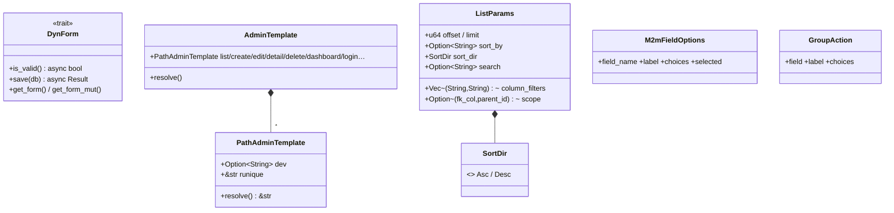
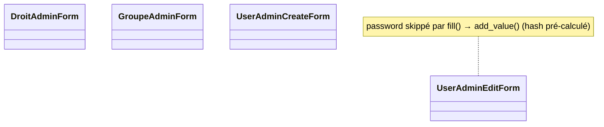
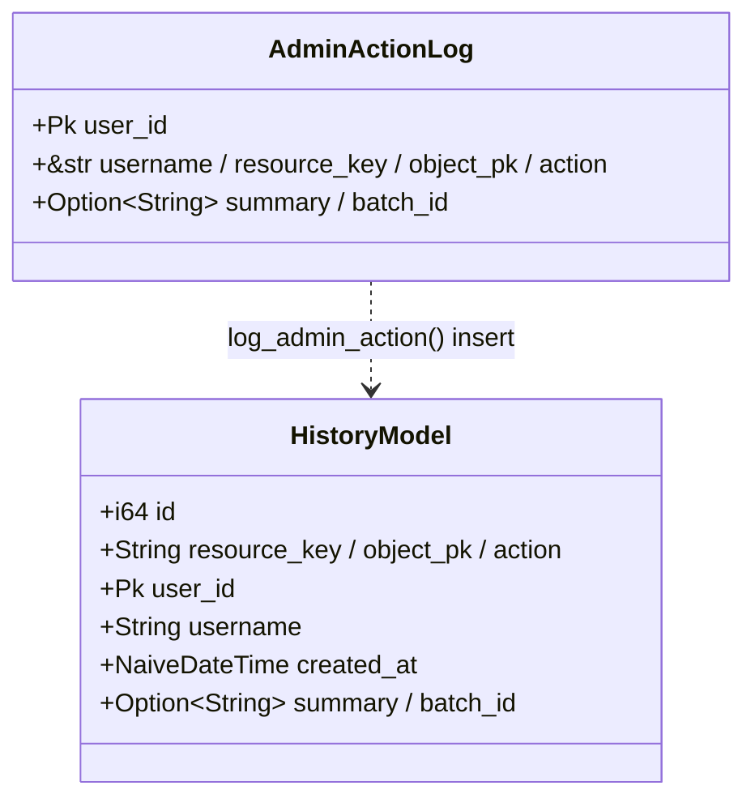
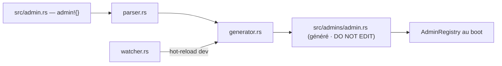

# UML — Admin : daemon, helper, forms admin, history

Complément de [admin-resource-permissions.md](admin-resource-permissions.md).

## Helper (templates, dyn form, params liste)

[`admin/helper/`](../../../runique/src/admin/helper/)

`DynForm` = effacement de type pour stocker des forms hétérogènes dans `ResourceEntry`
(le `FormBuilder` renvoie `Box<dyn DynForm>`). `PathAdminTemplate.dev` permet d'override le
template Runique par un template projet (dev prioritaire).

### Surcharge de template — clés de contexte obligatoires (le contrat)

Override d'un template via `template_list()/template_create()/…` sur `AdminResource` (ou le bloc
`admin!{}`). Le template custom **doit** consommer les clés ci-dessous — elles sont injectées par
`inject_context` (commun) + le handler de l'action. Source : `admin_main/mod.rs` (`inject_context`),
`handle_list.rs`, `handle_crud.rs`.

**Communes à TOUS les templates admin** (via `inject_context`) :

| Clé | Type / contenu | Usage |
|-----|----------------|-------|
| `resource` | `AdminResource` (`.key`, `.title`, `.display`) | titres, colonnes |
| `resource_base` | `String` — base d'URL **scope-aware** | ⚠️ **toute** URL d'action : `{{ resource_base }}/create`, `.../{id}/edit`… |
| `resource_key` / `current_resource` | `&str` | état nav, checks perms |
| `resources` | `Vec<AdminResource>` (= `visible_to`) | menu latéral |
| `can_create/read/update/delete/update_own/delete_own` | `bool` | gate des boutons (UI = politique serveur) |
| `group_actions` | `Vec<GroupAction>` | actions groupées |
| `parent_key` / `parent_id` / `parent_title` / `parent_base` | `Option`/`String` | breadcrumb parent (nested) ; `parent_key` = null en flat |
| `admin_prefix`, `site_title`, `site_url`, `lang` | `String` | chrome + liens fixes (login/logout/history) |
| `admin_*` (i18n) | `String` | libellés (`admin_list_btn_edit`, …) |

**Spécifiques par action :**

| Template | Clés obligatoires en plus |
|----------|---------------------------|
| **list** | `entries` `Vec<Value>` · `total` `page` `page_count` `has_prev/next` `prev_page/next_page` · `visible_columns` `Vec<String>` · `column_labels` `Map` · `sort_by` `sort_dir` `sort_dir_toggle` · `search` `filter_values` `active_filters` `filter_qs` `filter_meta` `return_qs` · `rich_fields` |
| **create** | `form_fields` (`Forms`) · `is_edit=false` · `m2m_fields` (opt) |
| **edit** | `form_fields` · `is_edit=true` · `object_id` (**id local**) · `return_qs` · `orig_updated_at` (opt) · `m2m_fields` (opt) |
| **detail** | `entry` `Value` · `object_id` · `rich_fields` · `m2m_fields` (opt) · `inlines` `Vec<InlineList>` (opt, sous-listes enfants scopés) |
| **delete** | `entry` `Value` · `object_id` |

Règles :

- **Jamais** coder `{{ admin_prefix }}/{{ resource.key }}/…` en dur → utiliser `{{ resource_base }}`
  (gère flat **et** nested, id local vs composite). C'est LA source unique des URLs.
- Les URLs d'un membre utilisent **`object_id`** (id local), pas `entry.id` (qui peut être un id
  composite `"{parent}:{local}"` pour un enfant jonction).
- Les boutons doivent être gatés par les `can_*` correspondants (le serveur ré-applique de toute
  façon, mais l'UI ne doit pas afficher une action interdite).

## Forms admin builtin

[`admin/forms/mod.rs`](../../../runique/src/admin/forms/mod.rs)

## History (audit `eihwaz_history`)

[`admin/history.rs`](../../../runique/src/admin/history.rs)

## Daemon admin (génération de code)

[`admin/daemon/`](../../../runique/src/admin/daemon/) — fonctions (pas de struct) :

Routes émises par `routes()` : deux plates `/{resource}/{action}` + `/{resource}/{id}/{action}`
et **deux imbriquées** `/{parent}/{parent_id}/{resource}/[{id}/]{action}` (cf. ressources enfant
scopées). `count_fn`/`list_fn` générés portent le param/champ `scope`.

## Anomalies / flux suspects

### 🟢 `log_admin_action` désormais tracé (rappel)
L'insert audit loggue son échec (`warn!`) au lieu de l'avaler — cf. correctifs tracing.

### 🟡 Rappel A1/A2 — closures `Option` + `own_field`
Voir [admin-resource-permissions.md](admin-resource-permissions.md) : closures CRUD `Option`
(no-op silencieux) et `own_field = None` (droits `*_own` inopérants sans warning).
