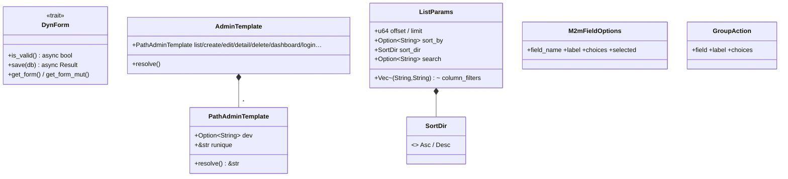
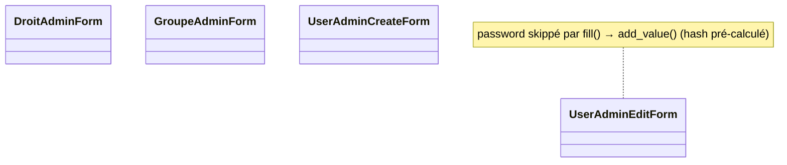
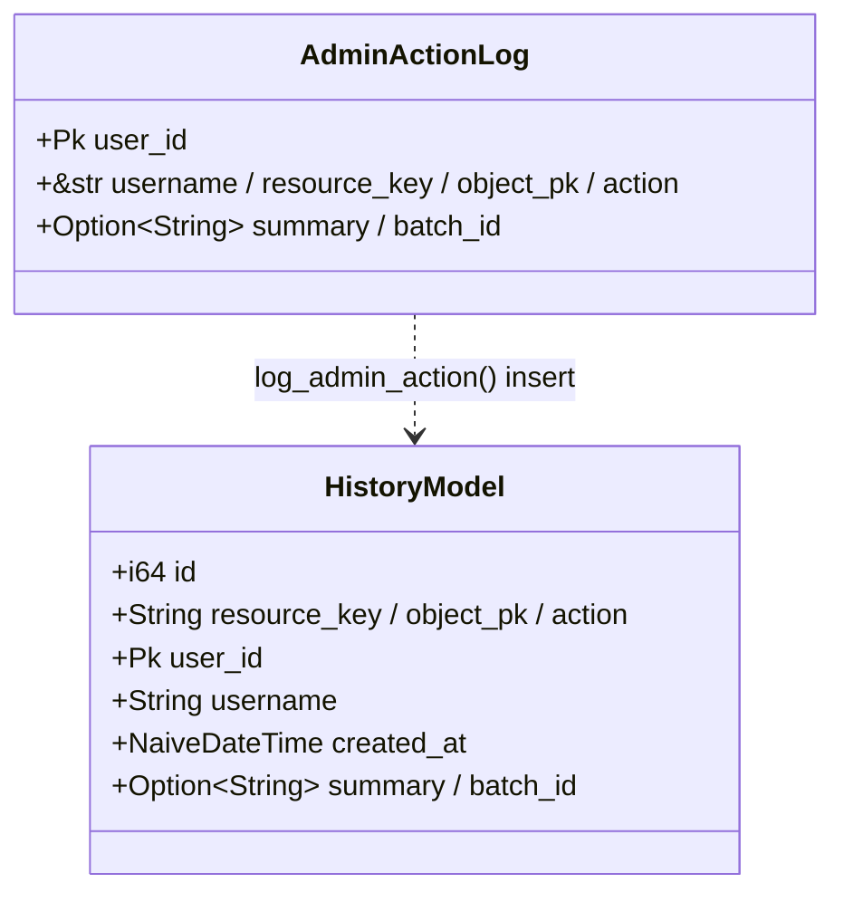

# UML — Admin : daemon, helper, forms admin, history

Complément de [admin-resource-permissions.md](admin-resource-permissions.md).

## Helper (templates, dyn form, params liste)

[`admin/helper/`](../../../runique/src/admin/helper/)



`DynForm` = effacement de type pour stocker des forms hétérogènes dans `ResourceEntry`
(le `FormBuilder` renvoie `Box<dyn DynForm>`). `PathAdminTemplate.dev` permet d'override le
template Runique par un template projet (dev prioritaire).

## Forms admin builtin

[`admin/forms/mod.rs`](../../../runique/src/admin/forms/mod.rs)



## History (audit `eihwaz_history`)

[`admin/history.rs`](../../../runique/src/admin/history.rs)



## Daemon admin (génération de code)

[`admin/daemon/`](../../../runique/src/admin/daemon/) — fonctions (pas de struct) :

```mermaid
flowchart LR
    SRC[src/admins/admin.rs admin!{}] --> PAR[parser.rs]
    PAR --> GEN[generator.rs → src/admins/generated.rs]
    GEN --> REG[AdminRegistry au boot]
    WAT[watcher.rs] -->|hot-reload dev| GEN
```

## Anomalies / flux suspects

### 🟢 `log_admin_action` désormais tracé (rappel)
L'insert audit loggue son échec (`warn!`) au lieu de l'avaler — cf. correctifs tracing.

### 🟡 Rappel A1/A2 — closures `Option` + `own_field`
Voir [admin-resource-permissions.md](admin-resource-permissions.md) : closures CRUD `Option`
(no-op silencieux) et `own_field = None` (droits `*_own` inopérants sans warning).
