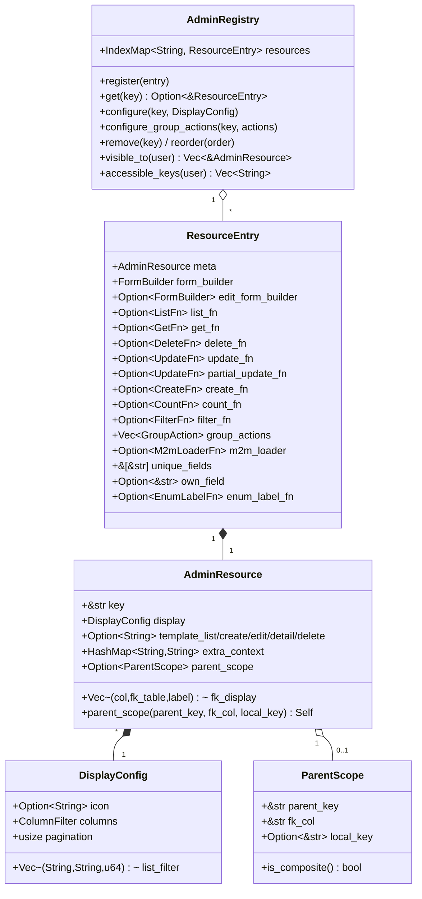
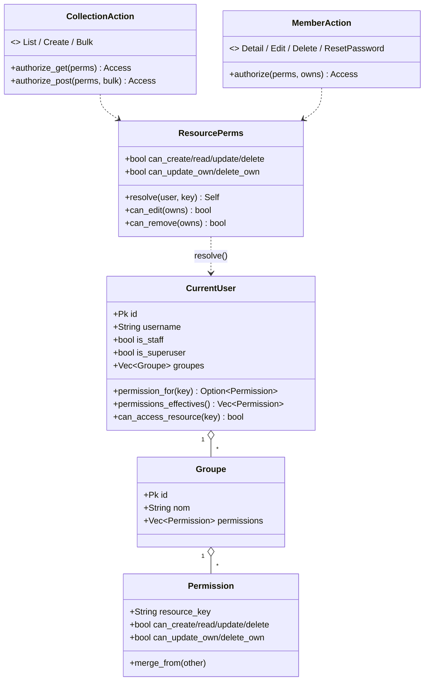
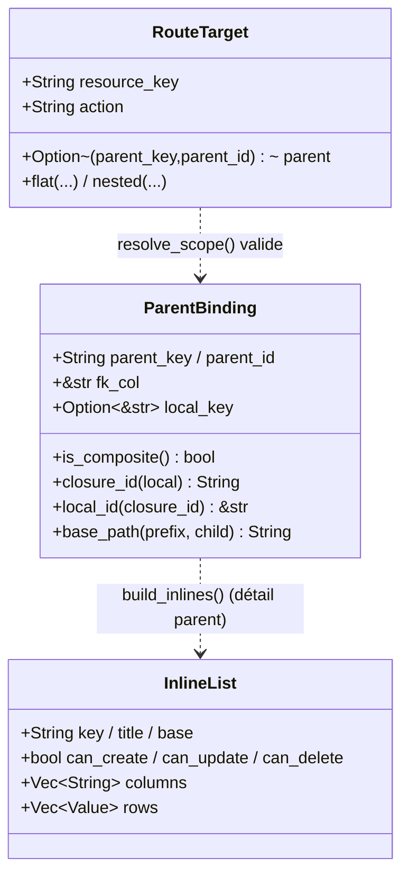

# UML — Admin : registry, resource, permissions, dispatch

## Registry & ResourceEntry

[`registry.rs`](../../../runique/src/admin/registry.rs),
[`helper/resource_entry.rs`](../../../runique/src/admin/helper/resource_entry.rs)

`ParentScope` déclare une resource comme **enfant scopé** d'une autre (atteinte via
`/{parent}/{parent_id}/{child}/…`) : la liste enfant est filtrée `WHERE fk_col = parent_id`,
le formulaire fixe/masque `fk_col`, et le détail parent la rend en sous-liste inline.
`local_key = Some(col)` = enfant composite (jonction, closure-id `"{parent_id}:{col}"`,
ex. `groupes_droits`) ; `None` = enfant à PK propre. Un enfant scopé reste visible au
top-level **et** inline (les deux coexistent) ; il n'est pas route-bloqué.

`FormBuilder`/`ListFn`/`GetFn`/`DeleteFn`/`UpdateFn`/`CreateFn`/`CountFn`/`FilterFn`/
`M2mLoaderFn` = closures `Arc<dyn Fn(...) -> BoxFuture<...>>` (effacement de type pour
stocker des resources hétérogènes dans une seule map → pattern Strategy + type erasure).

## Permissions (RBAC) & dispatch

[`permissions/mod.rs`](../../../runique/src/admin/permissions/mod.rs),
[`admin_main/action.rs`](../../../runique/src/admin/admin_main/action.rs)

## Ressources enfant scopées (nested) & intégrité

[`admin_main/mod.rs`](../../../runique/src/admin/admin_main/mod.rs),
[`admin_main/handle_inline.rs`](../../../runique/src/admin/admin_main/handle_inline.rs),
[`permissions/mod.rs`](../../../runique/src/admin/permissions/mod.rs)

Une resource déclarée `parent_scope(...)` (cf. `ParentScope` plus haut) est atteignable via
`/{parent}/{parent_id}/{child}/…` **en plus** du top-level. Les 4 handlers plats
(`admin_get/post/get_id/post_id`) et 4 handlers `admin_nested_*` délèguent tous aux **mêmes
dispatchers** — un seul chemin flat/nested.

Fonctions clés (libres, `mod.rs`) :

- `resolve_scope(meta, parent)` — valide le binding nested vs `ParentScope` (sinon 404, interdit
  `/{parent_étranger}/{id}/{child}/…`) ; un flat sur enfant scopé est **autorisé** (juste masqué
  du nav, pas route-bloqué → bypass superuser préservé).
- `ParentBinding.closure_id()/local_id()` — reconstruit/strippe l'id composite `"{parent}:{local}"`
  (enfant jonction, `local_key = Some`) → les closures CRUD restent **inchangées**.
- `verify_scope_ownership()` — garde **IDOR** pour un enfant à PK propre (`local_key = None`) :
  vérifie `row[fk_col] == parent_id` (erreur DB tracée, pas avalée).
- `force_scope_values()` / `hide_scope_fields()` (handle_crud) — **force** `fk_col = parent_id`
  depuis le path autorisé (jamais le body) + masque le champ FK/clé locale dans le form.
- `scope_base()` — base d'URL scope-aware, injectée en contexte (`resource_base`), **source unique**
  des liens templates.
- `build_inlines()` → `Vec~InlineList~` — sous-listes du détail parent (filtrées `can_read`,
  boutons gatés `can_create/update/delete`).

**Intégrité — `prune_orphan_droits(db, valid_keys)`** ([permissions/mod.rs](../../../runique/src/admin/permissions/mod.rs)) :
au **boot**, supprime les droits dont `resource_key ∉ registry` (réf. molle sans FK). Ferme la
réutilisation-de-clé → grant périmé. No-op si `valid_keys` vide (jamais tout purger).

> ⚠️ **Propriété de sécurité assumée** : `can_*` sur la resource `users` = **super-admin de fait**
> (permet de fixer `is_superuser`/`is_staff` et de s'assigner un groupe). Granularité au niveau
> resource ; pas de gate caché. Une vraie granularité « gérer sans élever » = feature niveau-champ.

## Anomalies / flux suspects

### 🟠 A1 — Toutes les closures CRUD sont `Option` → no-op silencieux
`list_fn`, `get_fn`, `create_fn`, `update_fn`, `delete_fn`… sont `Option`. Les handlers font
`match &entry.get_fn { Some(f) => …, None => None }`. Si une resource est enregistrée sans
sa closure (bug de génération du daemon), l'action **échoue en silence** (page vide / pas
d'erreur) au lieu de 501/500. À tracer : un `None` inattendu devrait logger/erreur, pas
dégrader silencieusement. (Lié à la règle « zéro erreur avalée ».)

### 🟠 A2 — `own_field = None` bloque les permissions `*_own` (sain) mais silencieux
[`resource_entry.rs:162`](../../../runique/src/admin/helper/resource_entry.rs#L162)
Si `own_field` n'est pas déclaré, `check_owns_record` renvoie toujours `false` → les droits
`can_update_own`/`can_delete_own` sont **inopérants**. C'est le défaut sûr, mais un admin qui
coche « modifier les siens » sans `own_field` déclaré ne verra **aucun effet ni avertissement**.
Candidat à un warning au boot (validation de cohérence resource).

### 🟠 A3 — `list_filter` dans `configure {}` builtin → 500 (bug connu)
Bug déjà répertorié : `list_filter` dans le bloc `configure {}` des resources builtin
provoque `Variable filter_values[col] not found in context`. `DisplayConfig.list_filter`
existe, mais le flux `configure` ne pousse pas `filter_values` dans le contexte. À confirmer
dans le flux liste admin et relier au bug connu.

### 🟡 A4 — `bulk POST` exige `can_create` (quirk préservé)
[`admin_main/action.rs`](../../../runique/src/admin/admin_main/action.rs) `authorize_post` :
un bulk edit/delete exige `can_create` **en plus** du droit d'opération. Comportement
historique préservé volontairement, mais probablement une sur-restriction non intentionnelle.
À trancher.
