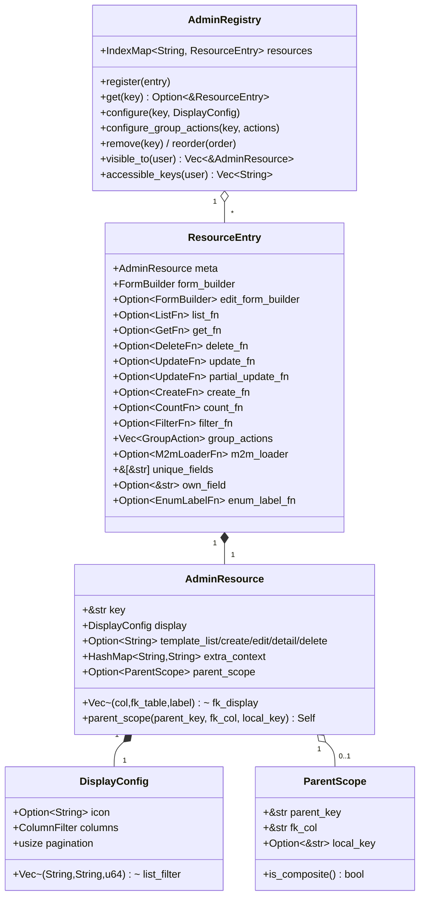
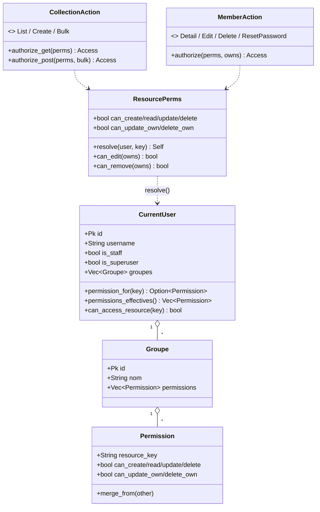
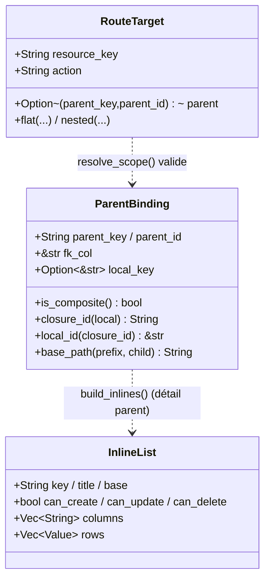

# UML — Admin : registry, resource, permissions, dispatch

## Registry & ResourceEntry

[`registry.rs`](../../../runique/src/admin/registry.rs),
[`helper/resource_entry.rs`](../../../runique/src/admin/helper/resource_entry.rs)

```mermaid
classDiagram
    class AdminRegistry {
        +IndexMap~String, ResourceEntry~ resources
        +register(entry)
        +get(key) Option~&ResourceEntry~
        +configure(key, DisplayConfig)
        +configure_group_actions(key, actions)
        +remove(key) / reorder(order)
        +visible_to(user) Vec~&AdminResource~
        +accessible_keys(user) Vec~String~
    }
    class ResourceEntry {
        +AdminResource meta
        +FormBuilder form_builder
        +Option~FormBuilder~ edit_form_builder
        +Option~ListFn~ list_fn
        +Option~GetFn~ get_fn
        +Option~DeleteFn~ delete_fn
        +Option~UpdateFn~ update_fn
        +Option~UpdateFn~ partial_update_fn
        +Option~CreateFn~ create_fn
        +Option~CountFn~ count_fn
        +Option~FilterFn~ filter_fn
        +Vec~GroupAction~ group_actions
        +Option~M2mLoaderFn~ m2m_loader
        +&[&str] unique_fields
        +Option~&str~ own_field
        +Option~EnumLabelFn~ enum_label_fn
    }
    class AdminResource {
        +&str key
        +DisplayConfig display
        +Option~String~ template_list/create/edit/detail/delete
        +HashMap~String,String~ extra_context
        +Vec~(col,fk_table,label)~ fk_display
        +Option~ParentScope~ parent_scope
        +parent_scope(parent_key, fk_col, local_key) Self
    }
    class ParentScope {
        +&str parent_key
        +&str fk_col
        +Option~&str~ local_key
        +is_composite() bool
    }
    class DisplayConfig {
        +Option~String~ icon
        +ColumnFilter columns
        +usize pagination
        +Vec~(String,String,u64)~ list_filter
    }
    AdminRegistry "1" o-- "*" ResourceEntry
    ResourceEntry "1" *-- "1" AdminResource
    AdminResource "1" *-- "1" DisplayConfig
    AdminResource "1" o-- "0..1" ParentScope
```

`ParentScope` déclare une resource comme **enfant scopé** d'une autre (atteinte via
`/{parent}/{parent_id}/{child}/…`) : la liste enfant est filtrée `WHERE fk_col = parent_id`,
le formulaire fixe/masque `fk_col`, et le détail parent la rend en sous-liste inline.
`local_key = Some(col)` = enfant composite (jonction, closure-id `"{parent_id}:{col}"`,
ex. `groupes_droits`) ; `None` = enfant à PK propre. Un enfant scopé reste visible au
top-level **et** inline (les deux coexistent) ; il n'est pas route-bloqué.

`FormBuilder`/`ListFn`/`GetFn`/`DeleteFn`/`UpdateFn`/`CreateFn`/`CountFn`/`FilterFn`/
`M2mLoaderFn` = closures `Arc<dyn Fn(...) -> BoxFuture<...>>` (effacement de type pour
stocker des resources hétérogènes dans une seule map → pattern Strategy + type erasure).

## Permissions (RBAC) & dispatch

[`permissions/mod.rs`](../../../runique/src/admin/permissions/mod.rs),
[`admin_main/action.rs`](../../../runique/src/admin/admin_main/action.rs)

```mermaid
classDiagram
    class CurrentUser {
        +Pk id
        +String username
        +bool is_staff
        +bool is_superuser
        +Vec~Groupe~ groupes
        +permission_for(key) Option~Permission~
        +permissions_effectives() Vec~Permission~
        +can_access_resource(key) bool
    }
    class Groupe {
        +Pk id
        +String nom
        +Vec~Permission~ permissions
    }
    class Permission {
        +String resource_key
        +bool can_create/read/update/delete
        +bool can_update_own/delete_own
        +merge_from(other)
    }
    class ResourcePerms {
        +bool can_create/read/update/delete
        +bool can_update_own/delete_own
        +resolve(user, key) Self
        +can_edit(owns) bool
        +can_remove(owns) bool
    }
    class CollectionAction {
        <<enum>> List / Create / Bulk
        +authorize_get(perms) Access
        +authorize_post(perms, bulk) Access
    }
    class MemberAction {
        <<enum>> Detail / Edit / Delete / ResetPassword
        +authorize(perms, owns) Access
    }
    CurrentUser "1" o-- "*" Groupe
    Groupe "1" o-- "*" Permission
    ResourcePerms ..> CurrentUser : resolve()
    CollectionAction ..> ResourcePerms
    MemberAction ..> ResourcePerms
```

## Ressources enfant scopées (nested) & intégrité

[`admin_main/mod.rs`](../../../runique/src/admin/admin_main/mod.rs),
[`admin_main/handle_inline.rs`](../../../runique/src/admin/admin_main/handle_inline.rs),
[`permissions/mod.rs`](../../../runique/src/admin/permissions/mod.rs)

Une resource déclarée `parent_scope(...)` (cf. `ParentScope` plus haut) est atteignable via
`/{parent}/{parent_id}/{child}/…` **en plus** du top-level. Les 4 handlers plats
(`admin_get/post/get_id/post_id`) et 4 handlers `admin_nested_*` délèguent tous aux **mêmes
dispatchers** — un seul chemin flat/nested.

```mermaid
classDiagram
    class RouteTarget {
        +String resource_key
        +String action
        +Option~(parent_key,parent_id)~ parent
        +flat(...) / nested(...)
    }
    class ParentBinding {
        +String parent_key / parent_id
        +&str fk_col
        +Option~&str~ local_key
        +is_composite() bool
        +closure_id(local) String
        +local_id(closure_id) &str
        +base_path(prefix, child) String
    }
    class InlineList {
        +String key / title / base
        +bool can_create / can_update / can_delete
        +Vec~String~ columns
        +Vec~Value~ rows
    }
    RouteTarget ..> ParentBinding : resolve_scope() valide
    ParentBinding ..> InlineList : build_inlines() (détail parent)
```

Fonctions clés (libres, `mod.rs`) :

- `resolve_scope(meta, parent)` — valide le binding nested vs `ParentScope` (sinon 404, interdit
  `/{parent_étranger}/{id}/{child}/…`) ; un flat sur enfant scopé est **autorisé** (juste masqué
  du nav, pas route-bloqué → bypass superuser préservé).
- `ParentBinding.closure_id()/local_id()` — reconstruit/strippe l'id composite `"{parent}:{local}"`
  (enfant jonction, `local_key = Some`) → les closures CRUD restent **inchangées**.
- `verify_scope_ownership()` — garde **IDOR** pour un enfant à PK propre (`local_key = None`) :
  vérifie `row[fk_col] == parent_id` (erreur DB tracée, pas avalée).
- `force_scope_values()` / `hide_scope_fields()` (handle_crud) — **force** `fk_col = parent_id`
  depuis le path autorisé (jamais le body) + masque le champ FK/clé locale dans le form.
- `scope_base()` — base d'URL scope-aware, injectée en contexte (`resource_base`), **source unique**
  des liens templates.
- `build_inlines()` → `Vec~InlineList~` — sous-listes du détail parent (filtrées `can_read`,
  boutons gatés `can_create/update/delete`).

**Intégrité — `prune_orphan_droits(db, valid_keys)`** ([permissions/mod.rs](../../../runique/src/admin/permissions/mod.rs)) :
au **boot**, supprime les droits dont `resource_key ∉ registry` (réf. molle sans FK). Ferme la
réutilisation-de-clé → grant périmé. No-op si `valid_keys` vide (jamais tout purger).

> ⚠️ **Propriété de sécurité assumée** : `can_*` sur la resource `users` = **super-admin de fait**
> (permet de fixer `is_superuser`/`is_staff` et de s'assigner un groupe). Granularité au niveau
> resource ; pas de gate caché. Une vraie granularité « gérer sans élever » = feature niveau-champ.

## Anomalies / flux suspects

### 🟠 A1 — Toutes les closures CRUD sont `Option` → no-op silencieux
`list_fn`, `get_fn`, `create_fn`, `update_fn`, `delete_fn`… sont `Option`. Les handlers font
`match &entry.get_fn { Some(f) => …, None => None }`. Si une resource est enregistrée sans
sa closure (bug de génération du daemon), l'action **échoue en silence** (page vide / pas
d'erreur) au lieu de 501/500. À tracer : un `None` inattendu devrait logger/erreur, pas
dégrader silencieusement. (Lié à la règle « zéro erreur avalée ».)

### 🟠 A2 — `own_field = None` bloque les permissions `*_own` (sain) mais silencieux
[`resource_entry.rs:162`](../../../runique/src/admin/helper/resource_entry.rs#L162)
Si `own_field` n'est pas déclaré, `check_owns_record` renvoie toujours `false` → les droits
`can_update_own`/`can_delete_own` sont **inopérants**. C'est le défaut sûr, mais un admin qui
coche « modifier les siens » sans `own_field` déclaré ne verra **aucun effet ni avertissement**.
Candidat à un warning au boot (validation de cohérence resource).

### 🟠 A3 — `list_filter` dans `configure {}` builtin → 500 (bug connu)
Bug déjà répertorié : `list_filter` dans le bloc `configure {}` des resources builtin
provoque `Variable filter_values[col] not found in context`. `DisplayConfig.list_filter`
existe, mais le flux `configure` ne pousse pas `filter_values` dans le contexte. À confirmer
dans le flux liste admin et relier au bug connu.

### 🟡 A4 — `bulk POST` exige `can_create` (quirk préservé)
[`admin_main/action.rs`](../../../runique/src/admin/admin_main/action.rs) `authorize_post` :
un bulk edit/delete exige `can_create` **en plus** du droit d'opération. Comportement
historique préservé volontairement, mais probablement une sur-restriction non intentionnelle.
À trancher.

### 🔴 A5 — `eihwaz_history` recopiait la valeur des champs sensibles
**Corrigé (2.2.0).** [`admin/history.rs`](../../../runique/src/admin/history.rs) `diff_fields`
parcourait le corps POST et n'excluait que `csrf_token` et `__original_updated_at` : modifier un
utilisateur par l'admin écrivait **l'ancien et le nouveau hash Argon2** dans la table d'audit, et
la vue diff les affichait.

Ce qui rend l'anomalie sérieuse n'est pas le hash en lui-même (Argon2id `m=19456,t=2` résiste
bien) mais **la frontière de permission franchie** : un compte disposant du droit *historique*
sans accès à la table utilisateurs pouvait lire les empreintes de tout le monde. La table d'audit
devenait un contournement du contrôle d'accès, et conservait indéfiniment du matériel de cassage
hors-ligne hors de la seule table censée le détenir.

Redaction à **cinq points de passage** : deux en écriture (`diff_fields` ; `summary_json`, qui
couvre les quatre variantes du bulk) et deux en lecture (`DiffField`, `parse_diff`). Le champ
reste listé — *qu'un* mot de passe ait changé est une information d'audit légitime, sa valeur non.
La redaction en lecture neutralise en outre **les lignes écrites avant le correctif**, sans
migration de données.

Le test porte sur le **nom** de colonne (`is_sensitive_key`) et non sur le type de champ,
volontairement : l'historique travaille sur des lignes DB brutes, sans objet `FormField` sous la
main — un `update_fn` custom peut écrire une colonne sensible sans jamais passer par un
`PasswordField`. Voir F5 pour le signal typé, qui couvre les chemins où un formulaire existe.

### 🟠 A6 — Les templates admin dupliquaient les règles de permission — et les appliquaient mal
**Corrigé (2.2.0).** Neuf templates admin recalculaient les droits en Tera en parcourant
`current_user.groupes[].permissions[]`, **écrasant** par `set_global` les drapeaux que
`inject_context` fournit déjà depuis `ResourcePerms::resolve`. Deux implémentations d'une même
règle d'accès, dont le commentaire de `ResourcePerms` affirmait pourtant qu'elle était
*« single source of truth shared by the template context and the server-side access checks »*.

La copie Tera ne testait que `can_update` / `can_delete` et **ignorait `can_update_own` /
`can_delete_own`** : un utilisateur disposant de droits sur ses propres enregistrements était
*autorisé* par le serveur et *refusé* par l'affichage. La fonctionnalité « droits sur ses propres
enregistrements » était donc inutilisable dans l'UI — un refus indu, pas une faille, mais un
défaut silencieux depuis l'origine.

Le calcul dupliqué est retiré de `create`, `edit`, `delete` et `bulk_edit`, dont les gardes
étaient de toute façon **inatteignables** : `authorize_get` et `MemberAction::authorize`
redirigent avant tout rendu. Les cinq templates restants (`list`, `list_partial`, `dashboard`,
`detail`, `kebab`) portent encore le recalcul — les corriger suppose que Rust injecte la décision
**effective** par enregistrement (`owns_record` n'est connu qu'après `inject_context`), et pour
`kebab`, rendu ligne par ligne, un `owns` porté par chaque ligne. Chantier ouvert.
