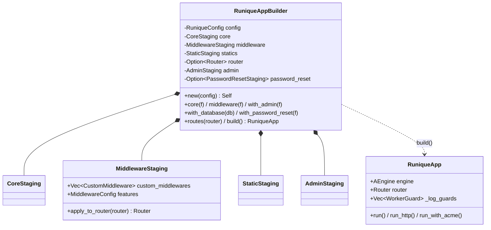
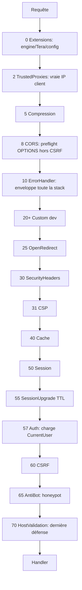

# UML — App : builder, staging, pipeline middleware

[`app/builder/mod.rs`](../../../runique/src/app/builder/mod.rs),
[`app/runique_app.rs`](../../../runique/src/app/runique_app.rs),
[`app/staging/middleware_staging/applicator.rs`](../../../runique/src/app/staging/middleware_staging/applicator.rs)

## Builder & staging (pattern Builder)

Collecte différée : chaque `.core()/.middleware()/.with_admin()` **stocke** sans exécuter ;
`build()` assemble (ordre indépendant de l'ordre d'appel du dev).

## Pipeline middleware par slots (ordre réel exécuté)

`apply_to_router` trie par slot. Ordre **extérieur → intérieur** (un slot bas = plus externe) :

## Anomalies / flux suspects

### 🟡 AP1 — `RuniqueEngine::attach_middlewares` est du code mort (confirme E2)
Le pipeline réel est `MiddlewareStaging::apply_to_router` (slots ci-dessus).
[`engine/core.rs:110`](../../../runique/src/engine/core.rs#L110) `attach_middlewares` n'a aucun
appelant → à supprimer pour éviter la confusion (deux ordres de middleware « apparents »).

### 🟡 AP2 — ErrorHandler (slot 10) gaté par `enable_debug_errors` (confirme E1, rétrogradé)
[`applicator.rs:348`](../../../runique/src/app/staging/middleware_staging/applicator.rs#L348)
Monté car le flag vaut `true` par défaut partout. Risque uniquement si désactivé
explicitement (nom trompeur). Pas un bug par défaut.

### 🟢 AP3 — Ordre des slots : cohérent et justifié (pas d'anomalie)
CORS (8) **hors** ErrorHandler (10) pour que le preflight OPTIONS n'atteigne jamais CSRF ;
Session (50) avant CSRF (60) car CSRF en dépend ; Auth (57) après Session. Ordre sain,
documenté slot par slot. À conserver tel quel.
