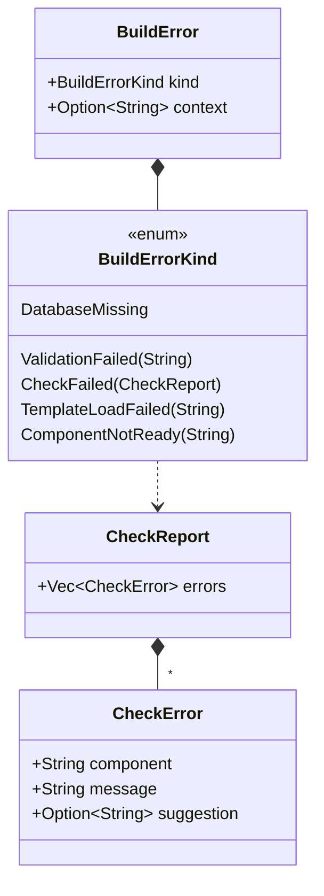
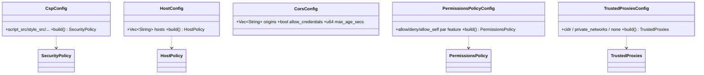

# UML — App : erreurs de build & config builders (staging)

Complément de [builder-staging.md](builder-staging.md).

## Validation au boot — `BuildError` / `CheckReport`

[`app/error_build.rs`](../../../runique/src/app/error_build.rs)

`build()` agrège des `CheckError` (component/message/suggestion) → un échec de boot est
**explicite et actionnable** (ex : "Database — connexion absente — appelez `.with_database()`").

## Config builders (staging)

[`app/staging/`](../../../runique/src/app/staging/) — chacun est un builder fluent passé à
`.middleware(|m| ...)` / `.with_csp(|c| ...)` :

Ces builders (staging) produisent les structs runtime de [../middleware/securite.md](../middleware/securite.md).

## Anomalies / flux suspects

### 🟡 CFG1 (rappel) — `secret_key` vide = warning, pas `CheckError`
Le boot a une infra de validation (`CheckReport`/`CheckError`) propre — mais `secret_key`
absent n'émet qu'un *warning* (cf. config) au lieu d'un `CheckError` bloquant en prod.
Candidat à ajouter à la validation de boot (`CheckFailed`).

### 🟢 Boot validation = audit clean
`BuildError` + `CheckReport` donnent des échecs de démarrage explicites avec suggestion.
Bon design (fail-fast au boot plutôt qu'erreurs runtime opaques).
