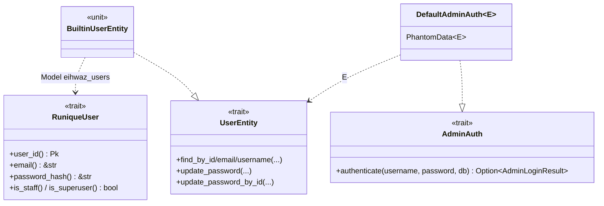
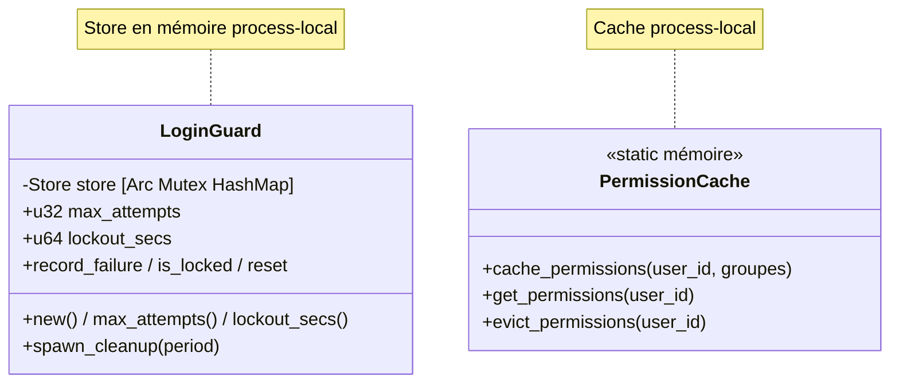
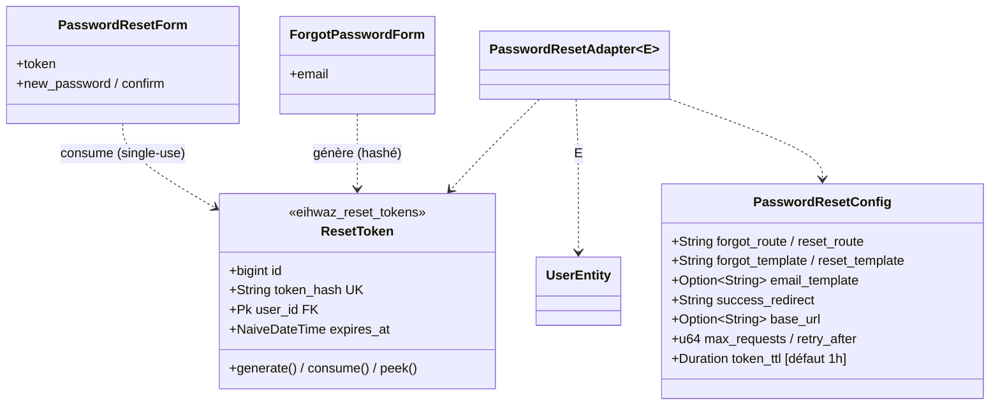

# UML — Authentification (traits, session, lockout, reset password)

[`auth/session.rs`](../../../runique/src/auth/session.rs),
[`auth/guard.rs`](../../../runique/src/auth/guard.rs),
[`auth/password.rs`](../../../runique/src/auth/password.rs),
[`auth/user.rs`](../../../runique/src/auth/user.rs)

## Traits & entité utilisateur

## Lockout & cache permissions (process-local)

## Reset password (token haché, single-use)

Sécurité reset (vérifié) : token **stocké haché** (jamais brut), **single-use strict**
(delete + `rows_affected == 1`), `user_id` dérivé **du token** (jamais d'un champ URL/form)
→ IDOR-safe.

## Anomalies / flux suspects

### 🟠 AU1 — Lockout `LoginGuard` en mémoire process-local
[`guard.rs:84`](../../../runique/src/auth/guard.rs#L84)
Le compteur d'échecs vit dans une `HashMap` mémoire. En multi-process/multi-instance,
le lockout d'une instance n'est pas vu par les autres → un attaquant réparti sur N instances
multiplie les tentatives par N avant blocage. Cohérent avec le modèle mono-process actuel,
mais à acter (même famille que AM4 cache permissions).

### 🟡 AU2 — Cache permissions sans invalidation cross-instance (rappel AM4)
`cache_permissions`/`evict_permissions` process-local : un changement de droits via une autre
instance n'évince pas le cache local → permissions périmées jusqu'au prochain login.

### Rappels (déjà listés ailleurs)
- **AM2** double écriture `eihwaz_sessions` au login (`session_id` divergent).
- **AM3** TTL 24h codé en dur en double.
- **S1** sessions anonymes (et leur CSRF) perdues au restart.
