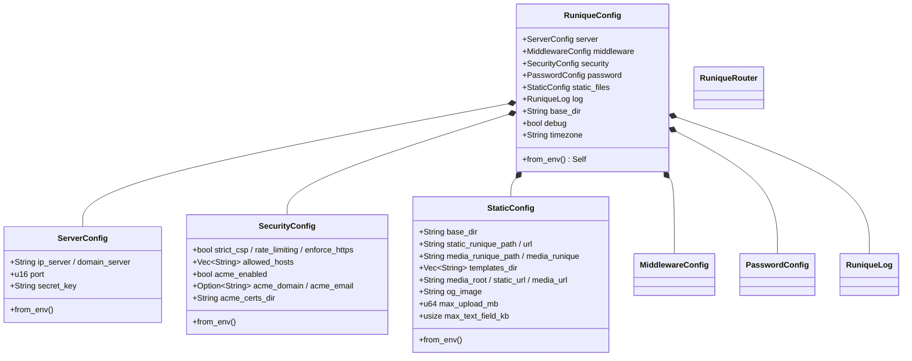
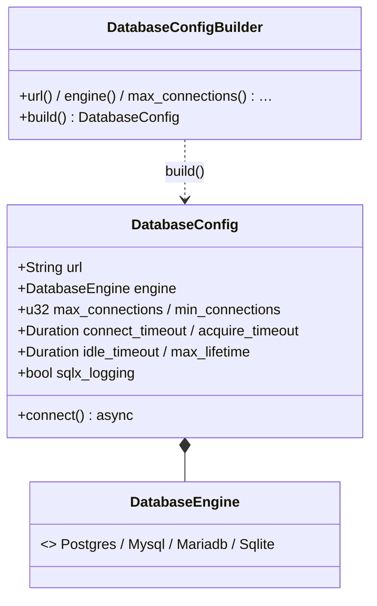

# UML — config & db

## config — `RuniqueConfig` et sous-configs

[`config/`](../../../runique/src/config/)

## db — connexion SeaORM

[`db/`](../../../runique/src/db/)

## Anomalies / flux suspects

### 🟡 CFG1 — `ServerConfig.secret_key` : warning si absent, pas d'échec — ✅ CORRIGÉ
**Corrigé (2.1.21).** `secret_key_is_weak()` (vide ‖ défaut ‖ < 32 car., plancher HMAC-SHA256) ;
`cross_validate` refuse le démarrage en prod pour toute clé faible. Debug : warning. Test `secret_key_tests`.

### 🟢 CFG2 — `from_env` par sous-config (pas d'anomalie)
Chaque sous-config charge ses propres variables → séparation claire, défauts documentés.
`max_upload_mb` (StaticConfig) = garde-fou DoS streaming, distinct du `max_size` par champ.
