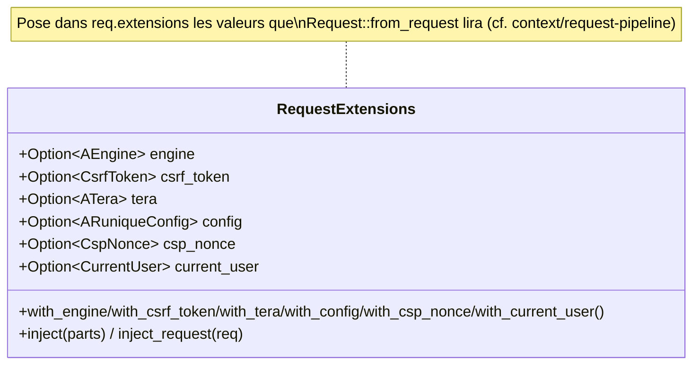
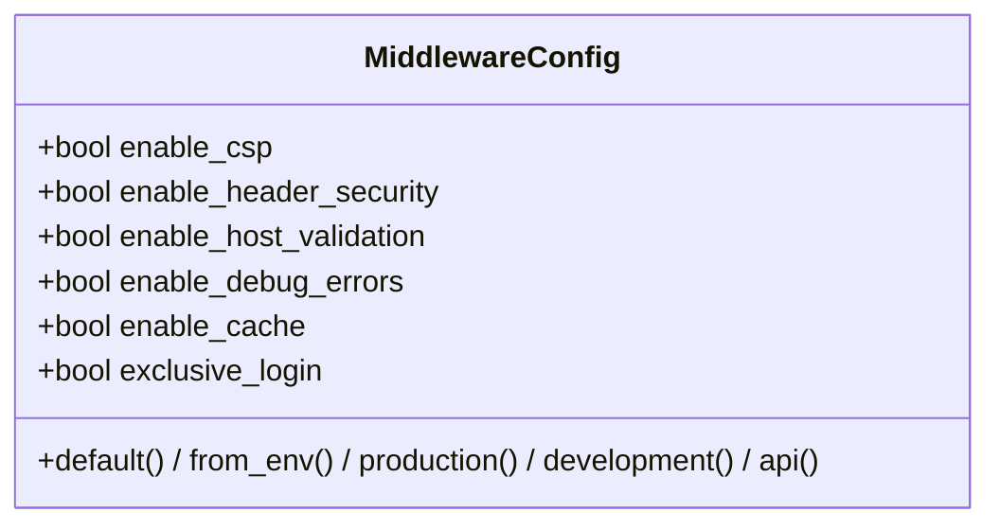

# UML — Extensions de requête, MiddlewareConfig, helpers Tera

## RequestExtensions — injection des extensions

[`context/request_extensions.rs`](../../../runique/src/context/request_extensions.rs)



C'est le **producteur** des extensions que `Request` consomme : le contrat slot→extension de
[request-pipeline.md](request-pipeline.md) passe par ce builder.

## MiddlewareConfig — toggles

[`middleware/config.rs`](../../../runique/src/middleware/config.rs)



Défauts : `enable_debug_errors=true` (handler d'erreurs toujours monté — cf. faux positif E1),
`enable_host_validation=true`, `enable_csp=true`, `enable_cache=true`,
`enable_header_security=false`, `exclusive_login=false`.

## Helpers Tera & cache dev (fonctions)

[`context/tera/`](../../../runique/src/context/tera/) · [`middleware/dev/cache.rs`](../../../runique/src/middleware/dev/cache.rs)

```mermaid
flowchart LR
    subgraph Tera helpers
      F["` / filtre form"]
      S["`"]
      M["`"]
      U["` reverse"]
    end
    DEV["dev_no_cache_middleware<br/>(Cache-Control: no-store en dev)"]
```

## Anomalies / flux suspects

### 🟡 CX2 — `enable_header_security=false` par défaut → CSP seule sans headers durcis — ✅ CORRIGÉ
**Corrigé (2.1.21).** `from_config` : `enable_header_security = security.strict_csp` (ranime le
flag `STRICT_CSP` qui était stocké mais jamais consommé ; secure-by-default, builder prioritaire).
**HSTS gaté** sur `should_emit_hsts()` (`enforce_https‖acme_enabled`) → pas de lock-in HTTPS sur un
déploiement HTTP. Test `hsts_tests`.

### Rappel CX1 — couplage extraction ↔ slots
`RequestExtensions` doit poser engine/session/csrf sinon `Request::from_request` → 500
(cf. [request-pipeline.md](request-pipeline.md)).
