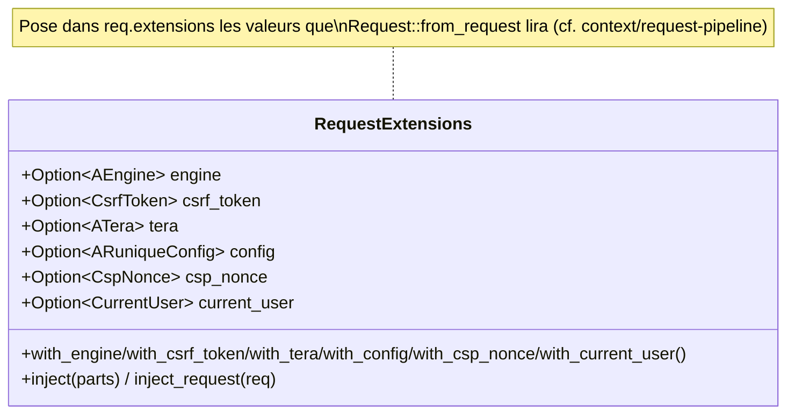
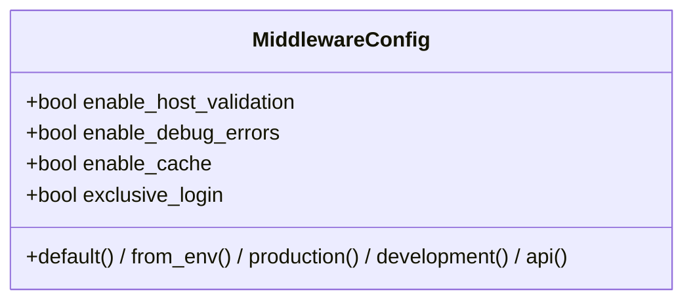

# UML — Extensions de requête, MiddlewareConfig, helpers Tera

## RequestExtensions — injection des extensions

[`context/request_extensions.rs`](../../../runique/src/context/request_extensions.rs)

```mermaid
classDiagram
    class RequestExtensions {
        +Option~AEngine~ engine
        +Option~CsrfToken~ csrf_token
        +Option~ATera~ tera
        +Option~ARuniqueConfig~ config
        +Option~CspNonce~ csp_nonce
        +Option~CurrentUser~ current_user
        +with_engine/with_csrf_token/with_tera/with_config/with_csp_nonce/with_current_user()
        +inject(parts) / inject_request(req)
    }
    note for RequestExtensions "Pose dans req.extensions les valeurs que\nRequest::from_request lira (cf. context/request-pipeline)"
```

C'est le **producteur** des extensions que `Request` consomme : le contrat slot→extension de
[request-pipeline.md](request-pipeline.md) passe par ce builder.

## MiddlewareConfig — toggles

[`middleware/config.rs`](../../../runique/src/middleware/config.rs)

```mermaid
classDiagram
    class MiddlewareConfig {
        +bool enable_host_validation
        +bool enable_debug_errors
        +bool enable_cache
        +bool exclusive_login
        +default() / from_env() / production() / development() / api()
    }
```

Défauts : `enable_debug_errors=true` (handler d'erreurs toujours monté — cf. faux positif E1),
`enable_host_validation=true`, `enable_cache=true`, `exclusive_login=false`.

`enable_csp`/`enable_header_security` retirés (2026-09-21) : plus rien ne les lisait dans le
pipeline vivant (`applicator.rs`) — voir CX2 ci-dessous, et E2/E3 dans `anomalies.md`.

## Helpers Tera & cache dev (fonctions)

[`context/tera/`](../../../runique/src/context/tera/) · [`middleware/dev/cache.rs`](../../../runique/src/middleware/dev/cache.rs)

```mermaid
flowchart LR
    subgraph Tera helpers
      F["{% form ... %}` / filtre form"]
      S["{% static \"...\" %}`"]
      M["{% media var %}`"]
      U["{% url \"name\" %}` reverse"]
    end
    DEV["dev_no_cache_middleware<br/>(Cache-Control: no-store en dev)"]
```

## Anomalies / flux suspects

### 🟡 CX2 — `enable_header_security=false` par défaut → CSP seule sans headers durcis
**Historique complet** : le fix 2.1.21 (`from_config` : `enable_header_security = security.strict_csp`)
pensait ranimer `STRICT_CSP` (stocké mais jamais consommé). En réalité, **rien ne lisait
`enable_header_security` non plus** — `security_headers_middleware` (HSTS/X-Frame/COOP/CORP + CSP+nonce)
tournait déjà **inconditionnellement** dans `applicator.rs`, indépendamment de ce flag. Le fix de 2.1.21
a donc réanimé un flag pour alimenter un autre flag tout aussi mort, sans jamais vérifier le bout
consommateur. Trouvé et nettoyé le 2026-09-21 : `enable_csp`/`enable_header_security`
(`MiddlewareConfig`), `enable_header_security`/`with_header_security()` (`CspConfig`), et
`strict_csp`/`STRICT_CSP` (`SecurityConfig`) supprimés — plus aucune trace, le comportement réel
(headers toujours actifs) reste inchangé. **HSTS reste gaté** sur `should_emit_hsts()`
(`enforce_https‖acme_enabled`) → pas de lock-in HTTPS sur un déploiement HTTP. Test `hsts_tests`.

### Rappel CX1 — couplage extraction ↔ slots
`RequestExtensions` doit poser engine/session/csrf sinon `Request::from_request` → 500
(cf. [request-pipeline.md](request-pipeline.md)).
