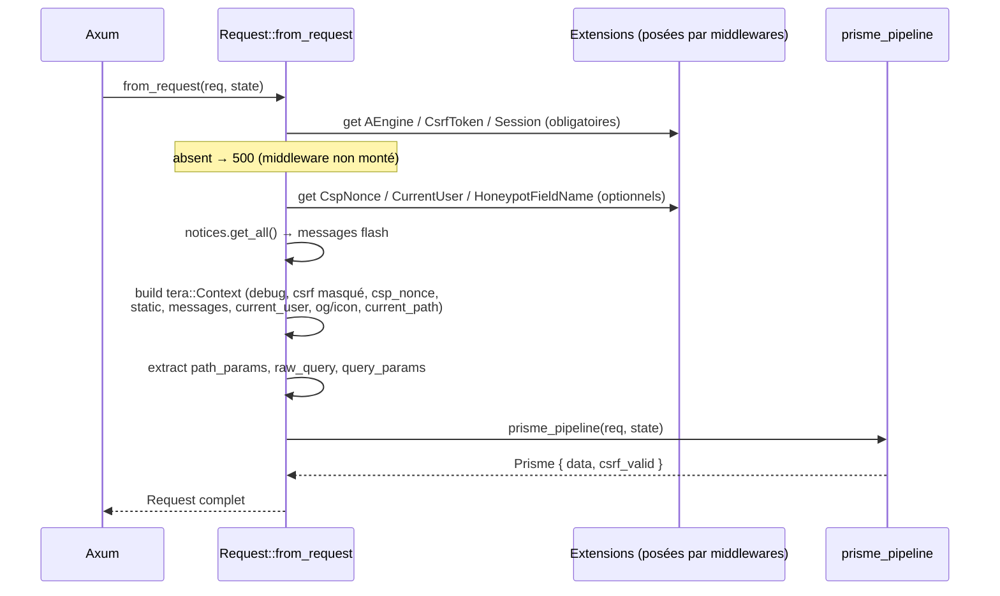

# UML / Flux — Pipeline d'extraction `Request`

Construction du contexte handler via `FromRequest` (body-consuming → **dernier** paramètre).
[`context/template.rs:123`](../../../runique/src/context/template.rs#L123)

## Dépendances (qui pose quoi)

| Extension | Posée par (slot) | Lue par `Request` |
|-----------|------------------|-------------------|
| `AEngine` | Extensions (0) | obligatoire |
| `Session` | Session (50) | obligatoire |
| `CsrfToken` | CSRF (60) | obligatoire |
| `CspNonce` | SecurityHeaders/CSP (30/31) | optionnel |
| `CurrentUser` | Auth (57) | optionnel |
| `HoneypotFieldName` | AntiBot (65) | optionnel |

## Anomalies / flux suspects

### 🟡 CX1 — Couplage fort extraction ↔ slots middleware
`Request` exige `AEngine`/`Session`/`CsrfToken` en extensions → si l'un des slots
correspondants est désactivé/réordonné, **toute** extraction `Request` renvoie 500.
Le contrat (quels slots sont obligatoires) est implicite. Documenté ici ; à garder en tête
lors de toute modification de l'ordre des slots ([../app/builder-staging.md](../app/builder-staging.md)).

### Rappels (déjà listés)
- **C1/C3** (corrigés) : le pipeline Prisme parse le multipart ; commit désormais en staging.
- **C2** (corrigé, 2.1.21) : `Prisme::data` est `pub(crate)` ; le corps se lit via `req.form()` ou `req.prisme.checked_data()` (fail-closed CSRF). Plus d'accès brut hors CSRF côté code tiers.
