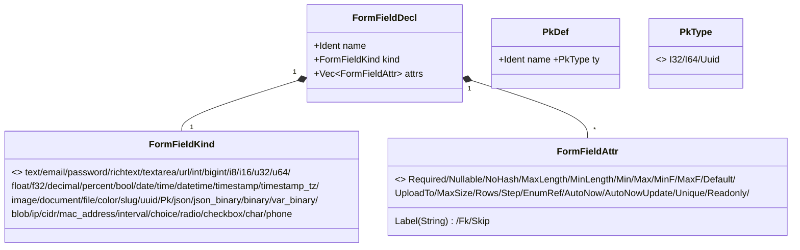
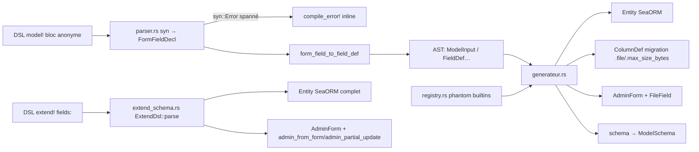

# UML — derive_form (proc-macro : `model!{}` / `#[form]` / `extend!{}`)

Crate séparée [`derive_form/`](../../../runique/derive_form/). `model!{}` n'a plus qu'**une seule
grammaire** de champs — bloc anonyme `{ name: SemanticType [options] }`. L'ancienne grammaire v1
(`fields: { name: SqlType [options] }`) a été **supprimée** (2026-08) ; `extend!{}` reste une macro
séparée qui a toujours requis `fields:` et le requiert toujours — ne pas confondre les deux lors
d'un audit.

Flux `model!{}` :
`DSL source (bloc anonyme) → parser.rs (syn) → FormFieldDecl (grammaire DSL) → form_field_to_field_def() → FieldDef/FieldType/FieldOption (représentation universelle) → generateur.rs → TokenStream Rust`.

Flux `extend!{}` : pipeline **séparé** dans `extend_schema.rs` (`ExtendDsl::parse` →
`generate_entity`/`generate_schema_fn`), mêmes types de champs/options que `model!{}` mais
toujours préfixés `fields:`.

## AST — grammaire DSL (ce que le parser lit)

[`derive_form/src/model/ast.rs`](../../../runique/derive_form/src/model/ast.rs)



**`Pk` se résout immédiatement au parsing** (pas une variante `FormFieldKind` à part) vers
`i32`/`i64`/`Uuid` selon la feature active (`big-pk`/`pk-uuid`, mutuellement exclusives), aussi
bien en position `pk: id => Pk` (`PkDef::parse`) qu'en champ normal — typiquement une FK vers une
table dont la PK est `Pk`, pour rester automatiquement synchronisée si la feature change.

## AST — représentation universelle (ce que le générateur consomme)

```mermaid
classDiagram
    class ModelInput {
        +Ident name
        +String table
        +Vec~FieldDef~ fields
        +Vec~EnumDef~ enums
        +PkDef pk
        +Vec~RelationDef~ relations
        +MetaDef meta
    }
    class FieldDef {
        +Ident name
        +FieldType ty
        +Vec~FieldOption~ options
    }
    class FieldType {
        <<enum>> String/Text/Char/Varchar/I8/I16/I32/I64/U32/U64/F32/F64/Decimal/Bool/
        Date/Time/Datetime/Timestamp/TimestampTz/Uuid/Json/JsonBinary/Binary/VarBinary/
        Blob/Enum/Inet/Cidr/MacAddress/Interval
    }
    class FieldOption {
        <<enum>> Required/Nullable/Unique/Default/MaxLen/MinLen/Max/Min/MaxF/MinF/
        AutoNow/AutoNowUpdate/Readonly/Label(String)/Help/Fk/File{kind,upload_to}/MaxSize
    }
    class FileKind { <<enum>> Image/Document/Any }
    class EnumDef { +Ident name +Vec~Variant~ variants +EnumBackingType }
    class PkDef
    class RelationDef { <<enum>> BelongsTo/HasMany/HasOne }
    class FkDef { +Ident table +Ident column +FkAction action }
    ModelInput "1" *-- "*" FieldDef
    ModelInput "1" *-- "*" EnumDef
    ModelInput "1" *-- "*" RelationDef
    ModelInput "1" *-- "1" PkDef
    FieldDef "1" *-- "1" FieldType
    FieldDef "1" *-- "*" FieldOption
    FieldOption ..> FileKind
    FieldOption ..> FkDef
```

`form_field_to_field_def()` (`parser.rs`) traduit `FormFieldDecl` → `FieldDef` : c'est le seul
endroit où une option v2 parsée peut finir **sans effet** si la traduction oublie de la
transcrire (cf. DF4 ci-dessous — classe de bug réelle, pas hypothétique).

## Pipeline d'expansion



`#[form(schema=Path)]` délègue à `Schema::schema()` au **runtime** (ne lit pas le `max_size`
du modèle à l'expansion — cf. discussion uploads). Le registre fantôme ne couvre que les
tables builtin `eihwaz_*` (name/type/widget, **pas** `max_size`).

## Anomalies / flux suspects

### 🟡 DF1 — Validation des bornes d'override impossible à l'expansion cross-macro
`#[form]` n'a que le `Path` du schéma → un override DSL de `max_size` ne peut pas être
comparé au plafond modèle à la compilation (faute de littéral). Compile-error possible
uniquement via émission d'une `const` par `model!{}` + `const assert!` côté override
(non implémenté). Borne runtime (`set_max_size_bounded`) en place.

### 🟢 DF2 — Erreurs DSL spannées (audit clean)
Le parser émet `syn::Error::new(span, msg)` → `compile_error!` pointé sur le token fautif,
visible inline dans rust-analyzer. Bonne ergonomie, rien à corriger.

### 🟢 DF3 — Générateur : `let _ = write!(buf, …)` = bénins
Les ~308 `let _ =` du générateur/parsers écrivent dans une `String` (infaillible). Pas des
erreurs avalées.

### 🟢 DF4 — v1 supprimée, parité v2 fermée (2026-08)
Le retrait de la grammaire v1 a révélé que v2 avait été livrée incomplète : trois vrais bugs
silencieux trouvés et corrigés en l'auditant avant suppression — `json` routé par erreur vers
`FieldType::Text` (mélangé avec `richtext`/`textarea`), six options (`min_length`, `min`, `max`,
`min_f`, `max_f`, `max_size`) parsées sans erreur par `FormFieldAttr` mais jamais transcrites
dans `form_field_to_field_def()` → **aucun effet** sur la validation/le schéma généré, et
`var_binary` retombant sur `VARCHAR` générique dans les deux parseurs de migration. `index` et
`select_as` confirmés morts (jamais lus) plutôt que portés. Détail complet : `CHANGELOG.md [2.2.0]`.
