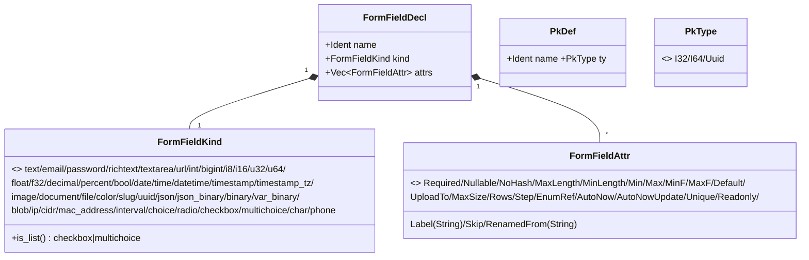
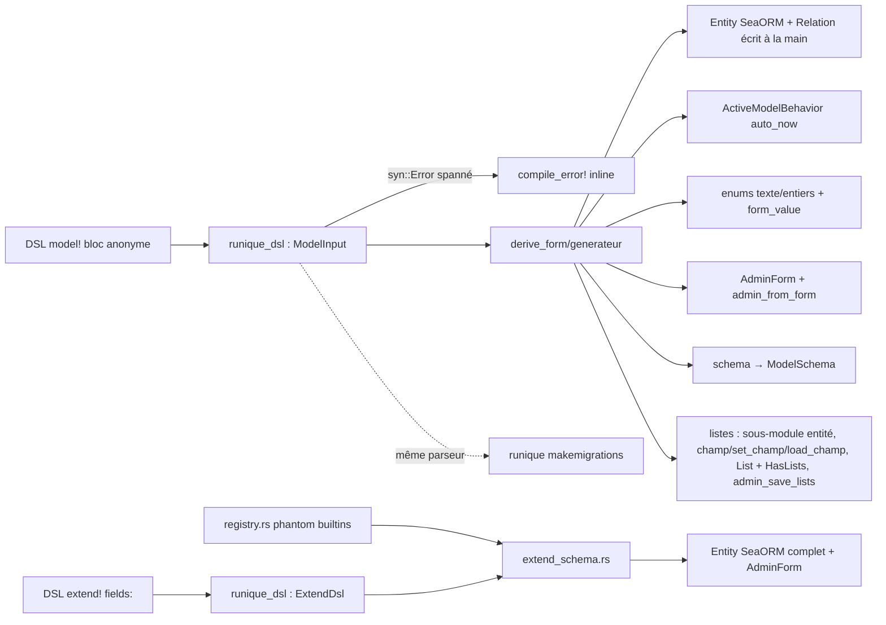

# UML — derive_form + runique_dsl (`model!{}` / `#[form]` / `extend!{}`)

> **3.0.0 (2026-10-06)** — l'AST et le parseur ont quitté `derive_form` pour la crate
> [`runique_dsl/`](../../../runique/runique_dsl/), partagée avec `makemigrations` : la macro et
> la CLI lisent le DSL avec le même code. `derive_form` ne fait plus que générer.

Une seule grammaire de champs pour `model!{}` — bloc anonyme `{ name: SemanticType [options] }`
(la v1 `fields: { name: SqlType }` est supprimée depuis 2026-08). `extend!{}` requiert toujours
`fields:` — ne pas confondre les deux lors d'un audit.

Flux `model!{}` :
`tokens → runique_dsl (impl Parse for ModelInput : FormFieldDecl → form_field_to_field_def() → FieldDef, listes à part) → derive_form/generateur/ → TokenStream Rust`.

Flux `extend!{}` : `runique_dsl::extend::ExtendDsl` → `derive_form/extend_schema.rs`
(entité complète base + ajouts).

## AST — grammaire DSL (`runique_dsl/src/ast.rs`)

```mermaid
classDiagram
    class FormFieldDecl {
        +Ident name
        +FormFieldKind kind
        +Vec~FormFieldAttr~ attrs
    }
    class FormFieldKind {
        <<enum>> text/email/password/richtext/textarea/url/int/bigint/i8/i16/u32/u64/
        float/f32/decimal/percent/bool/date/time/datetime/timestamp/timestamp_tz/
        image/document/file/color/slug/uuid/json/json_binary/binary/var_binary/
        blob/ip/cidr/mac_address/interval/choice/radio/checkbox/multichoice/char/phone
        +is_list() checkbox|multichoice
    }
    class FormFieldAttr {
        <<enum>> Required/Nullable/NoHash/MaxLength/MinLength/Min/Max/MinF/MaxF/Default/
        UploadTo/MaxSize/Rows/Step/EnumRef/AutoNow/AutoNowUpdate/Unique/Readonly/
        Label(String)/Skip/RenamedFrom(String)
    }
    class PkDef { +Ident name +PkType ty }
    class PkType { <<enum>> I32/I64/Uuid }
    FormFieldDecl "1" *-- "1" FormFieldKind
    FormFieldDecl "1" *-- "*" FormFieldAttr
```

**`Pk` se résout immédiatement au parsing** vers `i32`/`i64`/`Uuid` selon la feature active
(`big-pk`/`pk-uuid`), en position `pk: id => Pk` comme en champ normal (colonne de `belongs_to`).

**Validation au parsing** : nullabilité (`validate_nullability` : NOT NULL par défaut, `required`
+ `nullable` interdit, `nullable` sur `auto_now` interdit, type non texte sans
`required`/`nullable`/`default` interdit), listes (`validate_list` : enum obligatoire, seuls
`required`/`enum`/`label`), enums entiers (`validate_int_values` : une valeur par variante, dans
les limites, sans doublon), `belongs_to` (`validate_belongs_to` : colonne déclarée, `set_null` ⇒
`nullable`), `fk(...)` refusé avec un message qui renvoie vers `belongs_to`.

## AST — représentation universelle (ce que le générateur consomme)

```mermaid
classDiagram
    class ModelInput {
        +Ident name
        +String table
        +PkDef pk
        +Vec~EnumDef~ enums
        +Vec~FieldDef~ fields
        +Vec~FormFieldDecl~ form_fields
        +Vec~FormFieldDecl~ lists
        +Vec~RelationDef~ relations
        +Option~MetaDef~ meta
    }
    class FieldDef {
        +Ident name
        +FormFieldKind kind
        +Option~Ident~ enum_ref
        +Vec~FieldOption~ options
        +column_type() FieldType
    }
    class FieldType {
        <<enum>> String/Text/Char/Varchar/I8/I16/I32/I64/U32/U64/F32/F64/Decimal/Bool/
        Date/Time/Datetime/Timestamp/TimestampTz/Uuid/Json/JsonBinary/Binary/VarBinary/
        Blob/Enum/Inet/Cidr/MacAddress/Interval
    }
    class FieldOption {
        <<enum>> Required/Nullable/Unique/Default/MaxLen/MinLen/Max/Min/MaxF/MinF/
        AutoNow/AutoNowUpdate/Readonly/Label(String)/File{kind,upload_to}/MaxSize
    }
    class FileKind { <<enum>> Image/Document/Any }
    class EnumDef { +Ident name +Vec~EnumVariant~ variants +EnumBackingType }
    class EnumBackingType { <<enum>> Auto/I8/I16/I32/I64 }
    class RelationDef {
        <<enum>> BelongsTo{model,via,on_delete,on_update}/HasMany/HasOne/ManyToMany
    }
    class FkAction { <<enum>> NoAction/Cascade/SetNull/Restrict/SetDefault }
    ModelInput "1" *-- "*" FieldDef
    ModelInput "1" *-- "*" EnumDef
    ModelInput "1" *-- "*" RelationDef
    ModelInput "1" *-- "1" PkDef
    EnumDef *-- EnumBackingType
    FieldDef "1" *-- "*" FieldOption
    FieldDef ..> FieldType : column_type()
    FieldOption ..> FileKind
    RelationDef ..> FkAction
```

`form_field_to_field_def()` traduit `FormFieldDecl` → `FieldDef` : `Nullable` seulement si
déclaré (NOT NULL par défaut). `lists` ne passent pas par là : pas de colonne, pas de `FieldDef`.

## Pipeline d'expansion

```mermaid
flowchart LR
    SRC[DSL model! bloc anonyme] --> DSL[runique_dsl : ModelInput]
    DSL -->|syn::Error spanné| CE[compile_error! inline]
    DSL --> GEN[derive_form/generateur]
    GEN --> ENT[Entity SeaORM + Relation écrit à la main]
    GEN --> BEH[ActiveModelBehavior auto_now]
    GEN --> ENU[enums texte/entiers + form_value]
    GEN --> FORM[AdminForm + admin_from_form]
    GEN --> SCH[schema → ModelSchema]
    GEN --> LST[listes : sous-module entité, champ/set_champ/load_champ, List + HasLists, admin_save_lists]
    REG[registry.rs phantom builtins] --> EXTG

    SRC2[DSL extend! fields:] --> EXT[runique_dsl : ExtendDsl]
    EXT --> EXTG[extend_schema.rs]
    EXTG --> ENT2[Entity SeaORM complet + AdminForm]

    DSL -.même parseur.-> CLI[runique makemigrations]
```

`Relation` est écrit à la main (`RelationTrait`) et non dérivé : un `belongs_to` vise la vraie clé
primaire de la cible (lue sur son entité, `PrimaryKey::iter()`), avec ses actions — l'attribut
`to = "…::Column::Id"` de `DeriveRelation` supposait une PK nommée `id`.

`#[form(schema=Path)]` délègue à `Schema::schema()` au **runtime**. Le registre fantôme ne
couvre que les tables builtin `eihwaz_*`.

## Anomalies / flux suspects

### 🟡 DF1 — Validation des bornes d'override impossible à l'expansion cross-macro
`#[form]` n'a que le `Path` du schéma → un override DSL de `max_size` ne peut pas être
comparé au plafond modèle à la compilation (faute de littéral). Compile-error possible
uniquement via émission d'une `const` par `model!{}` + `const assert!` côté override
(non implémenté). Borne runtime (`set_max_size_bounded`) en place.

### 🟢 DF2 — Erreurs DSL spannées (audit clean)
Le parser émet `syn::Error::new(span, msg)` → `compile_error!` pointé sur le token fautif,
visible inline dans rust-analyzer. Bonne ergonomie, rien à corriger.

### 🟢 DF3 — Générateur : `let _ = write!(buf, …)` = bénins
Les ~308 `let _ =` du générateur/parsers écrivent dans une `String` (infaillible). Pas des
erreurs avalées.

### 🟢 DF4 — v1 supprimée, parité v2 fermée (2026-08)
Le retrait de la grammaire v1 a révélé que v2 avait été livrée incomplète : trois vrais bugs
silencieux trouvés et corrigés en l'auditant avant suppression — `json` routé par erreur vers
`FieldType::Text` (mélangé avec `richtext`/`textarea`), six options (`min_length`, `min`, `max`,
`min_f`, `max_f`, `max_size`) parsées sans erreur par `FormFieldAttr` mais jamais transcrites
dans `form_field_to_field_def()` → **aucun effet** sur la validation/le schéma généré, et
`var_binary` retombant sur `VARCHAR` générique dans les deux parseurs de migration. `index` et
`select_as` confirmés morts (jamais lus) plutôt que portés. Détail complet : `CHANGELOG.md [2.2.0]`.

### ✅ CORRIGÉ (2026-10-06) — FK : deux sources qui se contredisaient
La contrainte FK venait de `fk(table.col)` côté macro et de `belongs_to [action]` côté CLI ;
`belongs_to` jetait ses actions dans la macro et visait `Column::Id` en dur. `belongs_to` est
désormais la seule source (contrainte + relation), vers la vraie table et la vraie PK, avec ses
actions ; `fk()` est refusé. `table_to_module` (pluriel deviné) et les pivots implicites
supprimés.

### ✅ CORRIGÉ (2026-10-06) — enums entiers sans valeur stockés à 0
`Priority: i32 [Low, High]` donnait `num_value = 0` aux deux variantes (`_ => 0`,
`unwrap_or(0)`) : `High` relu comme `Low`. Refusé à la compilation (`validate_int_values`).
