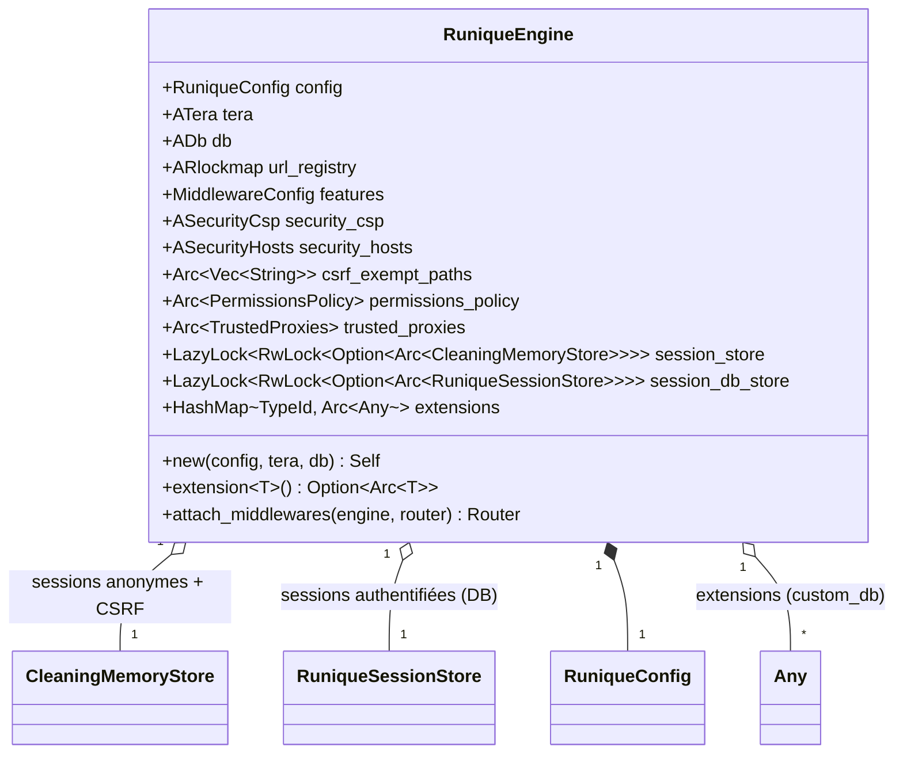
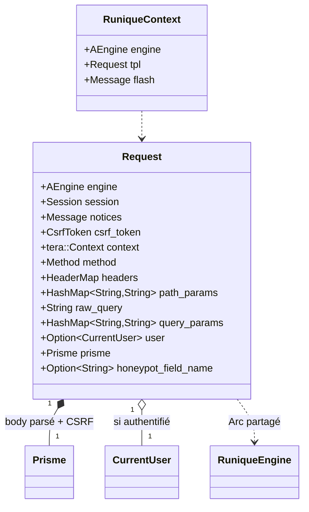

# UML — Engine & contexte de requête

## RuniqueEngine (état runtime partagé)

[`runique/src/engine/core.rs`](../../../runique/src/engine/core.rs)



## Request (contexte handler, via FromRequest)

[`runique/src/context/template.rs:93`](../../../runique/src/context/template.rs#L93)



`Request` est construit par `FromRequest` (body-consuming → dernier paramètre du handler) :
il lit les extensions injectées par les middlewares (engine, CsrfToken, Session, CspNonce,
CurrentUser, HoneypotFieldName) puis lance le pipeline Prisme.

## Anomalies / flux suspects

### 🟠 E1 — `error_handler_middleware` conditionné à `enable_debug_errors`
[`engine/core.rs:155`](../../../runique/src/engine/core.rs#L155)
```rust
if f.enable_debug_errors {
    router = router.layer(middleware::from_fn(error_handler_middleware));
}
```
Le handler d'erreurs (qui rend 404/429/500) n'est attaché **que si les erreurs de debug
sont activées**. En production (`enable_debug_errors = false`), il n'y a **plus** de
middleware d'erreurs → les pages d'erreur custom risquent de disparaître au profit des
réponses brutes d'Axum. Soit le nom du flag est trompeur, soit le handler devrait être
attaché inconditionnellement (et seul le *niveau de détail* gouverné par le flag). À lever.

### 🟠 E2 — Deux chemins d'attache de middleware
`RuniqueEngine::attach_middlewares` (ici) **et** le système de slots de `MiddlewareStaging`
(architecture : Extensions 0 → … → HostValidation 70) coexistent. Deux mécanismes pour la
même responsabilité = risque d'ordre incohérent ou de double-application (ex : CSRF appliqué
ici **et** via staging). À cartographier précisément dans [../../flux](../../flux) pour
confirmer lequel est réellement câblé au runtime.

### 🟡 E3 — Ordre des couches Axum vs intention
Les `.layer()` s'appliquent en ordre **inverse** d'ajout (Tower). Le code ajoute HTTPS→Host
→CSRF→Cache→CSP→Errors, donc à l'exécution l'ordre est inversé : Errors d'abord (extérieur),
HTTPS en dernier (intérieur). Le commentaire « Error Handler (Last, to catch errors from
others) » est cohérent avec ça, mais l'écart ordre-d'écriture/ordre-d'exécution est un
piège classique → à vérifier que l'intention (HTTPS tout en premier) tient vraiment.

### 🟡 E4 — `session_store`/`session_db_store` en `LazyLock<RwLock<Option<Arc<…>>>>` — ✅ VÉRIFIÉ clean
**Vérifié (2.1.21).** Aucun `unwrap`/`expect` sur ces stores : écritures gardées `if let Ok(write())`,
lectures `.read().ok().and_then()`, init `RwLock::new(None)` infaillible, store non-init → `None`
géré proprement. Pas de panic possible avant init.
