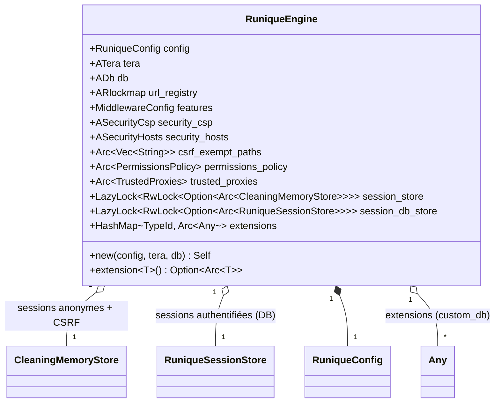
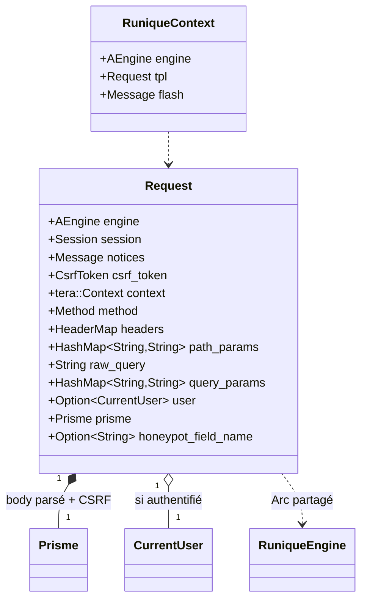

# UML — Engine & contexte de requête

## RuniqueEngine (état runtime partagé)

[`runique/src/engine/core.rs`](../../../runique/src/engine/core.rs)


```mermaid
classDiagram
    class RuniqueEngine {
        +RuniqueConfig config
        +ATera tera
        +ADb db
        +ARlockmap url_registry
        +MiddlewareConfig features
        +ASecurityCsp security_csp
        +ASecurityHosts security_hosts
        +Arc~Vec~String~~ csrf_exempt_paths
        +Arc~PermissionsPolicy~ permissions_policy
        +Arc~TrustedProxies~ trusted_proxies
        +LazyLock~RwLock~Option~Arc~CleaningMemoryStore~~~~ session_store
        +LazyLock~RwLock~Option~Arc~RuniqueSessionStore~~~~ session_db_store
        +HashMap~TypeId, Arc~Any~~ extensions
        +new(config, tera, db) Self
        +extension~T~() Option~Arc~T~~
    }
    RuniqueEngine "1" o-- "1" CleaningMemoryStore : sessions anonymes + CSRF
    RuniqueEngine "1" o-- "1" RuniqueSessionStore : sessions authentifiées (DB)
    RuniqueEngine "1" *-- "1" RuniqueConfig
    RuniqueEngine "1" o-- "*" Any : extensions (custom_db)
```

## Request (contexte handler, via FromRequest)

[`runique/src/context/template.rs:93`](../../../runique/src/context/template.rs#L93)


```mermaid
classDiagram
    class Request {
        +AEngine engine
        +Session session
        +Message notices
        +CsrfToken csrf_token
        +tera::Context context
        +Method method
        +HeaderMap headers
        +HashMap~String,String~ path_params
        +String raw_query
        +HashMap~String,String~ query_params
        +Option~CurrentUser~ user
        +Prisme prisme
        +Option~String~ honeypot_field_name
    }
    class RuniqueContext {
        +AEngine engine
        +Request tpl
        +Message flash
    }
    Request "1" *-- "1" Prisme : body parsé + CSRF
    Request "1" o-- "1" CurrentUser : si authentifié
    Request ..> RuniqueEngine : Arc partagé
    RuniqueContext ..> Request
```

`Request` est construit par `FromRequest` (body-consuming → dernier paramètre du handler) :
il lit les extensions injectées par les middlewares (engine, CsrfToken, Session, CspNonce,
CurrentUser, HoneypotFieldName) puis lance le pipeline Prisme.

## Anomalies / flux suspects

### 🟠 E1 — `error_handler_middleware` conditionné à `enable_debug_errors`
[`engine/core.rs:155`](../../../runique/src/engine/core.rs#L155)
```rust
if f.enable_debug_errors {
    router = router.layer(middleware::from_fn(error_handler_middleware));
}
```
Le handler d'erreurs (qui rend 404/429/500) n'est attaché **que si les erreurs de debug
sont activées**. En production (`enable_debug_errors = false`), il n'y a **plus** de
middleware d'erreurs → les pages d'erreur custom risquent de disparaître au profit des
réponses brutes d'Axum. Soit le nom du flag est trompeur, soit le handler devrait être
attaché inconditionnellement (et seul le *niveau de détail* gouverné par le flag). À lever.

### ✅ E2 — Deux chemins d'attache de middleware — RÉSOLU (2026-09-21)
`RuniqueEngine::attach_middlewares` coexistait avec le système de slots de `MiddlewareStaging`
(architecture : Extensions 0 → … → CSRF 60). Confirmé code mort (zéro appelant, y compris
en tests d'intégration réels) → fonction + son fichier de tests dédié supprimés. Seul le
système de slots (`applicator.rs`) est câblé au runtime.

### 🟡 E3 — Ordre des couches Axum vs intention
L'analyse ci-dessous portait sur `attach_middlewares` (désormais supprimé) ; le principe
reste valable pour le pipeline vivant (`applicator.rs`). Les `.layer()` s'appliquent en ordre
**inverse** d'ajout (Tower) : le dernier ajouté devient la couche la plus externe, et exécute
son traitement de réponse **en dernier**. C'est exactement ce qui casse le nonce CSP dans
`applicator.rs` (slot 31 ajouté après slot 30 → écrase son header en réponse) — voir l'entrée
E3 détaillée dans [`../../anomalies.md`](../../anomalies.md), bug encore ouvert.

### 🟡 E4 — `session_store`/`session_db_store` en `LazyLock<RwLock<Option<Arc<…>>>>` — ✅ VÉRIFIÉ clean
**Vérifié (2.1.21).** Aucun `unwrap`/`expect` sur ces stores : écritures gardées `if let Ok(write())`,
lectures `.read().ok().and_then()`, init `RwLock::new(None)` infaillible, store non-init → `None`
géré proprement. Pas de panic possible avant init.
