# UML — Forms : tous les types de champs, options, validator

Complément de [formulaires.md](formulaires.md) (Forms, GenericField, traits). Tous les champs
implémentent `FormField` et portent un `FieldConfig` de base (`base`).

## Champs concrets (un par fichier de `forms/fields/`)

```mermaid
classDiagram
    class FormField { <<trait>> }
    class TextField {
        +SpecialFormat? format
        +TextConfig config
        text/email/password/url/textarea/richtext/slug…
    }
    class SpecialFormat { <<enum>> Email/Password/Url/… }
    class NumericField { +NumericConfig (Integer/Float/Decimal/Percent/Range) }
    class BooleanField
    class ChoiceField { +Vec~ChoiceOption~ }
    class RadioField { +Vec~ChoiceOption~ }
    class CheckboxField { +Vec~ChoiceOption~ }
    class ChoiceOption { +value +label }
    class DateField
    class TimeField
    class DateTimeField
    class DurationField
    class FileField { +FileFieldType +AllowedExtensions +FileUploadConfig +model_max_size }
    class FileFieldType { <<enum>> Image/Document/Any/None }
    class AllowedExtensions
    class FileSize { u64 }
    class FileUploadConfig { +upload_to +max_size }
    class HiddenField
    class HoneypotField
    class ColorField
    class SlugField
    class UUIDField
    class JSONField
    class IPAddressField

    TextField ..|> FormField
    NumericField ..|> FormField
    BooleanField ..|> FormField
    ChoiceField ..|> FormField
    RadioField ..|> FormField
    CheckboxField ..|> FormField
    DateField ..|> FormField
    TimeField ..|> FormField
    DateTimeField ..|> FormField
    DurationField ..|> FormField
    FileField ..|> FormField
    HiddenField ..|> FormField
    HoneypotField ..|> FormField
    ColorField ..|> FormField
    SlugField ..|> FormField
    UUIDField ..|> FormField
    JSONField ..|> FormField
    IPAddressField ..|> FormField
    TextField *-- SpecialFormat
    ChoiceField *-- "*" ChoiceOption
    FileField *-- FileFieldType
    FileField *-- FileUploadConfig
    FileField *-- AllowedExtensions
```



## Options & validation

```mermaid
classDiagram
    class FieldConfig {
        +name / label / value / placeholder
        +BoolChoice is_required
        +Option~String~ error
        +type_field / template_name
        +StrMap html_attributes
        +JsonMap extra_context
    }
    class LengthConstraint { +u32 value +String message }
    class BoolChoice { +bool choice }
    class TextConfig { +Option~LengthConstraint~ max_length / min_length }
    class NumericConfig { <<enum>> Integer{min,max}/Float/Decimal/Percent/Range }
    class ValidationError {
        <<enum>> Required / TooLong / TooShort / Invalid / OutOfRange …
    }
    class FormValidator
    FieldConfig *-- BoolChoice
    TextConfig *-- LengthConstraint
```

## Anomalies / flux suspects

### 🟢 Champs = Strategy par type (audit clean)
Chaque type implémente `FormField` (validate/render propres). Dispatch unifié via
`GenericField`/`FieldKind`. Architecture saine — c'est le bon endroit pour la logique
spécifique par champ (cf. discussion GoF). Rien à corriger.

### 🟡 Rappel — `HoneypotField` / `force_invalid`
Le honeypot (anti-bot) pose `force_invalid` sur le `Forms` ; l'ordre vs `fill`/`is_valid`
est traité dans [../../flux/requete-csrf-upload.md](../../flux/requete-csrf-upload.md) (C-series).
