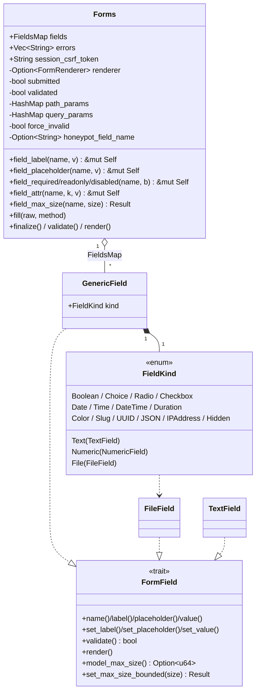
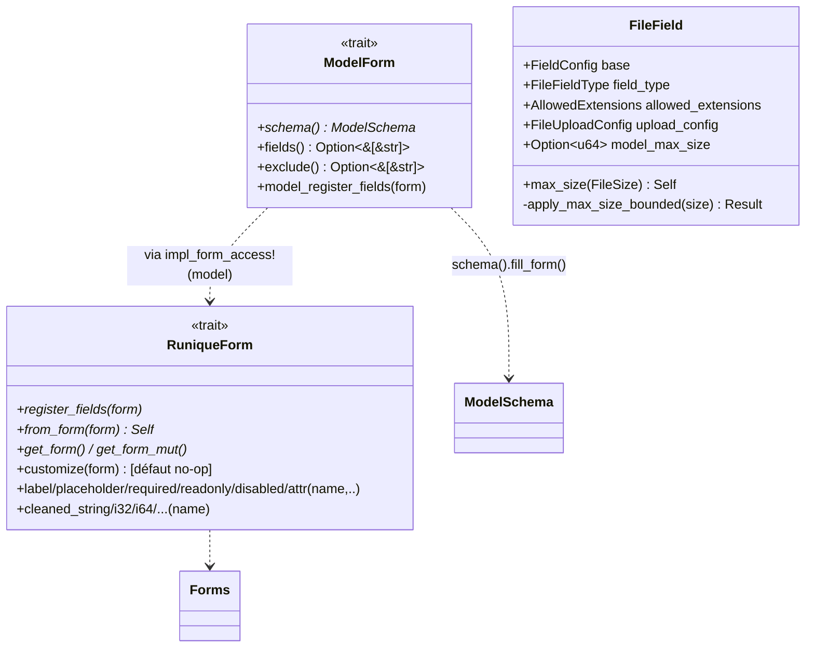

# UML — Formulaires (Forms, champs, ModelForm, Prisme)

## Forms + hiérarchie de champs

[`runique/src/forms/form.rs:30`](../../../runique/src/forms/form.rs#L30),
[`base.rs`](../../../runique/src/forms/base.rs), [`generic.rs`](../../../runique/src/forms/generic.rs)

## Pipeline form & traits de définition

Flux de construction d'un `#[form(schema=…)]` :
`build/build_with_data` → `register_fields` → `model_register_fields` →
`ModelSchema::fill_form` → `ColumnDef::to_form_field` (recrée chaque champ) →
**`Self::customize(form)`** (hook ajouté) → `fill(raw)` → `validate`.

## Anomalies / flux suspects

### 🟡 F1 — `customize` hors des chemins qui n'appellent pas `register_fields`
Le hook `customize` est appelé dans le `register_fields` généré par `impl_form_access!(model)`.
Tout chemin qui matérialise des champs **sans** passer par ce `register_fields` (formulaire
écrit à la main avec l'arm `()` ou `($field)` de la macro) **ne déclenchera pas** `customize`.
Acceptable (c'est ciblé sur les forms générés), mais à documenter pour éviter la surprise.

### 🟡 F2 — `max_size` du modèle vs défaut 10 Mo (résolu par couche 1, à régression-tester)
`to_form_field` applique `max_size` modèle seulement si `self.max_size` présent ; sinon le
`FileUploadConfig` garde son défaut (10 Mo). Le `min(modèle, override)` runtime repose sur
`model_max_size` posé ici. Si un champ fichier passe par un chemin qui **ne** repose pas sur
`to_form_field` (ex : AdminForm généré directement), il existe **deux sources** d'application
du `max_size` → vérifier qu'elles ne divergent jamais (cf. anomalie historique 2-sources).

### 🟠 F3 — `force_invalid` / honeypot : couplage middleware → champ privé
`Forms.force_invalid` est posé par le middleware anti-bot. Le flux exact (qui set, quand,
ordre vs `fill`) est à tracer : si `fill` ou `validate` tourne avant que le middleware ait
posé `force_invalid`, le honeypot peut être contourné. À vérifier dans [../../flux](../../flux).
