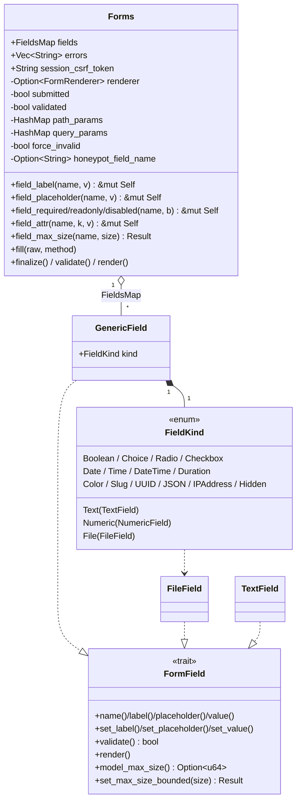
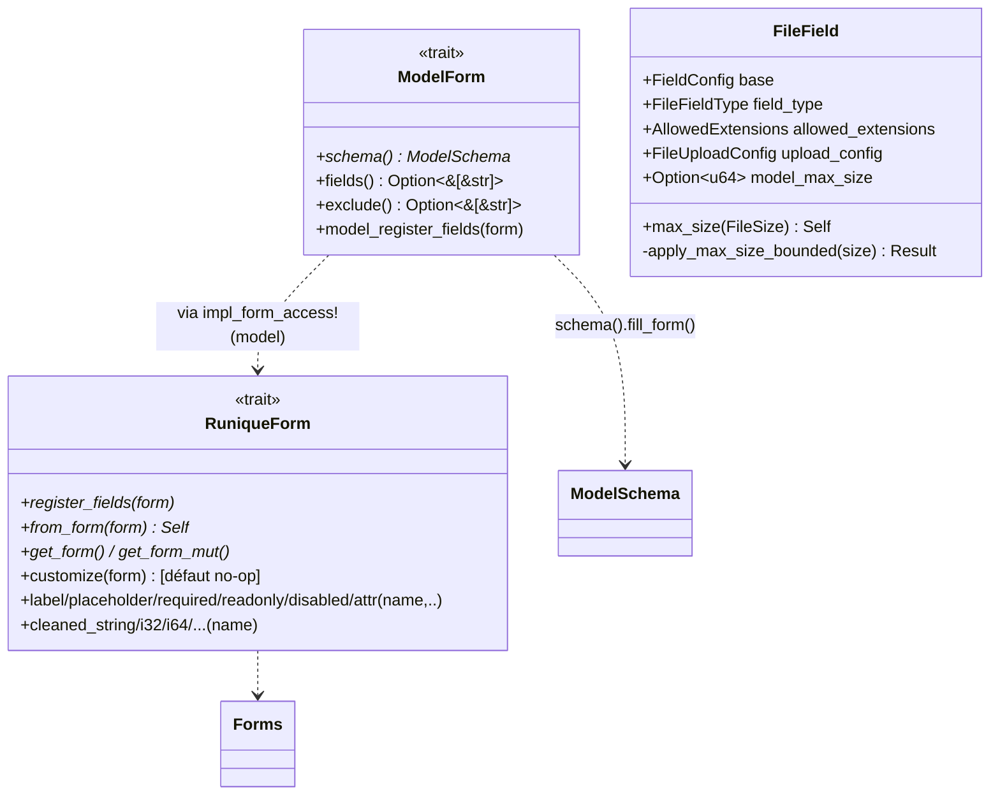

# UML — Formulaires (Forms, champs, ModelForm, Prisme)

## Forms + hiérarchie de champs

[`runique/src/forms/form.rs:30`](../../../runique/src/forms/form.rs#L30),
[`base.rs`](../../../runique/src/forms/base.rs), [`generic.rs`](../../../runique/src/forms/generic.rs)

## Pipeline form & traits de définition

Flux de construction d'un `#[form(schema=…)]` :
`build/build_with_data` → `register_fields` → `model_register_fields` →
`ModelSchema::fill_form` → `ColumnDef::to_form_field` (recrée chaque champ) →
**`Self::customize(form)`** (hook ajouté) → `fill(raw)` → `validate`.

## Anomalies / flux suspects

### 🟡 F1 — `customize` câblé seulement sur l'arm `(model)` — ✅ VÉRIFIÉ (voulu)
Le hook `customize` n'est appelé que dans le `register_fields` généré par
`impl_form_access!(model)`. **C'est voulu** : `customize` ne sert qu'aux forms générés depuis
un modèle ; un form écrit à la main (arms `()`/`($field)`) gère ses champs directement.
**Bug corrigé au passage (2.1.21)** : l'arm `(model)` était **dupliqué** dans la macro (2ᵉ copie
sans l'appel `customize`, inatteignable car `macro_rules!` prend le 1ᵉ match) → doublon mort supprimé.

### 🟡 F2 — `max_size` du modèle vs override de form — ✅ VÉRIFIÉ clean
**Vérifié (2.1.21).** Le modèle pose le plafond (`model_max_size`), l'override de form passe par
`Forms::field_max_size` → `set_max_size_bounded` → `apply_max_size_bounded` qui **rejette si
l'override dépasse le plafond modèle**. Les deux chemins sont réconciliés (pas en concurrence) :
override possible vers le bas, jamais au-dessus du plafond. Pas de divergence.

### 🟠 F3 — `force_invalid` / honeypot : ordre vs `fill`/`validate` — ✅ VÉRIFIÉ clean
**Vérifié (2.1.21).** `force_invalid` est posé à la construction du form (honeypot + CSRF)
**avant** `fill()` (qui n'y touche jamais) ; `is_valid()` court-circuite dessus avant toute
validation, et `is_save_allowed()` double-garde. Honeypot POST-only mais la garde CSRF couvre
toutes les méthodes mutantes. Pas de contournement possible.
