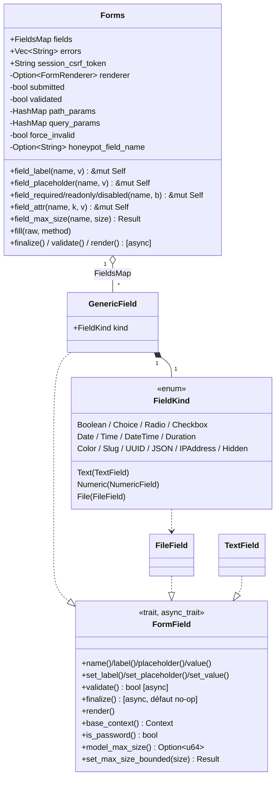

# UML — Formulaires (Forms, champs, ModelForm, Prisme)

## Forms + hiérarchie de champs

[`runique/src/forms/form.rs:30`](../../../runique/src/forms/form.rs#L30),
[`base.rs`](../../../runique/src/forms/base.rs), [`generic.rs`](../../../runique/src/forms/generic.rs)

```mermaid
classDiagram
    class Forms {
        +FieldsMap fields
        +Vec~String~ errors
        +String session_csrf_token
        -Option~FormRenderer~ renderer
        -bool submitted
        -bool validated
        -HashMap path_params
        -HashMap query_params
        -bool force_invalid
        -Option~String~ honeypot_field_name
        +field_label(name, v) &mut Self
        +field_placeholder(name, v) &mut Self
        +field_required/readonly/disabled(name, b) &mut Self
        +field_attr(name, k, v) &mut Self
        +field_max_size(name, size) Result
        +fill(raw, method)
        +finalize() / validate() / render() [async]
    }
    class FormField {
        <<trait, async_trait>>
        +name()/label()/placeholder()/value()
        +set_label()/set_placeholder()/set_value()
        +validate() bool [async]
        +finalize() [async, défaut no-op]
        +render()
        +base_context() Context
        +is_password() bool
        +model_max_size() Option~u64~
        +set_max_size_bounded(size) Result
    }
    class GenericField {
        +FieldKind kind
    }
    class FieldKind {
        <<enum>>
        Text(TextField)
        Numeric(NumericField)
        File(FileField)
        Boolean / Choice / Radio / Checkbox
        Date / Time / DateTime / Duration
        Color / Slug / UUID / JSON / IPAddress / Hidden
    }
    Forms "1" o-- "*" GenericField : FieldsMap
    GenericField "1" *-- "1" FieldKind
    GenericField ..|> FormField
    FieldKind ..> FileField
    FileField ..|> FormField
    TextField ..|> FormField
```

## Pipeline form & traits de définition

```mermaid
classDiagram
    class RuniqueForm {
        <<trait, async_trait>>
        +register_fields(form)*
        +from_form(form) Self*
        +get_form() / get_form_mut()*
        +customize(form) [défaut no-op, statique]
        +register_dynamic_fields(request) [async, défaut no-op]
        +validator_get(request) bool [défaut is_submitted()]
        +validator_post(request) bool [défaut is_submitted()]
        +label/placeholder/required/readonly/disabled/attr(name,..)
        +cleaned_string/i32/i64/...(name)
    }
    class ValidationForm~F~ {
        -F form
        +try_new(form, request)$ Result~Self,F~
        +into_form() F
        +database_error(msg) &mut Self
    }
    class ModelForm {
        <<trait>>
        +schema() ModelSchema*
        +fields() Option~&[&str]~
        +exclude() Option~&[&str]~
        +model_register_fields(form)
    }
    class FileField {
        +FieldConfig base
        +FileFieldType field_type
        +AllowedExtensions allowed_extensions
        +FileUploadConfig upload_config
        +Option~u64~ model_max_size
        +max_size(FileSize) Self
        -apply_max_size_bounded(size) Result
    }
    RuniqueForm ..> Forms
    ModelForm ..> ModelSchema : schema().fill_form()
    ModelForm ..> RuniqueForm : via impl_form_access!(model)
    ValidationForm~F~ o-- F : Deref (lecture seule)
    ValidationForm~F~ ..> RuniqueForm : F: RuniqueForm
```

Flux de construction d'un `#[form(schema=…)]` :
`build/build_with_data` → `register_fields` → `model_register_fields` →
`ModelSchema::fill_form` → `ColumnDef::to_form_field` (recrée chaque champ) →
**`Self::customize(form)`** (hook ajouté) → `fill(raw)` → `validate`.

Flux `ValidationForm<F>::try_new(form, request)` (remplace le boilerplate
`if request.is_post() && form.is_valid() {...} else {...}` désormais **supprimé**) :
`register_dynamic_fields(request).await` (champs dépendants de la requête) →
dispatch `validator_get`/`validator_post` selon `request.method.is_safe()` → si
`false`, retour `Err(form)` **sans validation** (pas d'erreur de champ posée) →
si `true`, `form.is_valid().await` → `Ok(ValidationForm(form))` ou `Err(form)`
(erreurs déjà peuplées par `is_valid()`). `into_form()` n'est atteignable
qu'après un `Ok` : impossible d'agir sur un form non validé (garantie de type,
pas seulement runtime).

## Anomalies / flux suspects

### 🟡 F1 — `customize` câblé seulement sur l'arm `(model)` — ✅ VÉRIFIÉ (voulu)
Le hook `customize` n'est appelé que dans le `register_fields` généré par
`impl_form_access!(model)`. **C'est voulu** : `customize` ne sert qu'aux forms générés depuis
un modèle ; un form écrit à la main (arms `()`/`($field)`) gère ses champs directement.
**Bug corrigé au passage (2.1.21)** : l'arm `(model)` était **dupliqué** dans la macro (2ᵉ copie
sans l'appel `customize`, inatteignable car `macro_rules!` prend le 1ᵉ match) → doublon mort supprimé.

### 🟡 F2 — `max_size` du modèle vs override de form — ✅ VÉRIFIÉ clean
**Vérifié (2.1.21).** Le modèle pose le plafond (`model_max_size`), l'override de form passe par
`Forms::field_max_size` → `set_max_size_bounded` → `apply_max_size_bounded` qui **rejette si
l'override dépasse le plafond modèle**. Les deux chemins sont réconciliés (pas en concurrence) :
override possible vers le bas, jamais au-dessus du plafond. Pas de divergence.

### 🟠 F3 — `force_invalid` / honeypot : ordre vs `fill`/`validate` — ✅ VÉRIFIÉ clean
**Vérifié (2.1.21).** `force_invalid` est posé à la construction du form (honeypot + CSRF)
**avant** `fill()` (qui n'y touche jamais) ; `is_valid()` court-circuite dessus avant toute
validation, et `is_save_allowed()` double-garde. Honeypot POST-only mais la garde CSRF couvre
toutes les méthodes mutantes. Pas de contournement possible.

### 🟠 F4 — `readonly` / `disabled` jamais posés sur 9 champs sur 18
**Corrigé (2.2.0).** Les templates `base_datetime`, `base_file`, `base_special`, `base_string` et
`base_hidden` testent tous `readonly.choice` / `disabled.choice`, mais **9 des 18 implémentations
de `render()` ne les inséraient pas dans le contexte**. Tera 1 évaluant une variable absente à
faux, l'attribut n'était simplement jamais émis — sans erreur, sans trace, sans test rouge. La
fonctionnalité n'avait donc jamais fonctionné sur ces champs. `text.rs` portait même un
commentaire `// IMPORTANT: Inject readonly/disabled config` suivi de rien.

Le correctif ne complète pas les 9 rendus fautifs : il **collapse le contrat en un chemin unique**.
`FormField::base_context()` fournit `field`, `readonly` et `disabled`, et les 18 rendus en partent.
Un 19ᵉ type de champ hérite du contrat sans avoir à y penser — c'est ce qui empêche le 10ᵉ oubli.
Révélé par la migration Tera 2, qui transforme la variable absente en erreur de rendu.

### 🔴 F5 — Marquage des champs sensibles : conception non contournable
**Ajouté (2.2.0).** `FieldConfig::is_password` est **privé**, **à sens unique** et **dérivé du
type** :

* privé — aucun code externe ne peut le remettre à `false`, il n'y a plus de champ public ;
* `mark_password()` l'active, **aucune opération ne le désactive** — un champ déclaré sensible ne
  peut pas cesser de l'être en cours d'exécution ;
* `FieldConfig::new` le pose pour tout `type_field == "password"`, quel que soit le constructeur —
  la protection ne peut donc pas être perdue par **omission**, qui est le mode de défaillance le
  plus probable ;
* le lecteur `is_password()` reteste le type en second rideau, si bien qu'une désérialisation
  posant le drapeau à `false` reste sans effet.

Il remplace les comparaisons `field_type() == "password"` jusque-là éparpillées dans `fill()` :
un seul point d'interrogation pilote désormais le rendu du widget, le saut en GET, le relâchement
de `required` en édition, le masquage dans les journaux et la sérialisation vers `form_fields`.
Un champ portant un secret sans être de type password (clé d'API, jeton) hérite de tout cela via
`mark_password()`, ce qu'un test sur le type ne permettra jamais.

### 🟠 F6 — Échec CSRF totalement silencieux — ✅ CORRIGÉ (2026-09-22)
`force_invalid` (posé par `Request::form()` sur CSRF KO, cf. F3 ci-dessus)
court-circuite `is_valid()` **avant** que `HiddenField::validate()` ne puisse
poser son propre message d'erreur CSRF — lequel dépendait de
`set_expected_value()`, **jamais appelé en production** (code mort). Résultat :
un CSRF invalide/expiré échouait sans **aucun** message nulle part — l'utilisateur
voyait juste le formulaire revenir vide, sans explication. Corrigé dans
`Request::form()` (`context/template.rs`) : `t("csrf.invalid_or_missing")` est
poussé directement dans `Forms.errors` dès la détection, avant le court-circuit.
Détail complet : [../../flux/requete-csrf-upload.md](../../flux/requete-csrf-upload.md) (C6).

### 🟡 F7 — `Request::is_get/is_post/is_put/is_delete` supprimées — RUPTURE D'API (2026-09-22)
Ces 4 méthodes n'avaient plus qu'un seul usage réel dans tout le framework : le
check honeypot (`self.is_post()` → inliné en `self.method == Method::POST`).
Leur unique raison d'être historique était le boilerplate de validation
`if request.is_post() && form.is_valid() {...} else {...}`, remplacé par
`ValidationForm::try_new()` (ci-dessus), qui dispatche lui-même sur la méthode
via `http::Method::is_safe()`. Supprimées avec les tests associés ; nouveaux
tests de régression honeypot ajoutés (`test_validation_form.rs`) puisque ce
comportement n'était pas testé directement avant.
