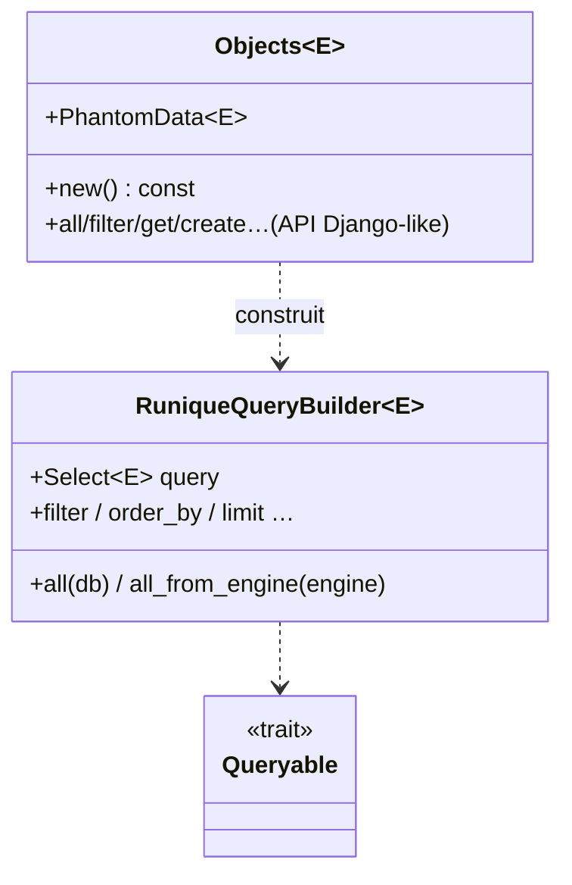
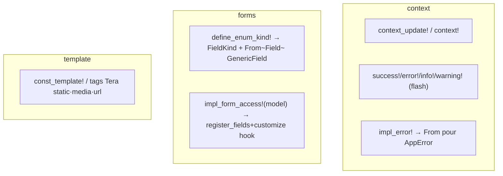

# UML — macros (bdd, routeur, context, forms, template)

Module surtout déclaratif (`macro_rules!`) + quelques types support génériques.

## bdd — ORM ergonomique (`Objects` / `search!`)

[`macros/bdd/`](../../../runique/src/macros/bdd/)



Macros associées :
- `impl_objects!` — génère `Model::objects` (point d'entrée `Objects<E>`).
- `search!{}` / `search_cond!` / `search_munch!` / `search_apply_op!` — DSL de filtres
  composables → `Condition` SeaORM (op `eq/like/gt/in/...`). Voir [filter.rs](../../../runique/src/macros/bdd/filter.rs).

## routeur — routing déclaratif

[`macros/routeur/`](../../../runique/src/macros/routeur/)

```mermaid
flowchart LR
    UP["urlpatterns!{ \"/path\" => view }"] --> RT[Router Axum]
    UP --> REG[register_url: nom → path reverse]
    V["view!"] --> H[handler GET/POST]
    REG --> TAG["` Tera"]
```

- `urlpatterns!{}` — déclare les routes (`"/x" => view`, `[get:…, post:…]`), peuple le
  registre d'URL nommées (reverse ``).
- `view!` ([get_post.rs](../../../runique/src/macros/routeur/get_post.rs)) — sépare handlers GET/POST.
- `register_url` / `router_ext` — extension du Router + enregistrement reverse.

## context / forms / template — macros



## Anomalies / flux suspects

### 🟢 macros = génération concrète (pas d'avalage)
`search!`/`impl_objects!`/`urlpatterns!` génèrent du code concret. Les `let _ = write!` des
expansions écrivent dans des `String` (infaillible) — bénins (déjà classés).

### 🟡 Rappel F1 — `customize` câblé seulement sur `impl_form_access!(model)` — ✅ VÉRIFIÉ (voulu)
Les forms non-`model` (arms `()`/`($field)`) ne déclenchent pas `customize` — comportement
voulu. Arm `(model)` dupliqué mort supprimé en 2.1.21. Voir
[../forms/formulaires.md](../forms/formulaires.md).
