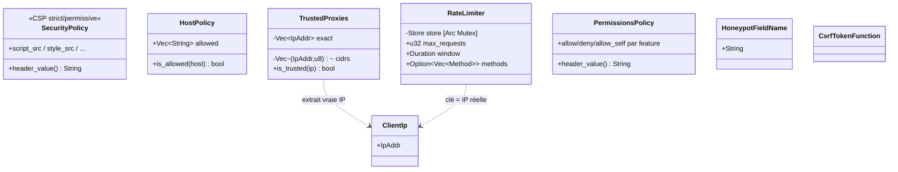

# UML — Middleware sécurité (hors session)

[`middleware/security/`](../../../runique/src/middleware/security/)

Middlewares correspondants (slots) : TrustedProxies(2), CORS(8), OpenRedirect(25),
SecurityHeaders(30)/CSP(31), CSRF(60), AntiBot(65), HostValidation(70).
`open_redirect::is_safe_redirect` valide les `Location` de redirection contre les hôtes autorisés.

## Anomalies / flux suspects

### 🟠 SEC1 — `RateLimiter` en mémoire process-local (même famille que AU1)
[`rate_limit.rs:22`](../../../runique/src/middleware/security/rate_limit.rs#L22)
Le compteur de requêtes vit dans une `HashMap` mémoire. En multi-instance, la limite est
**par instance** → un client réparti sur N instances obtient N× le quota. Cohérent avec le
mono-process actuel, mais à acter (avec AU1 lockout, AU2/AM4 cache : **thème state
process-local** à externaliser le jour du multi-instance).

### 🟡 SEC2 — `TrustedProxies` par défaut fait confiance à tout le privé (RFC 1918 + loopback)
[`trusted_proxies.rs:72`](../../../runique/src/middleware/security/trusted_proxies.rs#L72)
Défaut raisonnable derrière un reverse-proxy, mais si l'app est exposée **directement** (sans
proxy) avec ce défaut, un client du même réseau privé pourrait usurper `X-Forwarded-For` →
fausser `ClientIp` (donc rate-limit/lockout par IP). À documenter : `TrustedProxies::none()`
quand pas de proxy.

### 🟢 SEC3 — OpenRedirect validé contre les hôtes autorisés (pas d'anomalie)
`is_safe_redirect` empêche les redirections ouvertes en validant l'hôte cible. Sain.
