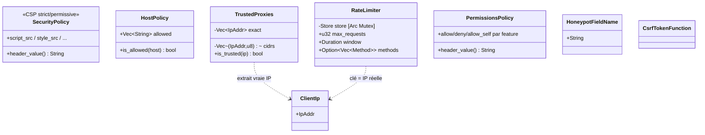

# UML — Middleware sécurité (hors session)

[`middleware/security/`](../../../runique/src/middleware/security/)

```mermaid
classDiagram
    class SecurityPolicy {
        <<CSP strict/permissive>>
        +script_src / style_src / ...
        +header_value() String
    }
    class HostPolicy {
        +Vec~String~ allowed
        +is_allowed(host) bool
    }
    class TrustedProxies {
        -Vec~IpAddr~ exact
        -Vec~(IpAddr,u8)~ cidrs
        +is_trusted(ip) bool
    }
    class ClientIp {
        +IpAddr
    }
    class RateLimiter {
        -Store store [Arc Mutex]
        +u32 max_requests
        +Duration window
        +Option~Vec~Method~~ methods
    }
    class PermissionsPolicy {
        +allow/deny/allow_self par feature
        +header_value() String
    }
    class HoneypotFieldName {
        +String
    }
    class CsrfTokenFunction
    TrustedProxies ..> ClientIp : extrait vraie IP
    RateLimiter ..> ClientIp : clé = IP réelle
```

Middlewares correspondants (slots) : TrustedProxies(2), CORS(8), HostValidation(15),
OpenRedirect(25), SecurityHeaders(30)/CSP(31), CSRF(60), AntiBot(65).
`open_redirect::is_safe_redirect` valide les `Location` de redirection contre les hôtes autorisés.

## Anomalies / flux suspects

### 🟠 SEC1 — `RateLimiter` en mémoire process-local (même famille que AU1)
[`rate_limit.rs:22`](../../../runique/src/middleware/security/rate_limit.rs#L22)
Le compteur de requêtes vit dans une `HashMap` mémoire. En multi-instance, la limite est
**par instance** → un client réparti sur N instances obtient N× le quota. Cohérent avec le
mono-process actuel, mais à acter (avec AU1 lockout, AU2/AM4 cache : **thème state
process-local** à externaliser le jour du multi-instance).
> Note (2026-07-26) : le **fallback** d'extraction d'IP (`extract_ip`, quand l'extension
> `ClientIp` n'est pas posée) lit désormais le **peer réel `ConnectInfo`**, plus le
> `X-Forwarded-For` spoofable (NEW6). Voir `audit-securite-diagrammes.md` (racine).

### 🟡 SEC2 — `TrustedProxies` par défaut fait confiance à tout le privé — ✅ MITIGÉ (2026-07-26)
[`trusted_proxies.rs`](../../../runique/src/middleware/security/trusted_proxies.rs)
Défaut raisonnable derrière un reverse-proxy, mais si l'app est exposée **directement** (sans
proxy) avec ce défaut, un client du même réseau privé pourrait usurper `X-Forwarded-For` →
fausser `ClientIp` (rate-limit/lockout par IP).
**Mitigé** : le défaut est désormais **edge-aware** — `TrustedProxies::default_for_edge(acme_enabled)`
→ `none()` quand Runique termine le TLS lui-même (mode ACME = pas de proxy par construction),
plages privées sinon (assemblé en [`build.rs`](../../../runique/src/app/builder/build.rs)). Le cas
HTTP-direct-sans-ACME reste indétectable par le framework → couvert par la **doc** (encadré
« Sécurité — quand utiliser `.none()` », docs trusted-proxies fr/en). Détail : `audit-securite-diagrammes.md` (racine).
> Rejeté sciemment : gater `X-Forwarded-Proto` sur le peer trusted (SEC2b) — casserait les
> proxies à IP publique (Cloudflare) en boucle de redirection, pour un gain sécurité ≈ 0.

### 🟢 SEC3 — OpenRedirect validé contre les hôtes autorisés (pas d'anomalie)
`is_safe_redirect` empêche les redirections ouvertes en validant l'hôte cible. Sain.
