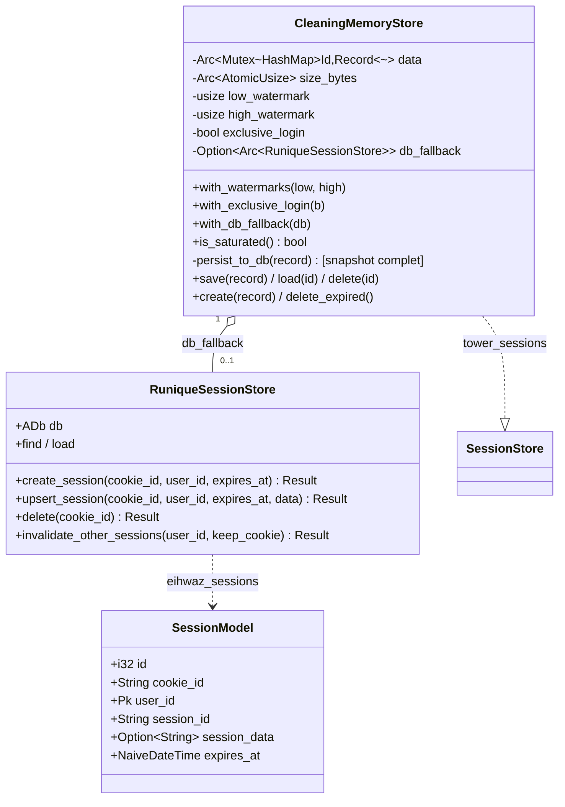

# UML — Sessions (store mémoire + fallback DB)

[`cleaning_store.rs`](../../../runique/src/middleware/session/cleaning_store.rs),
[`session_db.rs`](../../../runique/src/middleware/session/session_db.rs)

Stratégie : **mémoire d'abord** (autoritaire) + **snapshot complet** vers la DB pour les
sessions **authentifiées** uniquement (présence `user_id`). `persist_to_db` écrit tous les
champs ensemble pour interdire un backup partiel/périmé. `load` : miss mémoire → DB →
reconstruit le `Record`. `delete` purge mémoire **et** DB (couvre le cleanup `cycle_id`).

## Anomalies / flux suspects

### 🟠 S1 — Sessions anonymes (et leur CSRF) perdues au redémarrage
`persist_to_db` est **no-op sans `user_id`** (sessions anonymes non persistées). Or le token
CSRF d'un visiteur non connecté vit dans sa session anonyme. Après un restart serveur, sa
session anonyme disparaît → le **POST d'un formulaire public** (login, contact…) échoue en
CSRF invalide jusqu'à rechargement de la page. UX dégradée non signalée. À confirmer dans le
flux CSRF/session.

### 🟠 S2 — Lock relâché avant l'écriture DB async (fenêtre de course)
[`cleaning_store.rs:378`](../../../runique/src/middleware/session/cleaning_store.rs#L378)
Le `save` relâche le `Mutex` mémoire **avant** le `persist_to_db().await`. Deux `save`
concurrents sur la même session peuvent donc écrire en DB dans un ordre ≠ de l'ordre mémoire
→ backup DB potentiellement périmé d'un cran (le dernier writer DB gagne, pas le dernier
writer mémoire). Mémoire reste cohérente (autoritaire), mais le fallback peut diverger.

### 🟠 S3 — High watermark : refus de nouvelles sessions sous pression — ✅ CORRIGÉ
**Corrigé (2.1.21).** Le refus au-delà du high watermark était déjà propre côté store (Err
typé, loggé), mais remontait en 500 générique. Ajout de `is_saturated()` +
`RuniqueEngine::session_store_saturated()` → le login admin renvoie un **503 + Retry-After**
clair (template `503.html` + `render_503`, 9 locales) au lieu d'un 500. Le login public se
protège pareil via l'accesseur engine.

### 🟡 S4 — Double identifiant `cookie_id` / `session_id` (rappel D4)
`SessionModel` porte `cookie_id` (UNIQUE, identifiant d'opposabilité) et `session_id`
(stable par device). La distinction est subtile et a déjà causé une collision (corrigée
2.1.19). À documenter dans le flux session pour éviter une régression.
