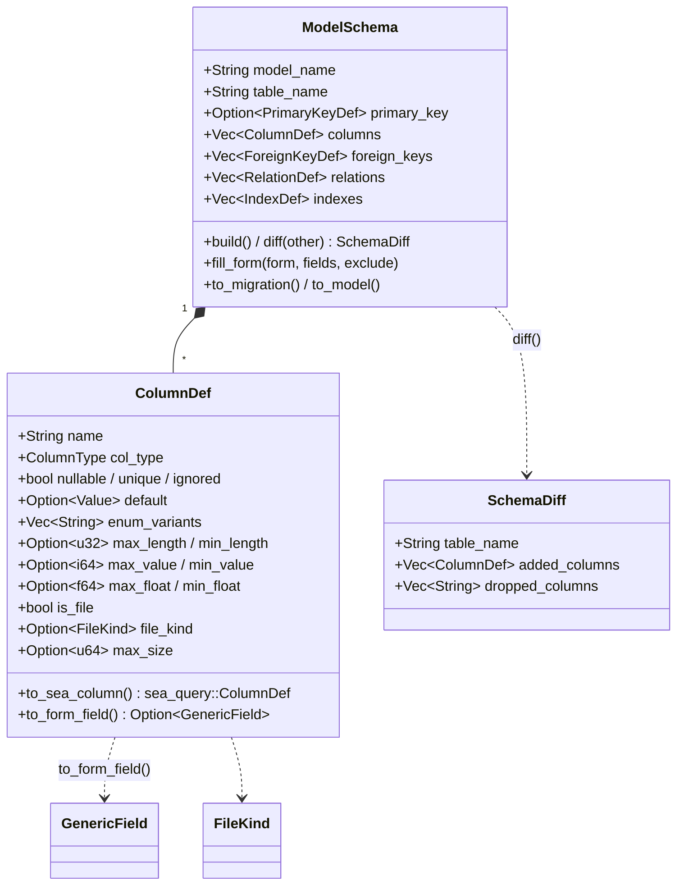

# UML — Migration (ColumnDef, ModelSchema, diff)

[`migration/column/mod.rs`](../../../runique/src/migration/column/mod.rs),
[`migration/schema/mod.rs`](../../../runique/src/migration/schema/mod.rs)

Double rôle de `ColumnDef` : génération SQL (`to_sea_column`) **et** génération de champ de
formulaire (`to_form_field`). Les métadonnées `is_file`/`file_kind`/`max_size` sont des
side-fields « form only » ignorés par `to_sea_column` (cf. chantier uploads).

## Anomalies / flux suspects

### 🔴 M1 — `SchemaDiff` ne détecte PAS les colonnes modifiées
[`schema/mod.rs:388`](../../../runique/src/migration/schema/mod.rs#L388)
`SchemaDiff` n'a que `added_columns` et `dropped_columns`. Le `diff()` compare les **ensembles
de noms** de colonnes (`difference`). Conséquence : un changement de **type**, de **nullabilité**,
d'**unicité**, de **default** ou de **longueur** sur une colonne existante **n'est jamais
détecté** → `makemigrations` ne génère **aucun `ALTER COLUMN`**. Le dev croit sa migration
générée alors que le schéma réel diverge du modèle. C'est un faux négatif silencieux, le pire
genre. À confirmer dans le flux makemigrations (03), mais la structure le prouve déjà.

### 🟠 M2 — `to_form_field` : aucune branche pour beaucoup de `ColumnType`
Le `match col_type` retombe sur `_ => TextField::text` pour tout type non explicitement géré
(binary, blob, inet, cidr, interval, json géré, etc.). Un champ `interval`/`binary` devient un
input texte silencieusement. Dégradation muette → au minimum un log/warn serait utile.

### 🟡 M3 — `max_size`/`is_file` côté schéma vs AdminForm généré (rappel F2)
Deux chemins produisent le `FileField` (schéma `to_form_field` et `generate_admin_form`).
Tant que les deux ne partagent pas une source unique, risque de divergence du `max_size`.
