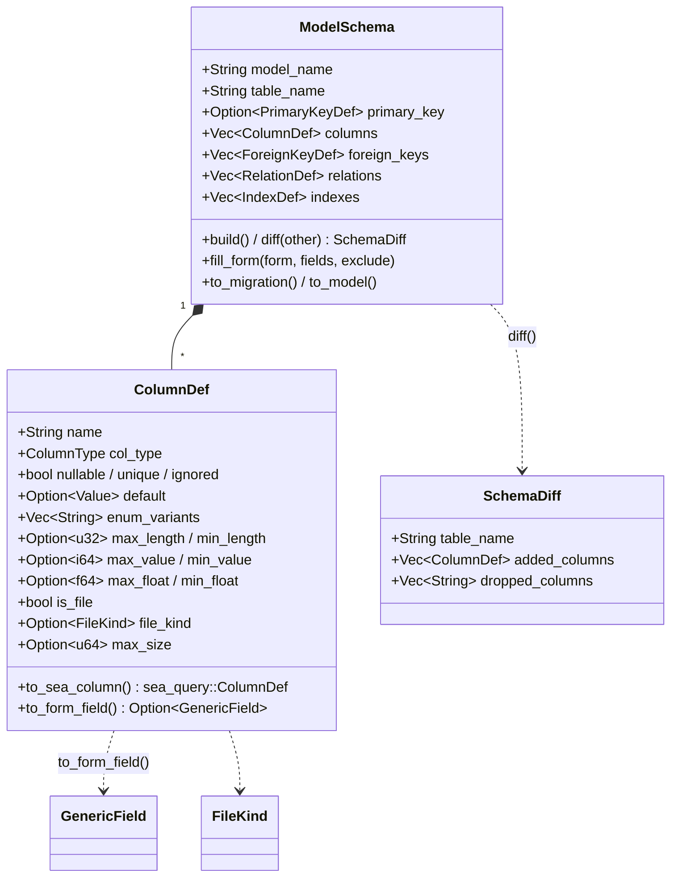

# UML — Migration (ColumnDef, ModelSchema, diff)

[`migration/column/mod.rs`](../../../runique/src/migration/column/mod.rs),
[`migration/schema/mod.rs`](../../../runique/src/migration/schema/mod.rs)

```mermaid
classDiagram
    class ModelSchema {
        +String model_name
        +String table_name
        +Option~PrimaryKeyDef~ primary_key
        +Vec~ColumnDef~ columns
        +Vec~ForeignKeyDef~ foreign_keys
        +Vec~RelationDef~ relations
        +Vec~IndexDef~ indexes
        +build() / diff(other) SchemaDiff
        +fill_form(form, fields, exclude)
        +to_migration() / to_model()
    }
    class ColumnDef {
        +String name
        +ColumnType col_type
        +bool nullable / unique / ignored
        +Option~Value~ default
        +Vec~String~ enum_variants
        +Option~u32~ max_length / min_length
        +Option~i64~ max_value / min_value
        +Option~f64~ max_float / min_float
        +bool is_file
        +Option~FileKind~ file_kind
        +Option~u64~ max_size
        +to_sea_column() sea_query::ColumnDef
        +to_form_field() Option~GenericField~
    }
    class SchemaDiff {
        +String table_name
        +Vec~ColumnDef~ added_columns
        +Vec~String~ dropped_columns
    }
    ModelSchema "1" *-- "*" ColumnDef
    ModelSchema ..> SchemaDiff : diff()
    ColumnDef ..> GenericField : to_form_field()
    ColumnDef ..> FileKind
```

Double rôle de `ColumnDef` : génération SQL (`to_sea_column`) **et** génération de champ de
formulaire (`to_form_field`). Les métadonnées `is_file`/`file_kind`/`max_size` sont des
side-fields « form only » ignorés par `to_sea_column` (cf. chantier uploads).

## Anomalies / flux suspects

### 🔴 M1 — `SchemaDiff` ne détecte PAS les colonnes modifiées
[`schema/mod.rs:388`](../../../runique/src/migration/schema/mod.rs#L388)
`SchemaDiff` n'a que `added_columns` et `dropped_columns`. Le `diff()` compare les **ensembles
de noms** de colonnes (`difference`). Conséquence : un changement de **type**, de **nullabilité**,
d'**unicité**, de **default** ou de **longueur** sur une colonne existante **n'est jamais
détecté** → `makemigrations` ne génère **aucun `ALTER COLUMN`**. Le dev croit sa migration
générée alors que le schéma réel diverge du modèle. C'est un faux négatif silencieux, le pire
genre. À confirmer dans le flux makemigrations (03), mais la structure le prouve déjà.

### 🟠 M2 — `to_form_field` : fallback `TextField` silencieux — ✅ CORRIGÉ
**Corrigé (2.1.21).** Le fallback `_ => TextField` émet désormais un log `debug`
(« type de colonne non géré → TextField par défaut »). Brancher les types manquants
(binary/inet/interval…) reste un nice-to-have non bloquant.

### 🟡 M3 — `max_size`/`is_file` côté schéma vs AdminForm généré (rappel F2) — ✅ VÉRIFIÉ clean
**Vérifié (2.1.21).** Voir F2 : le plafond modèle (`model_max_size`) borne tout override via
`set_max_size_bounded` (rejet si dépassement). Pas de divergence entre les chemins.

### 🟠 M4 — noms de contrainte FK/index générés sans limite de longueur — ✅ CORRIGÉ (2026-09-24)
[`cli/makemigration.rs`](../../../runique/src/cli/makemigration.rs)
MariaDB/MySQL rejette tout identifiant > 64 caractères ; Postgres tronque silencieusement à 63
(donc invisible sur cet engine). Trouvé en exerçant `many_to_many`/`unique_together` pour de vrai
sur des noms de table/colonne un peu longs. Pas de troncature auto (imprévisible depuis
`model!{}`) ni `panic!` (fuite du fichier/ligne interne au CLI) — validation en amont sur tout le
plan, même pattern que M1 aurait dû suivre si porté : `check_identifier_lengths` factorisé avec
`check_destructive` via `report_and_bail_if_any`. Détail : [[project_bugs_generateur]] Bug K.

### 🟠 M5 — `drop_index` avant `drop_table` cassait MariaDB si l'index servait une FK — ✅ CORRIGÉ (2026-09-24)
[`generators.rs::generate_create_file`](../../../runique/src/migration/utils/generators.rs)
Le `down()` d'une migration CREATE TABLE faisait un `drop_index` explicite avant `drop_table` —
redondant (`DROP TABLE` supprime déjà ses index) et cassé sur MariaDB (erreur 1553) quand l'index
encore actif servait de support à une FK. `generate_snapshot_file` avait déjà le bon ordre
(`fk_drops` avant `idx_drops`) — seul `generate_create_file` en manquait. Fix : suppression pure
du `drop_index` explicite. Détail : [[project_bugs_generateur]] Bug L.
