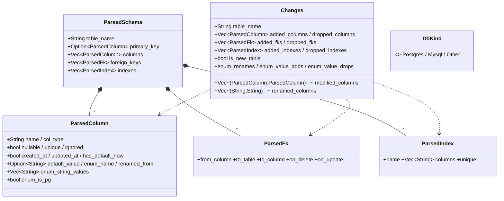

# UML — Migration : defs builder + types parsés/diff

Complément de [schema-et-diff.md](schema-et-diff.md) (ColumnDef/ModelSchema/SchemaDiff).

## Defs de schéma (builder)

[`migration/{primary_key,foreign_key,index,relation,hooks}`](../../../runique/src/migration/)

```mermaid
classDiagram
    class PrimaryKeyDef {
        +String name
        +ColumnType col_type
        +bool auto_increment
    }
    class ForeignKeyDef {
        +String from_column
        +String to_table / to_column
        +ForeignKeyAction on_delete / on_update
        +references() / to_column() / on_delete()
    }
    class IndexDef {
        +Vec~String~ columns
        +bool unique
        +Option~String~ name
    }
    class RelationDef {
        +RelationKind kind
        +String target
        +has_one/has_many/belongs_to/many_to_many()
    }
    class RelationKind {
        <<enum>> HasOne / HasMany / BelongsTo{from,to} / ManyToMany{via}
    }
    class HooksDef {
        +Vec~Hook~ hooks
        +Option~String~ file_path
    }
    class Hook {
        +HookType hook_type
        +u8 slot
        +String handler_path
    }
    class HookType {
        <<enum>> BeforeSave / AfterSave / BeforeDelete / AfterDelete
    }
    RelationDef *-- RelationKind
    HooksDef *-- "*" Hook
    Hook *-- HookType
```

`ModelSchema` agrège : `Vec<ColumnDef>`, `Option<PrimaryKeyDef>`, `Vec<ForeignKeyDef>`,
`Vec<IndexDef>`, `Vec<RelationDef>` (cf. schema-et-diff.md).

## Types parsés + diff (`migration/utils/types.rs`)



## Anomalies / flux suspects

### ✅ Confirmation — `Changes` est le vrai diff (AM1/M1 = faux positifs)
`diff_schemas` produit un `Changes` complet : `modified_columns`, `renamed_columns`
(RENAME COLUMN sans perte), `added/dropped_fks`, `added/dropped_indexes`, `enum_renames`,
`enum_value_adds/drops`. La détection de modification existe bien — le `ModelSchema::diff`
limité (add/drop) n'est qu'un diff secondaire non utilisé par la CLI.

### 🟢 Note — `ParsedColumn.renamed_from` transient (design sain)
`renamed_from` vit uniquement dans le modèle source, jamais écrit en snapshot → consommé par
le diff pour émettre `RENAME COLUMN` au lieu de DROP+ADD (préserve les données). Bonne
conception, pas d'anomalie.
