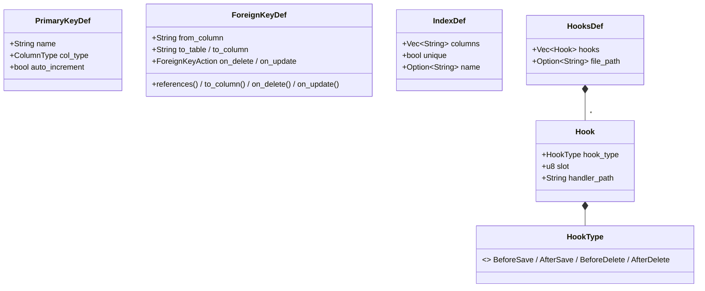
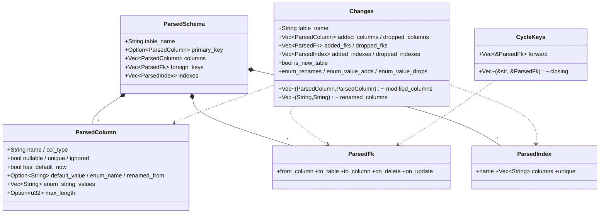

# UML — Migration : defs builder + types parsés/diff

Complément de [schema-et-diff.md](schema-et-diff.md) (ColumnDef/ModelSchema/SchemaDiff).

> **3.0.0 (2026-10-06)** — `makemigrations` lit le DSL avec `runique_dsl` (même parseur que la
> macro) ; le module `migration::relation` (`RelationDef`/`RelationKind`, jamais lu) est
> supprimé ; `ParsedColumn` perd `created_at`/`updated_at` (illisibles depuis un snapshot) et
> gagne `max_length`.

## Defs de schéma (builder)

[`migration/{primary_key,foreign_key,index,hooks}`](../../../runique/src/migration/)

```mermaid
classDiagram
    class PrimaryKeyDef {
        +String name
        +ColumnType col_type
        +bool auto_increment
    }
    class ForeignKeyDef {
        +String from_column
        +String to_table / to_column
        +ForeignKeyAction on_delete / on_update
        +references() / to_column() / on_delete() / on_update()
    }
    class IndexDef {
        +Vec~String~ columns
        +bool unique
        +Option~String~ name
    }
    class HooksDef {
        +Vec~Hook~ hooks
        +Option~String~ file_path
    }
    class Hook {
        +HookType hook_type
        +u8 slot
        +String handler_path
    }
    class HookType {
        <<enum>> BeforeSave / AfterSave / BeforeDelete / AfterDelete
    }
    HooksDef *-- "*" Hook
    Hook *-- HookType
```

`ModelSchema` agrège : `Vec<ColumnDef>`, `Option<PrimaryKeyDef>`, `Vec<ForeignKeyDef>`,
`Vec<IndexDef>` (cf. schema-et-diff.md). Les FK de `schema()` viennent des `belongs_to` : table
et clé primaire lues sur l'entité cible.

## Lecture du DSL (`migration/utils/parser_builder`, `parser_extend`)

```mermaid
classDiagram
    class MacroCollector~T~ {
        +&str name
        +Vec~syn::Result~T~~ found
        visit_macro()
    }
    class ParsedModel {
        +String name
        +ParsedSchema schema
        +Vec~ParsedSchema~ lists
    }
    class to_schema {
        <<module>>
        +decl_to_column(FormFieldDecl, enums) ParsedColumn
        +model_to_parsed_schema(ModelInput) ParsedSchema
        +list_tables(ModelInput, owner) Vec~ParsedSchema~
    }
    class runique_dsl {
        <<crate>>
        ModelInput / ExtendDsl
    }
    MacroCollector ..> runique_dsl : syn::parse2
    to_schema ..> runique_dsl
    ParsedModel *-- ParsedSchema
```

- `parse_model_from_source` → `Result<Option<ParsedModel>>` : erreur avec `ligne:colonne` ;
  deux `model!{}` dans un fichier = erreur.
- `model_to_parsed_schema` ajoute un index `idx_<table>_<col>` par colonne de `belongs_to` (sauf
  `unique` ou déjà en tête d'un index).
- `list_tables` : une table `{table}_{champ}` par champ liste (`id`, `owner_id` FK CASCADE,
  `value`, unique `(owner_id, value)`, index `(value, owner_id)`).
- `scan_entities` résout `ParsedFk.to_table` (nom de module) en vraie table + vraie PK.

## Types parsés + diff (`migration/utils/types.rs`)

```mermaid
classDiagram
    class ParsedSchema {
        +String table_name
        +Option~ParsedColumn~ primary_key
        +Vec~ParsedColumn~ columns
        +Vec~ParsedFk~ foreign_keys
        +Vec~ParsedIndex~ indexes
    }
    class ParsedColumn {
        +String name / col_type
        +bool nullable / unique / ignored
        +bool has_default_now
        +Option~String~ default_value / enum_name / renamed_from
        +Vec~String~ enum_string_values
        +Option~u32~ max_length
    }
    class ParsedFk { +from_column +to_table +to_column +on_delete +on_update }
    class ParsedIndex { +name +Vec~String~ columns +unique }
    class Changes {
        +String table_name
        +Vec~ParsedColumn~ added_columns / dropped_columns
        +Vec~(ParsedColumn,ParsedColumn)~ modified_columns
        +Vec~(String,String)~ renamed_columns
        +Vec~ParsedFk~ added_fks / dropped_fks
        +Vec~ParsedIndex~ added_indexes / dropped_indexes
        +bool is_new_table
        +enum_renames / enum_value_adds / enum_value_drops
    }
    class CycleKeys {
        +Vec~&ParsedFk~ forward
        +Vec~(&str, &ParsedFk)~ closing
    }
    ParsedSchema *-- "*" ParsedColumn
    ParsedSchema *-- "*" ParsedFk
    ParsedSchema *-- "*" ParsedIndex
    Changes ..> ParsedColumn
    Changes ..> ParsedFk
    Changes ..> ParsedIndex
    CycleKeys ..> ParsedFk
```

`CycleKeys` (generators.rs) : pour une table nouvelle, ses FK vers une table créée plus tard
(`forward`, inline sous SQLite seulement) et les FK d'autres tables à ajouter après sa création
(`closing`, `ALTER` hors SQLite).

## Anomalies / flux suspects

### ✅ Confirmation — `Changes` est le vrai diff (AM1/M1 = faux positifs)
`diff_schemas` produit un `Changes` complet : `modified_columns` (type, nullable, unique,
default, **longueur**), `renamed_columns` (RENAME COLUMN sans perte), `added/dropped_fks`,
`added/dropped_indexes`, `enum_renames`, `enum_value_adds/drops`. Le `ModelSchema::diff` limité
(add/drop) n'est qu'un diff secondaire non utilisé par la CLI.

### 🟢 Note — `ParsedColumn.renamed_from` transient (design sain)
`renamed_from` vit uniquement dans le modèle source, jamais écrit en snapshot → consommé par
le diff pour émettre `RENAME COLUMN` au lieu de DROP+ADD (préserve les données).

### ✅ CORRIGÉ (2026-10-06) — deux lecteurs du DSL qui divergeaient
La CLI avait son propre parseur, tolérant (relations illisibles sautées, fichier invalide =
`None`), avec sa propre règle de nullabilité (`V2_TYPES`) et des noms magiques (`created_at`,
`updated_at`, `cache_key`). La macro lisait les FK depuis `fk()`, la CLI depuis `belongs_to` :
un même modèle n'avait pas les mêmes FK selon le lecteur. Un seul parseur (`runique_dsl`)
désormais, strict, `belongs_to` seule source des FK.

### ✅ CORRIGÉ (2026-10-06) — `max_length` jamais migré
La longueur n'existait pas dans `ParsedColumn` : changer `max_length` ne produisait aucune
migration. Elle est suivie par snapshot (marqueur `SNAPSHOT_LENGTHS_MARKER`) ; un ancien
snapshot adopte une fois les longueurs du modèle.
