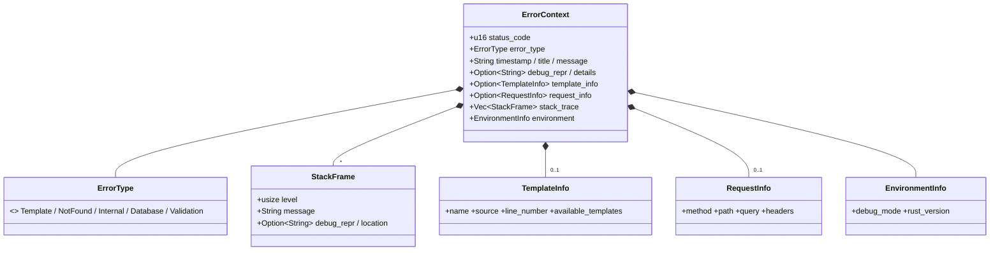
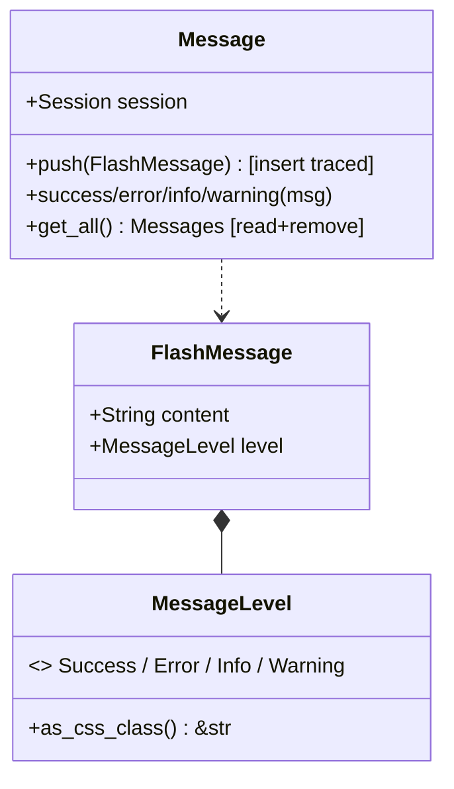
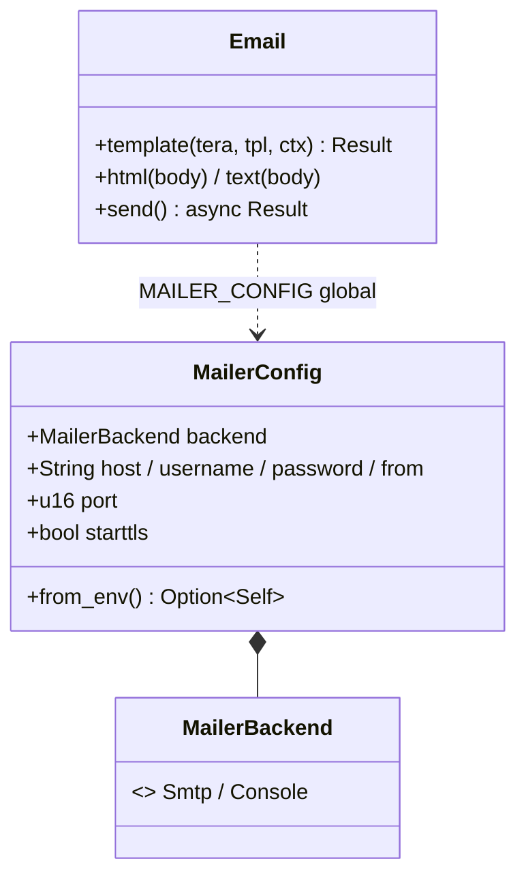
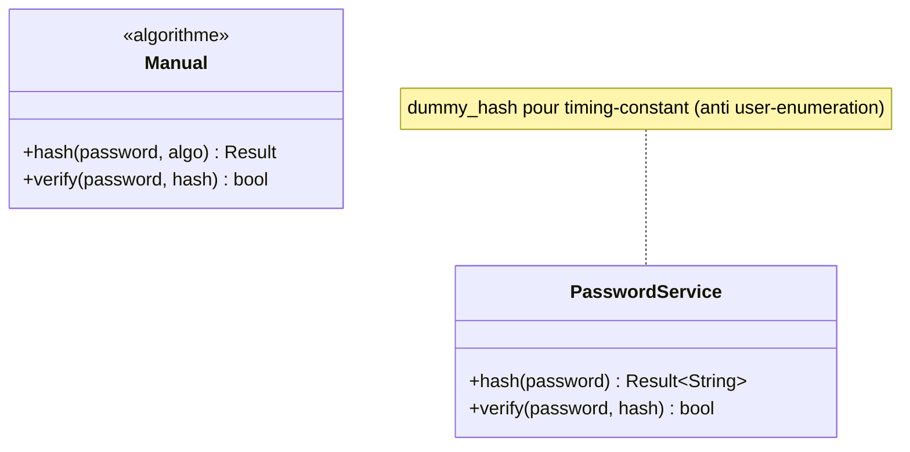
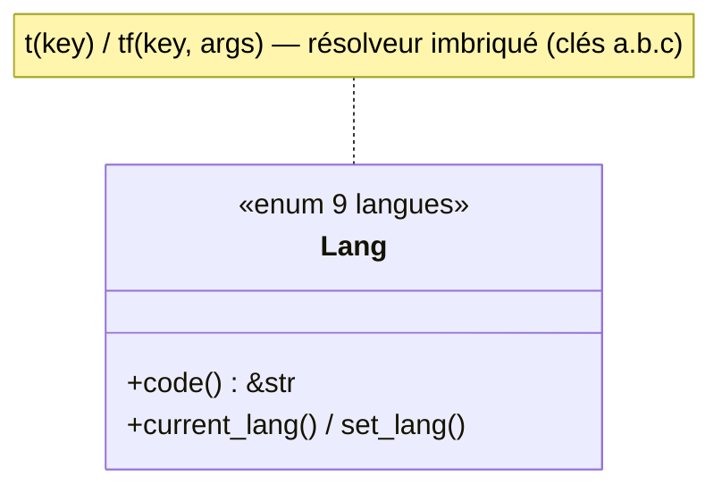

# UML — Modules transverses (errors, flash, mailer, password, i18n)

Modules utilitaires sans flux de données propre, regroupés ici pour la complétude.

## errors — `RuniqueError` / `ErrorContext`

[`errors/error.rs`](../../../runique/src/errors/error.rs)

`debug_repr`/`stack_trace`/`request_info` ne doivent être exposés qu'en `debug_mode`
(le rendu HTML d'erreur masque ces champs en prod — à vérifier côté template d'erreur).

## flash — messages éphémères

[`flash/flash_struct.rs`](../../../runique/src/flash/flash_struct.rs),
[`flash/flash_manager.rs`](../../../runique/src/flash/flash_manager.rs)

Écritures session **tracées** (`.trace`) ; lectures = défaut vide bénin. Audit clean.

## mailer — `Email` / `MailerConfig`

[`utils/mailer/mod.rs`](../../../runique/src/utils/mailer/mod.rs)

## password — hash (argon2/bcrypt/scrypt)

[`utils/password/mod.rs`](../../../runique/src/utils/password/mod.rs)

## i18n — `Lang`

[`utils/trad/switch_lang.rs`](../../../runique/src/utils/trad/switch_lang.rs)

## Anomalies / flux suspects

### 🟡 TR1 — Exposition conditionnelle des détails d'erreur
`ErrorContext` porte `debug_repr`, `stack_trace`, `request_info` (headers inclus). À
**garantir** que le template d'erreur ne les rend qu'en `debug_mode` — une fuite en prod
exposerait stack traces + en-têtes de requête. À vérifier dans le template `errors/*.html`.

### 🟡 TR2 — `MailerConfig.password` en clair dans les logs — ✅ CORRIGÉ
**Corrigé (2.1.21).** `MailerConfig` dérivait `Debug` → `{:?}` imprimait le mot de passe SMTP en
clair. Impl `Debug` manuelle masquant `password: "***"`. (Le secret reste en `String` en mémoire,
inévitable pour l'auth SMTP, mais n'est plus exposable via un log.)
