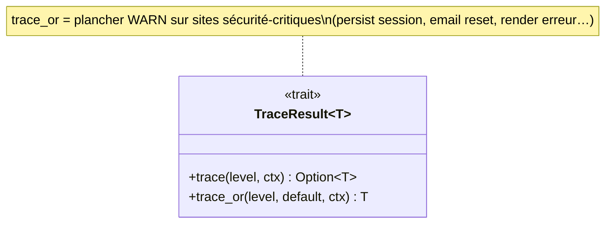

# UML — utils : tracing, TraceResult, tokens CSRF/CSP

## Tracing — `RuniqueLog` (arbre par domaine)

[`utils/config/runique_log/`](../../../runique/src/utils/config/runique_log/)

```mermaid
classDiagram
    class RuniqueLog {
        -Option~String~ subscriber_level
        +Option~FormTracing~ forms
        +Option~MiddlewareTracing~ middleware
        +Option~SessionTracing~ session
        +Option~AuthTracing~ auth
        +Option~AdminTracing~ admin
        +Option~DbTracing~ db
        +Option~MailerTracing~ mailer
        +Option~MigrationTracing~ migration
        +Option~TemplatesTracing~ templates
        +Option~ErrorsTracing~ errors
        +Option~BuilderTracing~ builder
        +Vec~LogOutput~ outputs
        +output()/external()/dev()
        +init_subscriber() Vec~WorkerGuard~
    }
    class LogOutput {
        <<enum>> Stdout / File{path,rotation} / Custom(LogSink)
    }
    class LogRotation { <<enum>> Daily / Hourly / Never }
    class LogSink { <<trait>> +emit(LogRecord) }
    class LogRecord { +level +target +fields… }
    RuniqueLog *-- "*" LogOutput
    LogOutput *-- LogRotation
    LogOutput ..> LogSink
    LogSink ..> LogRecord
```

Chaque `*Tracing` (FormTracing, AuthTracing, AdminTracing…) = sous-struct avec une feuille
`Option<Level>` par sous-canal → activation fine par domaine. `runique_log!(level, …)` émet ;
`get_log().<domaine>.<canal>` lit le niveau gaté.

## TraceResult — ne pas avaler les `Result`

[`utils/config/trace_ext.rs`](../../../runique/src/utils/config/trace_ext.rs)



C'est l'outil canonique du chantier « zéro erreur avalée » : `result.trace(level, "ctx")`
logge `file:line` + l'erreur puis renvoie `Option`, au lieu d'un `.ok()` muet.

## Tokens — CSRF & CSP nonce

[`utils/middleware/`](../../../runique/src/utils/middleware/)

```mermaid
classDiagram
    class CsrfToken { +String +masked()/unmasked() HMAC }
    class CsrfContext { <<enum>> Anonymous{session_id} / Authenticated{user_id} }
    class CspNonce { -String +as_str()/as_attr() }
    CsrfToken ..> CsrfContext : generate_with_context()
```

`CsrfToken` : masquage/démasquage HMAC (anti BREACH) ; lié au contexte (anonyme vs
authentifié) pour invalider le token à l'élévation de privilège. `CspNonce` : nonce par
requête injecté dans la CSP + les `<script nonce>`.

## Reste utils (data/flux, pas de classe notable)

- `cli/` : `makemigration`/`migrate`/`cli_admin`/`new_project`/`start` = **fonctions de flux**
  (couvertes par flux/makemigrations + commit atomique). Pas de struct porteuse.
- `reset_token/entity` : Model `eihwaz_reset_tokens` (cf. [merise](../../merise/modele-donnees.md) + [auth](../auth/authentification.md)).
- `constante/`, `aliases/`, `config/{env,integrity,pk,url_params}`, `resolve_ogimage/`,
  `init_error/` : constantes, alias de types, helpers — pas de modèle de données propre.

## Anomalies / flux suspects

### 🟢 Tracing infra = audit clean
`TraceResult` + `RuniqueLog` arbre + `trace_or` plancher WARN sur sites critiques : c'est
l'infrastructure qui rend les correctifs « zéro erreur avalée » possibles. Rien à corriger ici.
